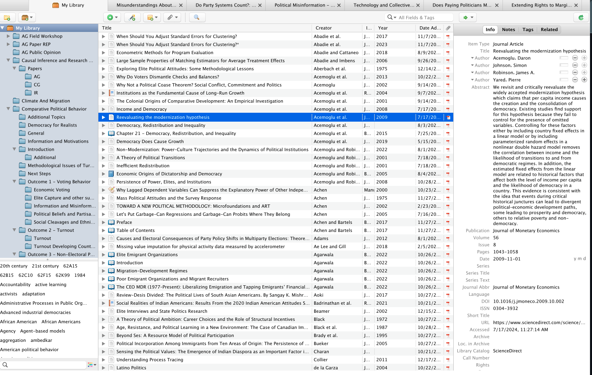

## Programming Session - Day 1 {#sec-01-programming}

We will be getting started with installing and setting up a few softwares today: 

1.    [R](https://www.r-project.org/about.html) - Statistical Programming Language

2.    [RStudio](https://posit.co/products/open-source/rstudio/) - Interactive Development Environment for R

3.    [Zotero](https://www.zotero.org/) - Reference Management Tool

4.    [GitHub](https://github.com/) - Storing code online with version control


### R and R Studio

Use the [link here](https://rstudio-education.github.io/hopr/starting.html) to install RStudio on your systems. 

::: {.callout-note}
## The connection between R and R Studio

R is a programming language while RStudio, an integrated development environment (IDE), provides the interface for us to run computations. You can think of R as the engine of the car, and RStudio as the dashboard. 

:::


### Zotero 

Zotero is a reference management tool. It allows you to maintain a structured bibliography. Its integration with various web browsers and software like MS Word and R, makes it a fantastic tool for keeping track of readings as well as citing them.  

```{r}
#| echo: false
#| fig-cap: "Zotero Folder"


```

1.    Make [Zotero](https://www.zotero.org/) Account. 
2.    Add a connector to the browser (For eg, [zotero connector](https://www.zotero.org/start) for google chrome). 
3.    Download Zotero Desktop App [here]((https://www.zotero.org/)). 
4.    Connect Zotero to R Studio. (We will do this step on Day 5, using the link [here](https://github.com/scskalicky/zotero_tutorial/blob/main/zotero_and_Rstudio.md)). 

### GitHub

Make your account [here](https://github.com/)

