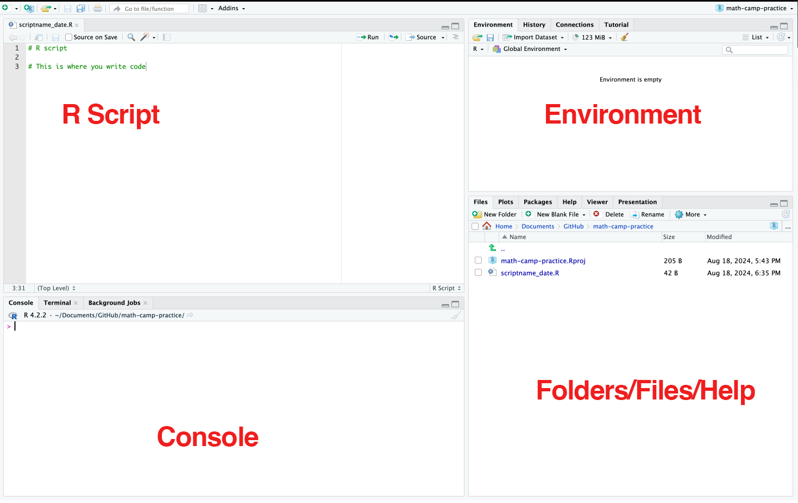
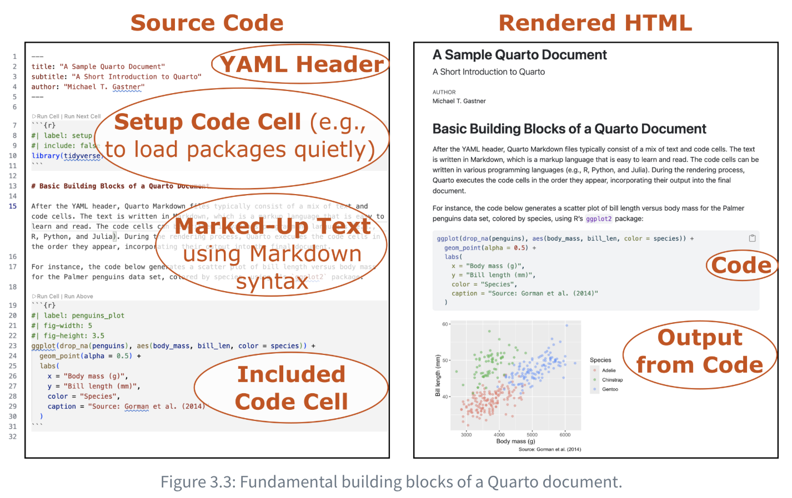
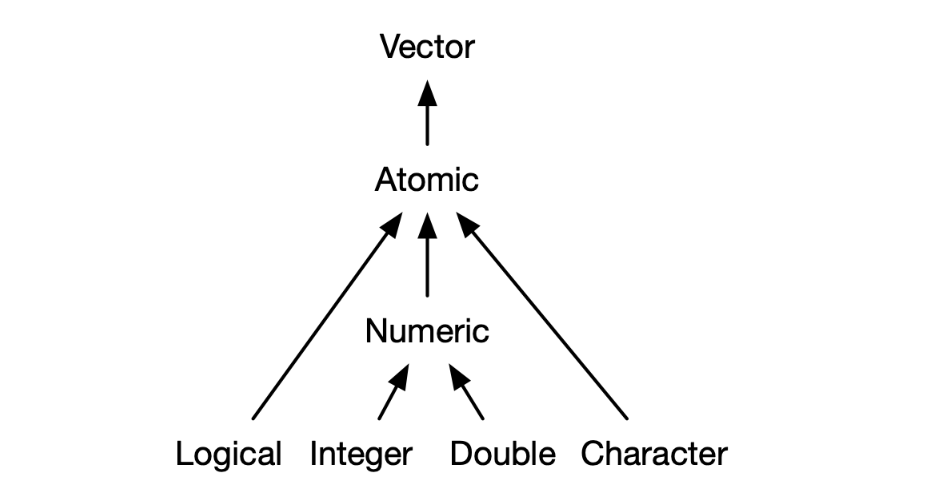
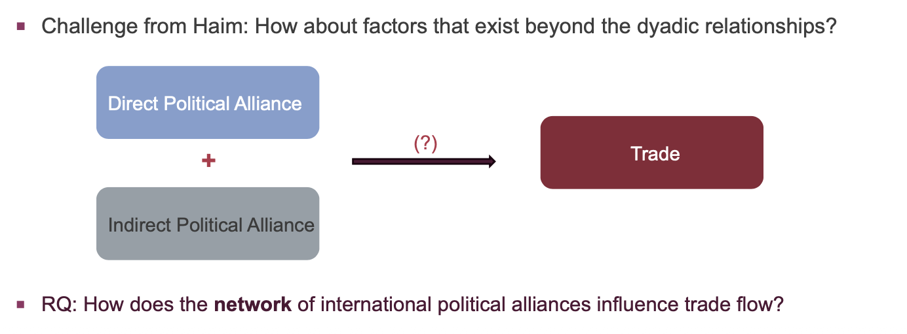

## Programming Session - Day 2 {#sec-02-programming}

### Why programming or coding, as a political scientist?   

People often give sophisticated answers to this question. But the basic idea is surprisingly simple.

As political scientists, we use data to learn about the world. Data by themselves do not tell us anything—they must be cleaned, organized, analyzed, and visualized before they become evidence. Programming is simply the language we use to tell the computer how to perform these tasks.

::: {.callout-note icon=false}

## Two goals are the pre-requisite of coding:

**Understanding your data**: how it is structured and what each observation and variable represent.

**Understanding your goal**: what question you are trying to answer and what operations are needed to answer it.

:::

Notice that neither of these is really about programming. Coding is simply the tool that translates your analytical thinking into a sequence of instructions that the computer can execute.

One of the greatest benefits of programming is that it allows you to be productively lazy. Rather than repeating the same steps over and over again, you teach the computer how to perform them once and then let it repeat those tasks accurately and consistently.

This matters because many research tasks—data cleaning, data wrangling, visualization, statistical analysis, and report generation—are inherently repetitive. You will often perform the same analysis on different datasets, update an existing analysis with new data, or revisit a project months later. A well-written script lets you reproduce those analyses with minimal effort.

Ultimately, programming is about formalizing your reasoning. Every line of code represents a decision about how data should be processed and analyzed. Once those decisions are written down, they become transparent, reproducible, and easy to improve. In that sense, coding not only increases efficiency but also strengthens the quality and credibility of your research.

::: {.callout style="background:#eef7fc; border-left:6px solid #1696d2; padding: 1em;"}
**Guidelines for data and statistical analyses:[^Aaron]**

[^Aaron]: Inspired by the summary provided by Prof [Aaron Williams](https://aaronrwilliams.com/about)' course on Data Analysis offered at McCourt School. Strongly recommended to learn good coding using R

1.    **Accuracy**: Write a code that reduces the chances of making an error and lets you catch one if it occurs. 
2.    **Efficiency**: If you are doing it twice, see the pattern of your decision-making and formalize it in your code. *Difference between Excel and coding*
3.    **Replicate-and-Reproduce**: Ability to repeat the computational process which reflects your thinking and decisions that you took along the way. Improves transparency and forces one to be deliberate and responsible about choices during analyses.  
4.    **Human Interpretability**: Writing code is not just about analyzing but allowing yourself and then others to be able to understand your analytic choices.  
5.    **Public Good**: Research is a public good. And the code allows your research to be truly accessible. This means you write a code that anyone else who understands the language can read, reuse, and recreate without you being present. We essentially ensure that by writing a readable and ideally publicly accessible code.

:::

### R and RStudio

*Recall: R is a free open-source statistical programming language. We generally use R through RStudio which is an integrated development environment (IDE). Essentially, it is the graphic user interface that allows us to use R efficiently. It has point-and-click functionality also (which we would not use a lot).*

```{r}
#| echo: false
#| fig-cap: "RStudio Screen"

 
```

#### Interface

**R Scripts**: This is where put your code in a script. The script is saved with a `.R` extension. An R script is a text file that you can read on text editors too. We use RStudio to run the code in a way that the computer understands.   
**Console**: Output from your code appears here. You can also write the code directly here. But it does not get saved. Also, by default, it shows only a limited number of previous steps (commands + outputs). Not a good practice to code here.  
**Environment**: All the objects, datasets, lists, etc that you have created/loaded in the environment appear here. Alongside, you also see the custom functions that you might create.  
**File Browser/Help/Plot**: Internal file navigator and help documentation for packages and functions appear here. Further, when you plot anything, that also gets shown here. 

#### Script Types

**Basic R scripts** (`.R`) 
* A plain text file that stores a sequence of R commands.
* Best suited for writing reproducible analytical workflows.

**Quarto** (`.qmd`) [^Gastner]

* A more advanced canvas that combines code and output in a cohesive document.
* Compatible with other programming langagues (e.g., Python and Julia)
* Produce a wide range of file formats (e.g., HTML, PDF, and Microsoft word) and support various project types such as presentations and websites.

[^Gastner]: Inspired by Prof Michael T. Gastner's [book](https://data-vis-using-r.info/) on "Mastering Data Visualization Using R, Quarto, and the Tidyverse". 

```{r}
#| echo: false
#| fig-cap: "RStudio Screen"

 
```


#### Commenting and Chunks

**Comments**: R interprets every line in the script as a separate command. And it does for each line unless preceded by a `#`. Comments signal to R that what follows the `#` is to be ignored. We use comments to write explanatory notes about the code. A comment should explain the purpose of a command or code and not just be a description of what it does. 

```{r}
#| echo: true

1 + 1 # an operation

#getwd()  #silence the code

```

**Chunks**: One of the fascinating features about quarto is that you can write code to analyze data and regular text in the same document, and we integrate code into quarto by setting up code chunks. 

::: {.callout-tip}
##### Ideal Practice With Code Chunks

A chunk should be relatively self-contained, and focused around a single task. This helps break down the entire project or operation by tasks, and makes any adjustment to each segment easier. For example, we can more easily turn on and off individual tasks by manipuating the entire code chuck. We will come back to code chunk options in day 4 - stay tuned!

:::

### Basics

R uses `<-` as the assignment operator. To the left of it is an object (sort of like a box that stores values which are to the right of the operator). 

**Syntax**: `object <- value/data`


::: {.panel-tabset}

### [`r paste("Exercise", 1)`]{style="color:#1696d2;"}

1.    Create a new `.R` script. Name it and save it on your system.  
2.    R does all the functions of a calculator. Write some code in the script that

  *   Adds two numbers
  
  *   Multiplies three numbers
  
  *   Prints your name
  
3. Run each command separately by using `cmd + Enter / ctrl + Enter`. 

4. Assign the outputs from **task 2** to different objects.  

5. Print the objects with some description using `paste()`.

6. Run the whole file.  

### [`r paste("Code", 1)`]{style="color:#1696d2;"}

You can start a new script through many different ways:  

1.    `ctrl + shift + n`

2.    Click on the tiny white page button with a green+sign on the upper left corner of the screen

3.    Click on `File > New file> R script`

Saving a script:

1.    `Ctrl + S`

2.    Enter the name of the script, and add `.R` as a suffix. For example: xyzbasic.R


```{r eval=FALSE}
#2. 
2 + 7

56 * 9 * 33

print("Rong")
```
The output is displayed in the console.  

```{r}
#4

sum_2 <- 2 + 7

prod_3 <- 56 * 9 * 33

name1 <- "Rong"

name2 <- "Parushya"
```

```{r}
#5

paste("Sum of 2 and 7 is", sum_2)

paste("Product of 56, 9 and 33 is", prod_3)

paste("This very fancy R code was written by", name1, "with the help from", name2)

```
:::

<br>

## Objects, Datatypes, and Data Structures

### Objects

::: callout

#### [`r paste("Exercise", 2)`]{style="color:#1696d2;"}

Run the following code in the same script that we created

```{r eval=FALSE}


class(sum_2)

class(prod_3)

class(name1)

class(name2)
```

:::


**Everything in R is called an "object"**

"Objects" contain "data".  

The variables we created - `sum_2`, `prod_3`, and `name` - were all basic objects.

R has 4 basic or "atomic" **classes/datatypes** of objects.[^Wickham]

1.    `Character`: strings or individual characters (e.g., abc)

2.    `Double`: decimals or scientific numbers (e.g., 1,7.5,etc)

3.    `Integer`: any integer(s)/whole numbers (e.g., 1,2,0,-896)

4.    `Logical`: variables composed of TRUE or FALSE (e.g., True/False)

```{r}
#| echo: false
#| fig-cap: "RStudio Screen"

 
```

::: {.callout-note}
Collectively integer and double are both subsets of `numeric`.
:::

```{r, echo=TRUE}

class(sum_2)

class(name1) 

typeof(sum_2) # a higher resolution
typeof(name1)

is.double(sum_2)
```

[^Wickham]: Hadley Wickham, 2nd edition of [“Advanced R”](https://adv-r.hadley.nz/index.html), a book in Chapman & Hall’s R Series.

### Data Structures

**Data structures** are bigger containers that hold many objects.

Two basic or "atomic" data structures in R are:

1.  **Vectors**: Vectors can hold objects of same datatype (i.e., homogeneous). Vectors are the most basic and fundamental data structure in R. Other data structures are made up of one or more vectors.

2.  **Matrix**: Matrices are vectors with two dimenions, so are also homogenous.

3.  **Lists**: Lists are the most flexible form of data structures and can hold objects with different datatypes (i.e., heterogeneous).


#### Understanding Vectors

We can create a vector using the `c()` command. 

```{r eval=TRUE}

a_num <- c(0, 0.7, 9, 2, 3, 4, -1) # numeric or double
class(a_num) #lower resolution
typeof(a_num) #higher resolution

b_logical <- c(TRUE, FALSE, TRUE, TRUE, TRUE) # logical
class(b_logical)

c_char <- c("Sheila", "Nila", "Camilla")  # character

d_int <- 1:20 # This R code creates a vector named e_int containing a sequence of integers from 1 to 20.

e_int <- c(1,2,3,4,5)  # integer

```
 
#### Indexing

Indexing can be used to get values from an object or to set values in an object. [^Gennatas]

The main indexing operator in R is the square bracket `[]`.

[^Gennatas]: E D Gennatas, [Programming for Data Science in R](https://pdsr.rtemis.org/).

```{r, echo=TRUE}
#recall:

d_int <- 1:20 # This R code creates a vector named e_int containing a sequence of integers from 1 to 20.
d_int

#if we'd like to get the 5th element in this vector
d_int[5]

#or, the 6th to the 9th of the same vector
d_int[6:9]

#or, combine the 1st element, repeat for three times, with the 4th element
d_int[c(1, 1, 1, 4)]
```

#### Working with matrices

Basic vectors are uni-dimensional. We can make a two dimensional vector, which is called **matrix**. 

::: {.callout-note}
Matrices are homogenous, meaning that the entire matrix is composed of one R class, e.g. all numeric, all characters, all logical, etc.
:::

```{r eval=TRUE}
# Creating Blank Matrix
m_1 <- matrix(nrow=3,ncol=4)
m_1      
dim(m_1)
```

```{r, eval=FALSE}
?matrix # Help documentation

# Creating Matrix with elements

m_2 <- matrix(1:10, nrow = 3, ncol = 4) # Why the warning?
m_2

# With correct number of elements
m_3 <- matrix(1:18, nrow=9, ncol=2))
m3
```

::: {.callout-note}
Matrices are constructed column-wise. So, it fills the upper left corner, and then runs down along.
:::

**Indexing in matrices**
```{r eval=FALSE}
# Rows & Columns ----    
# Very simply the syntax is:  (2,3) = (Rows, Columns)
# m[1,] - 1st row
# m[2,] - 2nd row
# m[,3] - 3rd column  
# m[,5] - 5th column
# m[,7] - 7th column
```


```{r eval=TRUE}
# What if you already have a vector?
# Example: You have received a list of students who have skipped school today.
# You know which section they are in, and want to create a matrix.
G <- c("John","Rong","Manon","Samirah","Parushya","Marcel", "Sara", "Pedro")
G

dim(G) <- c(4,2)
G

colnames(G) <- c("IR", "CG")
G
rownames(G) <- c("Student 1", "Student 2", "Student 3", "Student 4")
G
```


**Binding vectors together to make a matrix**

```{r eval=TRUE}
# Binding by column
AG <- c("Cecillia", "Quinn", "Patrik", "Gabi")
G <- cbind(G,AG) # Stitches vector column wise, or vertically
G

# Binding by row
row5 <- c("Minha", "Diana", "Mckenzie")
G <- rbind(G, row5)
G

rownames(G)[5] <- "Student 5"
G
```


#### Lists

If we want to create something that stores objects of different classes together, we use another data structure called `list`.

A list can contain two or more classes of objects with different lengths.  


##### Creating lists

```{r eval=TRUE}

Profile <- list(
  name   = "Nick",
  age    = 28,
  GREscores = c(310, 330, 328),   
  active = TRUE
)
Profile

```

::: {.callout-note}
Note how each element has a name under $name heading. And note how vectors of different nature - `numeric`, `logical`, and `character` are all stored in one object now. 
:::

##### Accessing elements in lists

`[[ ]]` reaches into the list and returns the element itself, by capturing the position of that vector in the list. `$` is the readable shortcut for `[[ ]]` when you know the name as you type it.

```{r eval=TRUE}
# Structure of the list
str(Profile)

# same element, by position or by name
Profile[[3]]
Profile$GREscores

# extract the second and third elements, altogether
Profile[c(2, 3)]
Profile[c("age", "GREscores")]

# reach one layer below to extract the score of the third test
Profile[[3]][3]

```

##### Modifying lists

```{r eval=TRUE}
# add a new element
Profile$email <- "nic@example.com"  

# modify an element
Profile[["age"]] <- 29 

# remove an element
Profile$email <- NULL 

str(Profile)
```

## Exercise with a real replication dataset

```{r, echo=FALSE, warning=FALSE, message=FALSE}
library(readr)
library(dplyr)

load("../../Resources/Dataset/JPRdata_Haim.rda")
COW_country_codes <- read_csv("../../Resources/Dataset/COW-country-codes.csv")

JPRdata_joined <- left_join(JPRdata, COW_country_codes, by = c("ccode_e" = "CCode"))
JPRdata_joined <- JPRdata_joined %>%
  rename(StateAbb_export = StateAbb,
         StateNme_export = StateNme) %>%
  relocate(
    StateAbb_export,
    StateNme_export,
    .after = ccode_e
  ) 

JPRdata_joined <- left_join(JPRdata_joined, COW_country_codes, by = c("ccode_a" = "CCode"))
JPRdata_joined <- JPRdata_joined %>%
  rename(StateAbb_import = StateAbb,
         StateNme_import = StateNme) %>%
  relocate(
    StateAbb_import,
    StateNme_import,
    .after = ccode_a
  ) 

JPRdata_cut <- JPRdata_joined %>%
  filter(year > 2000)

JPRdata_select <- JPRdata_cut%>%
  select(year,
         ccode_e,
         StateAbb_export,
         StateNme_export,
         ccode_a,
         StateAbb_import,
         StateNme_import,
         logflow,
         shareally,
         MID,
         loggdp.e,
         loggdp.a,
         comcur,
         sscore,
         region,
         bilatno,
         multino)

readr::write_csv(
  JPRdata_select,
  "../../Resources/Dataset/JPRdata_select.csv"
)
```

This sample dataset is adapted from the replication data accompanying:

> Haim, Dotan. 2016. *Alliance Networks and Trade: The Effect of Indirect Political Alliances on Bilateral Trade Flows*. Journal of Peace Research.

The original replication files and codebook are available through the Journal of Peace Research replication archive and the author's website. This version retains a subset of variables for instructional purposes and adds country names and abbreviations by merging the Correlates of War (COW) country code list.

**Research Question: How does the political alliances influence trade flow?**

```{r}
#| echo: false
#| fig-cap: "RStudio Screen"

 
```

### KNOW YOUR DATA!

#### Variables

| Variable          | Description                                                                                                                                                                                                                                        |
|:------------------------------|:---------------------------------------|
| `year`            | Year of the observation.                                                                                                                                                                                                                           |
| `ccode_e`         | Correlates of War (COW) numeric country code for the exporting (ego) state.                                                                                                                                                                        |
| `StateAbb_export` | Three-letter country abbreviation for the exporting state (added from the COW country code list).                                                                                                                                                  |
| `StateNme_export` | Country name for the exporting state (added from the COW country code list).                                                                                                                                                                       |
| `ccode_a`         | Correlates of War (COW) numeric country code for the importing (alter) state.                                                                                                                                                                      |
| `StateAbb_import` | Three-letter country abbreviation for the importing state (added from the COW country code list).                                                                                                                                                  |
| `StateNme_import` | Country name for the importing state (added from the COW country code list).                                                                                                                                                                       |
| `logflow`         | Natural logarithm of exports from the exporting state to the importing state, measured in millions of standardized U.S. dollars. Data originate from the CEPII Trade dataset.                                                                      |
| `shareally`       | Number of alliance ties jointly shared by both members of a dyad, adjusted for allies unique to the importing state. This variable measures indirect alliance embeddedness.                                                                        |
| `MID`             | Indicator for whether the two states were involved in a Militarized Interstate Dispute (MID) during the observation year.                                                                                                                          |
| `loggdp.e`        | Natural logarithm of the exporting state's gross domestic product (GDP), measured in millions of standardized U.S. dollars.                                                                                                                        |
| `loggdp.a`        | Natural logarithm of the importing state's gross domestic product (GDP), measured in millions of standardized U.S. dollars.                                                                                                                        |
| `comcur`          | Indicator for whether the two states share a common currency.                                                                                                                                                                                      |
| `sscore`          | Affinity (S-) score measuring similarity in the two states' United Nations General Assembly voting behavior.                                                                                                                                       |
| `region`          | Geographic region of the exporting state. Categories include East Asia and Pacific, South Asia, Middle East and North Africa, Sub-Saharan Africa, Europe and Central Asia, Latin America and Caribbean, North/Central America, and Western Europe. |
| `bilatno`         | Indicator for whether the two states are partners in at least one bilateral alliance.                                                                                                                                                              |
| `multino`         | Indicator for whether the two states are partners in at least one multilateral alliance.                                                                                                                                                           |

::: {.callout-note}

-   Each observation represents a **directed country dyad-year**, where an exporting state trades with an importing state.
-   Variables beginning with `.e` refer to characteristics of the exporting (ego) state, whereas variables beginning with `.a` refer to the importing (alter) state.
-   `StateAbb_*` and `StateNme_*` were added to improve readability and are not part of the original Haim (2016) replication dataset.

:::

```{r, message=FALSE, warning=FALSE, echo=FALSE}
JPRdata_select <- readr::read_csv(
  "../../Resources/Dataset/JPRdata_select.csv"
)
head(JPRdata_select)
```

#### Exercises

```{r, eval=FALSE, echo=TRUE}
#install.packages(readr)
library(readr)
JPRdata_select <- readr::read_csv(
  "Resources/Dataset/JPRdata_select.csv"
)

```

::: {.panel-tabset}

### [`r paste("Exercise", 3)`]{style="color:#1696d2;"}

1. What are the classes of the variable `StateNme_export`, `logflow`, `region`? (hint: `class()` or `typeof()`)

2. How many rows and columns are in this dataset?

3. How to extract the column `shareally` from this dataset?

4. Can you create a list to store the dyad information from the first observation in this dataset?

### [`r paste("Code for your reference")`]{style="color:#1696d2;"}

#### Question 1

```{r eval=FALSE}
class(JPRdata_select$StateAbb_export)

class(JPRdata_select$logflow)
typeof(JPRdata_select$logflow)

class(JPRdata_select$region)
```

#### Question 2

```{r eval=FALSE}
dim(JPRdata_select)
```

#### Question 3

```{r eval=FALSE}
shareally <- JPRdata_select[,9]
shareally <- JPRdata_select$shareally
```

#### Question 4

```{r eval=FALSE}
Dyad1 <- list(
  year      = JPRdata_select$year[1],
  exporter  = JPRdata_select$StateNme_export[1],
  importer  = JPRdata_select$StateNme_import[1],
  trade     = JPRdata_select$logflow[1],
  alliance  = JPRdata_select$shareally[1],
  MID       = JPRdata_select$MID[1],
  region    = JPRdata_select$region[1]
)

Dyad1$alliance

Dyad1$MID
Dyad1[3]
Dyad1[[3]]
```

:::

<br>

