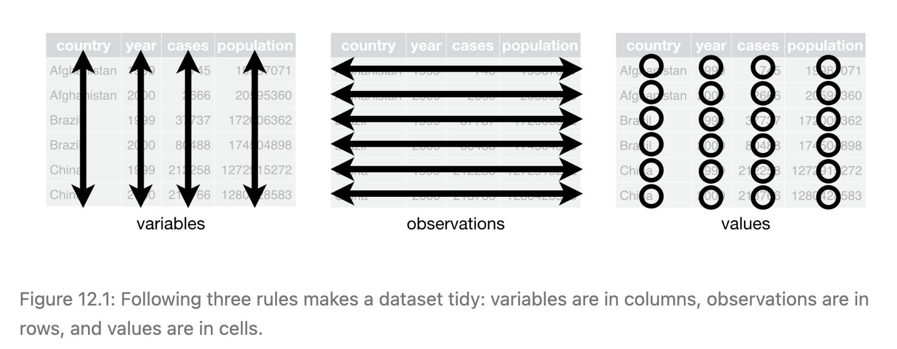
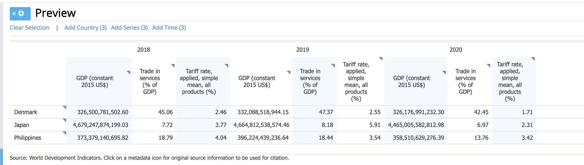

## Programming Session - Day 4 {#sec-04-programming}

# Housekeeping

::: {.callout-note}
Housekeeping would be most helpful when we have created some mess when exploring stuff around earlier. Now, let's get the house in order!
:::

## Working directories

A **working directory** is sort of the "office" that you operate from. They tell R where to operate from.

Working directories are specified using a file path i.e. the address in your computer where your script will be stored, or where your dataset is kept.  

```{r eval=FALSE}
# Commands:
getwd() # Gets the present directory or pathway where you are operating from
     
setwd("<press tab here>") # Setting new directory as working directory

list.files()  #list the files in the working directory

```

## Importing and Exporting Dataset

```{r eval=FALSE}
read.csv("FileName") # reads CSV files / press tab inside the quotes
read_csv("Pathname/filename.csv")  

# The part before :: in the following code refers to the package from where the 
#  function comes from. You will need to load those packages first.

readxl::read_excel() # read excel files
readxl::read_xlsx() # reads excel workbooks
haven::read_dta()   # reads stata dta files

# example: 
    
library(readr)
JPRdata_select <- readr::read_csv("Resources/Dataset/JPRdata_select.csv")
```

## Packages

"Packages are the fundamental units of reproducible R code. They include reusable R functions, the documentation that describes how to use them, and sample data." [^WickhamandBryan]

[^WickhamandBryan]: Hadley Wickham and Jennifer Bryan, [R Packages](https://r-pkgs.org/)

::: {.callout-note}
Or, in my words, packages are useful, because smart people have figured out efficient ways to do (relatively) basic data operations, and we are standing on their shoudlers so no one needs to reinvent the wheels.
:::

```{r eval=FALSE}
# Check available packages
library()
```

You can install packages from Comprehensive R Archive Network or CRAN which is an online storage of peer-reviewed and documented packages.

The command for loading a package is `install.package()`.

```{r eval=FALSE}

# installing package. Eg, tidyverse

install.packages("dplyr") # You have to run this once on system

library(dplyr) # Once installed library(<packagename>) command loads all the functions associated with the package in the current session for use
```

## Summary: Importing Common Data File Types in R

| File type | Typical extension | Package | Command |
|:--|:--|:--|:--|
| CSV | `.csv` | `readr` | `readr::read_csv("file.csv")` |
| Excel | `.xlsx`, `.xls` | `readxl` | `readxl::read_excel("file.xlsx")` |
| Stata | `.dta` | `haven` | `haven::read_dta("file.dta")` |
| R object | `.rds` | Base R | `readRDS("file.rds")` |
| R workspace/data file | `.RData`, `.rda` | Base R | `load("file.rda")` |
| Plain text / delimited | `.txt`, `.tsv` | `readr` | `readr::read_tsv("file.tsv")` |

::: {.callout style="background:#f7fcf5; border-left:6px solid #41ab5d; padding: 1em;"}

### Data Loading Exercise
<br>
Let's explore this [website](https://dataverse.harvard.edu/) and find one article you might want to replicate its findings. 

I did a quick search and the following two articles seem to have a pretty simple set up for replication files:

* Global Power Index [link](https://dataverse.harvard.edu/dataset.xhtml?persistentId=doi:10.7910/DVN/QRGCWI)
* International Sanctions Termination Dataset [link](https://dataverse.harvard.edu/dataset.xhtml?persistentId=doi:10.7910/DVN/SVR5W7)

Let's try to load the dataset into your R Studio!

```{r eval=FALSE}
read_csv()
read_excel() #package readxl()

#install.packages("readxl")
library(readxl)
test <- read_excel("../../Resources/Dataset/IST_JPR_Attia_Grauvogel.xlsx")
```

:::

<br>

## YAML 

Short for *Yet-Another-Markup-Languge*

"YAML is a human-readable data serialization format that Quarto uses to configure documents and control their behavior. Think of YAML as a set of instructions that tell Quarto how to process and present your document." 

"Key benefits of YAML: - Simple, readable syntax - Flexible configuration options - Separates content from formatting - Allows consistent styling across documents"[^Martin]

[^Martin]: Greg Martin, [Customize with YAML](https://rpubs.com/drgregmartin/1266674)

::: {.callout-note}
This is the part we see sandwiched between two `---` at the start of `.qmd` file. Here we define different global settings for the particular document.
:::

Currently, we see

    ---
    title: "Untitled"
    format: html
    ---

It can be expanded into one like

::: callout
    ---
  title: "Analysis Report"
  author: "Sherlock Holmes"
  date: today
  execute:
    echo: false        # hide code
  format:
    html:
      code-fold: true # # Enable code folding
      toc-depth: 3     # Specific to this document
  ---
:::

We can add many more options here to modify the details to appear at the start of the document. Here's an example from [quarto reference site](https://quarto.org/docs/authoring/front-matter.html)

::: callout
      ---
      title: "Toward a Unified Theory of High-Energy Metaphysics: Silly String Theory"
      date: 2008-02-29
      author:
        - name: Josiah Carberry
          id: jc
          orcid: 0000-0002-1825-0097
          email: josiah@psychoceramics.org
          affiliation: 
            - name: Brown University
              city: Providence
              state: RI
              url: www.brown.edu
      abstract: > 
        The characteristic theme of the works of Stone is 
        the bridge between culture and society. ...
      keywords:
        - Metaphysics
        - String Theory
      license: "CC BY"
      copyright: 
        holder: Josiah Carberry
        year: 2008
      citation: 
        container-title: Journal of Psychoceramics
        volume: 1
        issue: 1
        doi: 10.5555/12345678
      funding: "The author received no specific funding for this work."
      ---
      
:::

## Code Chunks

Recall, one of the fascinating features about quarto is that you can write code to anlayse data and regular text in the same document.  

R code chunks are surrounded by ```` ```{r} ```` and ```` ``` ````, separating the entire document into chunks.

Again, recall, a chunk should be relatively self-contained, and focused around a single task.

::: {.callout-tip}
You can start a new `R` code chunk by pressing `cmd + option + I` or `ctrl + alt + I`.

You can run each code chunk by clicking the Run icon (it looks like a play button at the top of the chunk), or by pressing Cmd/Ctrl + Shift + Enter.

Try to use the keyboard shortcut more often as it will save you a ton of time later.

:::

#### Options

You can customize the presentation of each code chunk (along with the output from each code chunk) by playing around with the code chunk YAML. Code chunk options are included in a special comment at the top of the block (lines at the top prefaced with `#|` are considered options).  

More on code chunk options [here](https://quarto.org/docs/computations/execution-options.html)

```r
#| eval: true # Do evaluate this chunk
#| echo: true # Do show this chunk in the final rendered document
#| output: true # Do show the output / results of this chunk in the rendered document

print("Dont run this code")
```

Options available for customizing output include:


+-----------+---------------------------------------------------------------------------------------------------------------------------------------------------------------------------------------------------+
| Option    | Description                                                                                                                                                                                       |
+===========+===================================================================================================================================================================================================+
| `eval`    | Evaluate the code chunk (if `false`, just echos the code into the output).                                                                                                                        |
+-----------+---------------------------------------------------------------------------------------------------------------------------------------------------------------------------------------------------+
| `echo`    | Include the source code in output                                                                                                                                                                 |
+-----------+---------------------------------------------------------------------------------------------------------------------------------------------------------------------------------------------------+
| `output`  | Include the results of executing the code in the output (`true`, `false`, or `asis` to indicate that the output is raw markdown and should not have any of Quarto's standard enclosing markdown). |
+-----------+---------------------------------------------------------------------------------------------------------------------------------------------------------------------------------------------------+
| `warning` | Include warnings in the output.                                                                                                                                                                   |
+-----------+---------------------------------------------------------------------------------------------------------------------------------------------------------------------------------------------------+
| `error`   | Include errors in the output (note that this implies that errors executing code will not halt processing of the document).                                                                        |
+-----------+---------------------------------------------------------------------------------------------------------------------------------------------------------------------------------------------------+
| `include` | Catch all for preventing any output (code or results) from being included (e.g. `include: false` suppresses all output from the code block).                                                      |
+-----------+---------------------------------------------------------------------------------------------------------------------------------------------------------------------------------------------------+


The following table summarizes which types of output each option suppresses:[^hadley]

[^hadley]: This section is copied from [R4DS book](https://github.com/hadley/r4ds/blob/main/quarto.qmd)

| Option           | Run code | Show code | Output | Plots | Messages | Warnings |
|------------------|:--------:|:---------:|:------:|:-----:|:--------:|:--------:|
| `eval: false`    |    X     |           |   X    |   X   |    X     |    X     |
| `include: false` |          |     X     |   X    |   X   |    X     |    X     |
| `echo: false`    |          |     X     |        |       |          |          |
| `results: hide`  |          |           |   X    |       |          |          |
| `fig-show: hide` |          |           |        |   X   |          |          |
| `message: false` |          |           |        |       |    X     |          |
| `warning: false` |          |           |        |       |          |    X     |


::: {.callout-note}
#### Hierarchy of YAML settings
Note that code chunk YAML takes priority over document YAML header, meaning that the options in the code chunk YAML override the default setting laid out earlier in the document YAML header. 

:::

For example, you can set `echo: true` as a global option for the entire document in the document header YAML to show code throughout, but override it in a specific code chunk (`echo: false`) to hide the code within:

    ---
    execute: 
      echo: true #show code
      inlcude: false
    ---

```r
#| eval: true # Do evaluate this chunk
#| echo: false # Do show this chunk in the final rendered document
#| output: true # Do show the output / results of this chunk in the rendered document

```   


### Inline code


We can also embed R code into a Quarto document: directly into the text, with: ```` ```{r} <code> ``` ````.

For example: ```` ```{r} (2+2)``` ````.


### Formatting

::: callout

These are some of the regularly used formatting options in RMarkdown/Quarto
    Titles and subtitles
    ------------------------------------------------------------

    # Title 1

    ## Title 2

    ### Title 3


    Text formatting 
    ------------------------------------------------------------

    *italic*  

    **bold**   

    `code`

    Lists
    ------------------------------------------------------------

    * Bulleted list item 1
    * Item 2
      * Item 2a
      * Item 2b

    1. Item 1
    2. Item 2

    Links and images
    ------------------------------------------------------------
:::

# Data Wrangling with dplyr

```{r, message=FALSE, warning=FALSE, echo=FALSE}
library(readr)
library(dplyr)
library(tidyverse)
YJPRdata_select <- readr::read_csv(
  "../02-probability/data/JPRdata_select.csv"
)
#head(JPRdata_select)
```

The **dplyr** verbs make data manipulation fast and expressive. They work best with the pipe `|>` (base R) or `%>%` (magrittr). We'll use `|>` here.

**dplyr** is a part of `tidyverse` universe. `Tidyverse` is an opiniated approach to data handling. What this means is that the packages and practices in this approach presuppose a particular format of data. The data either needs to be in the particular format or be transformed to one, for this approach to work efficiently. In practice, it is quite intuitive and simple. 

There are three interrelated rules of `tidy` data are:[^WickhamandGrolemund]

1-  Each variable must have its own column.  
2-  Each observation must have its own row.  
3-  Each value must have its own cell.  

```{r}
#| echo: false
#| fig-cap: "Tidy Dataset"

 
```

[^WickhamandGrolemund]: Hadley Wickham and Garrett Grolemund, [R for DAta Science](https://r4ds.had.co.nz/tidy-data.html)

## Pipes

::: panel-tabset
### Code

```{r}
#| eval: false
# Without pipe
head(arrange(select(mpg, manufacturer, model, hwy), desc(hwy)), 5)

# With pipe (clearer)
mpg |>
  select(manufacturer, model, hwy) |>
  arrange(desc(hwy)) |>
  head(5)
```

### Result

```{r}
#| echo: false
# Without pipe
head(arrange(select(mpg, manufacturer, model, hwy), desc(hwy)), 5)

# With pipe (clearer)
mpg |>
  select(manufacturer, model, hwy) |>
  arrange(desc(hwy)) |>
  head(5)
```
:::

## `select()` (choose columns)

::: panel-tabset
### Code

```{r}
#| eval: false
mpg |>
  select(manufacturer, model, hwy)

mpg |>
  select(starts_with("d")) |>
  head(3)

# Rename while selecting
mpg |>
  select(make = manufacturer, model, hwy) |>
  head(3)

# Move columns around
mpg |>
  relocate(hwy, .before = displ) |>
  head(3)
```

### Result

```{r}
#| echo: false
mpg |>
  select(manufacturer, model, hwy)

mpg |>
  select(starts_with("d")) |>
  head(3)

# Rename while selecting
mpg |>
  select(make = manufacturer, model, hwy) |>
  head(3)

# Move columns around
mpg |>
  relocate(hwy, .before = displ) |>
  head(3)
```
:::

## `filter()` (keep rows)

::: panel-tabset
### Code

```{r}
#| eval: false
mpg |>
  filter(class == "suv", hwy >= 20) |>
  head(5)

mpg |>
  filter(manufacturer %in% c("toyota", "honda")) |>
  count(manufacturer)
```

### Result

```{r}
#| echo: false
mpg |>
  filter(class == "suv", hwy >= 20) |>
  head(5)

mpg |>
  filter(manufacturer %in% c("toyota", "honda")) |>
  count(manufacturer)
```
:::

## `mutate()` (create/modify columns)

::: panel-tabset
### Code

```{r}
#| eval: false
mpg |>
  mutate(
    hwy_kmpl = hwy * 0.425144,           # convert mpg to km/L (approx)
    efficiency = case_when(
      hwy >= 30 ~ "high",
      hwy >= 20 ~ "medium",
      TRUE ~ "low"
    )
  ) |>
  select(manufacturer, model, hwy, hwy_kmpl, efficiency) |>
  head(6)
```

### Result

```{r}
#| echo: false
mpg |>
  mutate(
    hwy_kmpl = hwy * 0.425144,           # convert mpg to km/L (approx)
    efficiency = case_when(
      hwy >= 30 ~ "high",
      hwy >= 20 ~ "medium",
      TRUE ~ "low"
    )
  ) |>
  select(manufacturer, model, hwy, hwy_kmpl, efficiency) |>
  head(6)
```
:::

## `arrange()` (sort rows)

::: panel-tabset
### Code

```{r}
#| eval: false
mpg |>
  arrange(manufacturer, desc(hwy)) |>
  head(6)
```

### Result

```{r}
#| echo: false
mpg |>
  arrange(manufacturer, desc(hwy)) |>
  head(6)
```
:::

## `group_by()` + `summarise()` (grouped summaries)

::: panel-tabset
### Code

```{r}
#| eval: false
mpg |>
  group_by(cyl) |>
  summarise(
    mean_cty = mean(cty),
    median_hwy = median(hwy),
    n = dplyr::n()
  )

mpg |>
  group_by(drv) |>
  summarise(across(c(cty, hwy), list(mean = mean, sd = sd)))
```

### Result

```{r}
#| echo: false
mpg |>
  group_by(cyl) |>
  summarise(
    mean_cty = mean(cty),
    median_hwy = median(hwy),
    n = dplyr::n()
  )

mpg |>
  group_by(drv) |>
  summarise(across(c(cty, hwy), list(mean = mean, sd = sd)))
```
:::

## `distinct()`, `slice()`, sampling

::: panel-tabset
### Code

```{r}
#| eval: false
# Unique combinations of columns
mpg |>
  distinct(manufacturer, class) |>
  head(10)

# Take specific rows by position
mpg |>
  slice(1:5)

# Random samples
set.seed(123)
mpg |>
  slice_sample(n = 5)
```

### Result

```{r}
#| echo: false
# Unique combinations of columns
mpg |>
  distinct(manufacturer, class) |>
  head(10)

# Take specific rows by position
mpg |>
  slice(1:5)

# Random samples
set.seed(123)
mpg |>
  slice_sample(n = 5)
```
:::

## Joins (combine tables by keys)

::: panel-tabset
### Code

```{r}
#| eval: false
a <- tibble(id = c(1,2,3), val = c("A","B","C"))
b <- tibble(id = c(2,3,4), note = c("two","three","four"))

left_join(a, b, by = "id")
inner_join(a, b, by = "id")
full_join(a, b, by = "id")
anti_join(a, b, by = "id")  # rows in a without matches in b
semi_join(a, b, by = "id")  # rows in a that have a match in b
```

### Result

```{r}
#| echo: false
a <- tibble(id = c(1,2,3), val = c("A","B","C"))
b <- tibble(id = c(2,3,4), note = c("two","three","four"))

left_join(a, b, by = "id")
inner_join(a, b, by = "id")
full_join(a, b, by = "id")
anti_join(a, b, by = "id")  # rows in a without matches in b
semi_join(a, b, by = "id")  # rows in a that have a match in b
```
:::

# Reshaping with tidyr & Pivoting

::: callout-note
`dplyr`, `readr`, `tidyr` are part of the packages under `tidyverse`--a collection packages for data science purposes. So far, we have installed the packages separately, but we could have or run `install.packages("tidyverse")` to obtain access to all directly.
:::

**Why Pivoting?**

Every dataset has a unit of observation. Before manipulating your data, always ask: "What does one row represent?" Pivoting is simply a way of redefining that unit so it matches the question you want to answer. This connects naturally to panel data in political science, where we often move between country-level, country-year, dyad-year, or country-industry-year units depending on the analysis.

```{r}
#| echo: false
#| fig-cap: "WorldBank Databank"


```

```{r, message=FALSE, warning=FALSE, echo=FALSE}
library(readxl)
worldbank <- read_excel(
  "data/worldbank.xlsx"
) |>
  slice(1:3)

worldbank <- worldbank |>
  rename(
    country_name = `Country Name`,
    country_code = `Country Code`,
    gdp_2018 = `2018 [YR2018] - GDP (constant 2015 US$) [NY.GDP.MKTP.KD]`,
    trade_services_2018 = `2018 [YR2018] - Trade in services (% of GDP) [BG.GSR.NFSV.GD.ZS]`,
    tariff_2018 = `2018 [YR2018] - Tariff rate, applied, simple mean, all products (%) [TM.TAX.MRCH.SM.AR.ZS]`,
    gdp_2019 = `2019 [YR2019] - GDP (constant 2015 US$) [NY.GDP.MKTP.KD]`,
    trade_services_2019 = `2019 [YR2019] - Trade in services (% of GDP) [BG.GSR.NFSV.GD.ZS]`,
    tariff_2019 = `2019 [YR2019] - Tariff rate, applied, simple mean, all products (%) [TM.TAX.MRCH.SM.AR.ZS]`,
    gdp_2020 = `2020 [YR2020] - GDP (constant 2015 US$) [NY.GDP.MKTP.KD]`,
    trade_services_2020 = `2020 [YR2020] - Trade in services (% of GDP) [BG.GSR.NFSV.GD.ZS]`,
    tariff_2020 = `2020 [YR2020] - Tariff rate, applied, simple mean, all products (%) [TM.TAX.MRCH.SM.AR.ZS]`
  )

```

::: callout-tip
This is a dataset with three dimensions--`country`, `indicator`, and `year`. However, only country appears as a proper variable, whereas other information are squeezed and hidden in the layout.
:::

**(1) Restoring Order**

`pivot_longer()` restores variables that have been embedded in column names (such as year or indicator) into proper columns. This creates a dataset that is often much easier to clean, reorganize, filter, and reshape for different analytical purposes.

::: panel-tabset
## Code

```{r}
#| eval: false
worldbank_long <- worldbank %>%
  pivot_longer(
    cols = -c(country_name, country_code), 
    names_to = c("indicator", "year"), #separate columns "indicator_year" into "indicator" and "year" separately
    names_pattern = "(.*)_(\\d{4})", #captures two groups here: four digits in the end, and everything before the underscore
    values_to = "value"
  )
```

## Result

```{r}
#| echo: false
worldbank_long <- worldbank %>%
  pivot_longer(
    cols = -c(country_name, country_code), 
    names_to = c("indicator", "year"), 
    names_pattern = "(.*)_(\\d{4})", 
    values_to = "value"
  )
head(worldbank_long)
```

:::

**(2) Preparing the data for your analysis**

Let's say if we'd like to explore the question: **Do countries with higher GDP impose higher tariff.** How should we organize our dataset in the best order? 

Ideally, we might want our dataset to look the following:

| Country | Year | GDP | Tariff |
|:---------|-----:|----:|--------:|
| Denmark  | 2018 | ... | 2.46 |
| Denmark  | 2019 | ... | 2.55 |
| Japan    | 2018 | ... | 3.77 |
| Japan    | 2019 | ... | 3.80 |

What we need to do is the following: (1) selecting the variables of interest and (2) reshape the dataset into this format.

::: panel-tabset
## Code

```{r}
#| eval: false
worldbank_filter <- worldbank_long %>%
  filter(indicator %in% c("gdp", "tariff"))

worldbank_wide <- worldbank_filter %>%
  pivot_wider(
    names_from = indicator,
    values_from = value
  )
```

## Result

```{r}
#| echo: false
worldbank_filter <- worldbank_long %>%
  filter(indicator %in% c("gdp", "tariff"))

worldbank_filter

worldbank_wide <- worldbank_filter %>%
  pivot_wider(
    names_from = indicator,
    values_from = value
  )

worldbank_wide
```
:::

::: callout-tip
## Quick Cheatsheet

-   Columns: `select()`, `rename()`, `relocate()`
-   Rows: `filter()`, `arrange()`, `slice()`
-   New columns: `mutate()`, `if_else()`, `case_when()`
-   Groups: `group_by()`, `summarise()`, `across()`
-   Uniques & counts: `distinct()`, `count()`
-   Joins: `left_join()`, `inner_join()`, `full_join()`, `anti_join()`, `semi_join()`
-   Reshape: `pivot_longer()`, `pivot_wider()`
:::

# Grammar of Graphics with ggplot2

## ggplot is the R functional form of the Grammar of Graphics

## But what does it mean?

The Grammar of Graphics was introduced to describe the deep structure underlying statistical graphics. @wilkinsonGrammerGraphics2005 formalized the idea of what a “statistical graphic” is; @wickhamLayeredGrammarGraphics2010 adapted that grammar into a layered system in R. In short, a statistical plot maps data to aesthetic attributes (e.g., colour, shape, size) of geometric objects (e.g., points, lines, bars), may include statistical transformations, is drawn on a coordinate system, and can be faceted to repeat the same plot over subsets of the data. It’s the combination of these independent components that makes a graphic. 

ggplot2 is built on the idea: any plot can be expressed from the same set of components—**a dataset**, **a coordinate system**, and **geoms** (visual marks). The key to understanding ggplot2 is thinking in **layers**, much like stacked layers in image editors such as Photoshop/Illustrator/Inkscape.

The guiding principle in ggplot2 is to build from **foundational** components (data, global mappings) to **specific** components (geoms, stats, scales, guides), connecting layers with `+`. Think of each layer as placed on the same canvas; together they compose the plot. The general structure is:

```{r}
#| eval: false
ggplot(data = <DATA>, mapping = aes(<X>, <Y>, <global aesthetics>)) +
  geom_<TYPE>(aes(<layer-specific aesthetics>), <layer options>) +
  stat_<TRANSFORM>(...) +
  scale_<...>(...) +
  coord_<...>(...) +
  facet_<...>(...) +
  labs(title = "...", subtitle = "...", x = "...", y = "...") +
  theme(...)
```

The **ggplot2** package builds plots by layering components: data, aesthetic mappings, geoms, statistics, scales, coordinates, and facets.

You can read more about ggplot [here](https://ggplot2-book.org/introduction.html#ref-wickham:2007d).  

### First plot

::: panel-tabset
#### Code

```{r}
#| eval: false
ggplot(worldbank_wide, aes(x = gdp, y = tariff)) +
  geom_point()
```

#### Result

```{r}
#| echo: false
ggplot(worldbank_wide, aes(x = gdp, y = tariff)) +
  geom_point()
```
:::

Compare to base R:

::: panel-tabset
#### Code

```{r}
#| eval: false
plot(x = worldbank_wide$gdp, y = worldbank_wide$tariff)

```

#### Result

```{r}
#| echo: false
plot(x = worldbank_wide$gdp, y = worldbank_wide$tariff)
```
:::

### Aesthetics: colour, size, shape, alpha

::: panel-tabset
#### Code

```{r}
#| eval: false

ggplot(worldbank_wide, aes(gdp, tariff, colour = country_name)) +
  geom_point()
ggplot(worldbank_wide, aes(gdp, tariff, colour = country_name, shape = factor(year))) +
  geom_point()
ggplot(worldbank_wide, aes(gdp, tariff, colour = country_name, alpha = factor(year))) +
  geom_point()
```

#### Result

```{r}
#| echo: false
ggplot(worldbank_wide, aes(gdp, tariff, colour = country_name)) +
  geom_point()
ggplot(worldbank_wide, aes(gdp, tariff, colour = country_name, shape = factor(year))) +
  geom_point()
ggplot(worldbank_wide, aes(gdp, tariff, colour = country_name, alpha = factor(year))) +
  geom_point()
```
:::

Fixed aesthetics (outside `aes()`):

* Inside `aes()` → map a variable or value (in your data) to a visual property.
* Outside `aes()` → set a fixed visual property.

::: callout-tip
`aes()` specifies which variables from that dataset should determine the appearance
:::


::: panel-tabset
#### Code

```{r}
#| eval: false
ggplot(worldbank_wide, aes(gdp, tariff)) + geom_point(aes(colour = "blue"))
ggplot(worldbank_wide, aes(gdp, tariff)) + geom_point(colour = "blue")
```

#### Result

```{r}
#| echo: false
ggplot(worldbank_wide, aes(gdp, tariff)) + geom_point(aes(colour = "blue"))
ggplot(worldbank_wide, aes(gdp, tariff)) + geom_point(colour = "blue")
```
:::

### Faceting

::: panel-tabset
#### Code

```{r}
#| eval: false
# those with higher GDP -> adopt higher tariff rates (within each year)
ggplot(worldbank_wide, aes(gdp, tariff)) +
  geom_point() +
  facet_wrap(~ year)

# higher GDP -> higher tariff rates (for each country across years)
ggplot(worldbank_wide, aes(gdp, tariff)) +
  geom_point() +
  facet_wrap(~ country_name)
```

#### Result

```{r}
#| echo: false
# those with higher GDP -> adopt higher tariff rates (within each year)
ggplot(worldbank_wide, aes(gdp, tariff)) +
  geom_point() +
  facet_wrap(~ year)

# higher GDP -> higher tariff rates (for each country across years)
ggplot(worldbank_wide, aes(gdp, tariff)) +
  geom_point() +
  facet_wrap(~ country_name)
```
:::

### Smoothed trends

::: panel-tabset
#### Code

```{r}
#| eval: false
ggplot(mpg, aes(displ, hwy)) + geom_point() + geom_smooth()
ggplot(mpg, aes(displ, hwy)) + geom_point() + geom_smooth(method = "lm")
ggplot(mpg, aes(displ, hwy)) + geom_point() + geom_smooth(span = 0.9)  # loess span
```

#### Result

```{r}
#| echo: false
ggplot(mpg, aes(displ, hwy)) + geom_point() + geom_smooth()
ggplot(mpg, aes(displ, hwy)) + geom_point() + geom_smooth(method = "lm")
ggplot(mpg, aes(displ, hwy)) + geom_point() + geom_smooth(span = 0.9)  # loess span
```
:::

### Distributions: histogram, frequency polygon, density, combo

::: panel-tabset
#### Code

```{r}
#| eval: false
ggplot(mpg, aes(hwy)) + geom_histogram()
ggplot(mpg, aes(hwy)) + geom_freqpoly()

# Change binwidth
ggplot(mpg, aes(hwy)) + geom_histogram(binwidth = 2)
ggplot(mpg, aes(hwy)) + geom_freqpoly(binwidth = 2)

# Density
ggplot(mpg, aes(hwy)) + geom_density()

# Overlay histogram + density and add a mean line
p <- ggplot(mpg, aes(hwy)) +
  geom_histogram(aes(y = ..density..), colour = "black", fill = "white") +
  geom_density(alpha = .2, fill = "#FF6666")

p + geom_vline(aes(xintercept = mean(hwy)), linetype = "dashed", size = 1)
```

#### Result

```{r}
#| echo: false
ggplot(mpg, aes(hwy)) + geom_histogram()
ggplot(mpg, aes(hwy)) + geom_freqpoly()

# Change binwidth
ggplot(mpg, aes(hwy)) + geom_histogram(binwidth = 2)
ggplot(mpg, aes(hwy)) + geom_freqpoly(binwidth = 2)

# Density
ggplot(mpg, aes(hwy)) + geom_density()

# Overlay histogram + density and add a mean line
p <- ggplot(mpg, aes(hwy)) +
  geom_histogram(aes(y = ..density..), colour = "black", fill = "white") +
  geom_density(alpha = .2, fill = "#FF6666")

p + geom_vline(aes(xintercept = mean(hwy)), linetype = "dashed", size = 1)
```
:::

### Box, violin, and jitter

::: panel-tabset
#### Code

```{r}
#| eval: false
ggplot(mpg, aes(drv, hwy)) + geom_boxplot()
ggplot(mpg, aes(drv, hwy)) + geom_jitter()
ggplot(mpg, aes(drv, hwy)) + geom_violin()
```

#### Result

```{r}
#| echo: false
ggplot(mpg, aes(drv, hwy)) + geom_boxplot()
ggplot(mpg, aes(drv, hwy)) + geom_jitter()
ggplot(mpg, aes(drv, hwy)) + geom_violin()
```
:::

### Bars: counts vs. pre-summarised values

::: panel-tabset
#### Code

```{r}
#| eval: false
# Counts from raw rows
ggplot(mpg, aes(manufacturer)) + geom_bar()

```

#### Result

```{r}
#| echo: false
# Counts from raw rows
ggplot(mpg, aes(manufacturer)) + geom_bar()

```
:::

### Lines & paths (time series)

::: panel-tabset
#### Code

```{r}
#| eval: false
worldbank_wide$year <- as.numeric(worldbank_wide$year)
ggplot(worldbank_wide %>% filter(country_name== "Japan"), aes(year, tariff)) + geom_line()

```

#### Result

```{r}
#| echo: false
worldbank_wide$year <- as.numeric(worldbank_wide$year)
ggplot(worldbank_wide %>% filter(country_name== "Japan"), aes(year, tariff)) + geom_line()

```
:::

### Axes, limits, annotations

::: panel-tabset
#### Code

```{r}
#| eval: false
library(scales)
ggplot(worldbank_wide, aes(gdp, tariff, colour = country_name)) +
  geom_point() +
  facet_wrap(~ year) +
  scale_x_continuous(
    labels = label_number(scale = 1e-9)
  ) +
  labs(
    x = "GDP (Billions of Dollars)",
    y = "Mean tariff rate on all products (%)",
    colour = "Country name",
    title = "Tariff rate vs GDP",
    subtitle = "Source: World Bank databank"
  )

```

#### Result

```{r}
#| echo: false
library(scales)
ggplot(worldbank_wide, aes(gdp, tariff, colour = country_name)) +
  geom_point() +
  facet_wrap(~ year) +
  scale_x_continuous(
    labels = label_number(scale = 1e-9)
  ) +
  labs(
    x = "GDP (Billions of Dollars)",
    y = "Mean tariff rate on all products (%)",
    colour = "Country name",
    title = "Tariff rate vs GDP",
    subtitle = "Source: World Bank databank"
  )
```

:::

### Saving plots

```{r}
#| eval: false
# Save a plot object to disk
p <- ggplot(worldbank_wide, aes(gdp, tariff, colour = country_name)) +
  geom_point() +
  facet_wrap(~ year) +
  scale_x_continuous(
    labels = label_number(scale = 1e-9)
  ) +
  labs(
    x = "GDP (Billions of Dollars)",
    y = "Mean tariff rate on all products (%)",
    colour = "Country name",
    title = "Tariff rate vs GDP",
    subtitle = "Source: World Bank databank"
  )
ggsave("plot.png", p, width = 5, height = 5)

# Or specify a full path you control:
# ggsave("path/to/your/folder/plot.png", p, width = 5, height = 5)
```


# Why functions (R for Data Science by Wickham et al.)?

- A good rule of thumb is to consider writing a function whenever you've copied and pasted a block of code more than twice (i.e. you now have three copies of the same code)
- Advantages of using functions:
  - You can give a function an evocative name that makes your code easier to understand.
  - As requirements change, you only need to update code in one place, instead of many.
  - You eliminate the chance of making incidental mistakes when you copy and paste (i.e. updating a variable name in one place, but not in another).
  - It makes it easier to reuse work from project-to-project, increasing your productivity over time

Here is a link to the source material in [R for Data Science](https://r4ds.hadley.nz/functions) for more information.

## How to write a function?

The basic and specific syntax for defining a function looks like:

```{r}
my_function = function(x,y) # Arguments broken up by commas 
  { # Brackets that house the code
  # Some code to execute
z = x*y 
return(z) } # Return a data value 
```

For example:

```{r}
Test1.function = function(xx, yy){ 
  return(xx *3 + 1 - yy)
}

Test1.function(4, 1)

#or

Test2.function = function(xx, yy){ 
  out <- xx *3 + 1 - yy
  return(out)
}

Test2.function(4, 1)
```

### Scenario 1 - Transformation

This could be useful if we would like to do the same transformation, like rescaling, for different variables for multiple times

```{r}
set.seed(1234)

df <- tibble(
  a = rnorm(5),
  b = rnorm(5),
  c = rnorm(5),
  d = rnorm(5),
)

df |> mutate(
  a = (a - min(a, na.rm = TRUE)) / 
    (max(a, na.rm = TRUE) - min(a, na.rm = TRUE)),
  b = (b - min(a, na.rm = TRUE)) / 
    (max(b, na.rm = TRUE) - min(b, na.rm = TRUE)),
  c = (c - min(c, na.rm = TRUE)) / 
    (max(c, na.rm = TRUE) - min(c, na.rm = TRUE)),
  d = (d - min(d, na.rm = TRUE)) / 
    (max(d, na.rm = TRUE) - min(d, na.rm = TRUE)),
)
```

::: callout-important
Oops we made a mistake above when copying-and-pasting and forgot to change an a to a b!
:::

It seems that there are some patterns in our code when making this transformation:

```{r, eval=FALSE}
(X - min(X, na.rm = TRUE)) / (max(X, na.rm = TRUE) - min(X, na.rm = TRUE))
```

We can then write instead:

```{r}
rescale <- function(x) {
  (x - min(x, na.rm = TRUE)) / (max(x, na.rm = TRUE) - min(x, na.rm = TRUE))
}

df |> mutate(
  a = rescale(a),
  b = rescale(b),
  c = rescale(c),
  d = rescale(d),
)

```

### Scenario 2 - Data Cleaning

Or maybe you want to strip percent signs, commas, and dollar signs from a string before converting it into a number:

```{r}
library(stringr)

v1 <- c("$12,300", "$500", "$9,300", "$34,300", "$400")
v2 <- c("55%", "34%", "24%", "34.4%", "14.9%")

clean_number <- function(x) {
  is_pct <- str_detect(x, "%")
  num <- x |> 
    str_remove_all("%") |> 
    str_remove_all(",") |> 
    str_remove_all(fixed("$")) |> 
    as.numeric()
  if_else(is_pct, num / 100, num)
  return(num)
}

clean_number(v1)
clean_number(v2)
```


