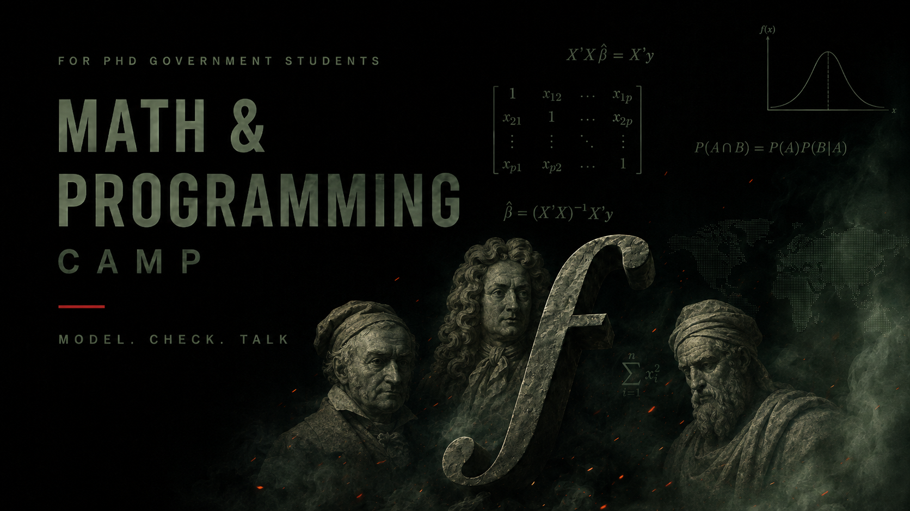

```{=html}
<style>
/* The book title already shows in the sidebar and in the cover image itself
   -- drop the repeated H1 the auto title-block would otherwise render here.
   Scoped to this page only (a shared styles.css rule would hide it on every
   chapter page too). */
#title-block-header h1.title { display: none; }
</style>
```

{.cover-banner fig-alt="Math & Programming Camp — for PhD Government students. Model. Check. Talk."}

::: {.index-byline}
**Authors:** Parushya, Rong Qin\
**Published:** 
:::

# Welcome {.unnumbered}

This is the interactive  book for **Math and Programming Camp 2026**, built
for the incoming Government PhD cohort. 

## How to use this book

Each session is its own chapter with two sub-chapters:

- **Mathematics Slides:** the in-class Mathematics slides (also browsable on its own
  [here](slides/index.html)).
- **Programming Lecture:** — a webpage walking through the programming material with
  runnable R code, worked examples, and  interactive
  visualizations.

## Sessions

This camp runs Monday, August 17 to Friday, August 21, 2026, ahead of the
start of the Political Science PhD program. Each day pairs a math
session with a hands-on R programming session. No prior programming
experience is assumed.

### Day 1 — Talking in Mathematics / Setup

**Math:** theory, concept, measure, variable, and hypothesis; sets and
set notation (unions, intersections, subsets, sample spaces);
functions (domain, codomain, range); summation and product notation;
exponents, logarithms, and roots; solving equations and finding roots.    
**Programming — Setup:** setting up R, RStudio, Zotero, and GitHub;
basic introduction to R and RStudio; basic practices (commenting, code
chunks).  

[Slides](chapters/01-notation-functions-limits/slides.qmd) &nbsp;|&nbsp;
[Programming Lecture](chapters/01-notation-functions-limits/programming.qmd)

### Day 2 — Probability / Basics

**Math:** basic probability; compound probability; random variables
and expectation algebra; conditional expectation and the type-shift
($E[Y|X=x]$ vs. $E[Y|X]$).    
**Programming — Basics:** why programming;
R basics; objects, data types, and data structures (vectors, matrices,
lists); exercise on a real replication dataset.  

[Slides](chapters/02-probability/slides.qmd) &nbsp;|&nbsp;
[Programming Lecture](chapters/02-probability/programming.qmd)

### Day 3 — Calculus / Exploration

**Math:** limits; differentiation and optimization (first-order
conditions); integration basics; area under the curve.   
**Programming — Exploration:** data structures continued (factors and data frames);
conditionals in base R; descriptive statistics and aggregation;
exercise exploring summary statistics of the sample dataset.  

[Slides](chapters/03-calculus/slides.qmd) &nbsp;|&nbsp;
[Programming Lecture](chapters/03-calculus/programming.qmd)

### Day 4 — Linear Algebra / Mission

**Math:** matrix readings; transformations; sampling distributions;
basic derivations.  

**Programming — Mission:** housekeeping (working
directories, importing/exporting datasets, packages, YAML, code
chunks); data wrangling with dplyr and tidyr; grammar of graphics with
ggplot; why functions.  

[Slides](chapters/04-linear-algebra/slides.qmd) &nbsp;|&nbsp;
[Programming Lecture](chapters/04-linear-algebra/programming.qmd)

### Day 5 — Intro to Advanced Topics / AI

**Math:** sampling distributions; the law of large numbers and central
limit theorem, by demonstration; frequentist vs. Bayesian inference;
causality and causal inference; the road ahead.   

**Programming — AI:** coding with AI.


[Slides](chapters/05-advanced-topics/slides.qmd) &nbsp;|&nbsp;
[Programming Lecture](chapters/05-advanced-topics/programming.qmd)

**Open Discussion and Q&A:**  
Prof. [Mark Richardson ](https://www.mrichardson.info/)  
Methods' Coordinator  
Department of Government

## Acknowledgements

Thanks to Henry Watson, Ankushi Mitra, and Hashem Krayem for sharing
teaching material from previous editions of Math Camp.

