## The Big Question(s) {.smaller}


::: {.incremental}

**Does Democracy Cause Growth?**

:::


```{=html}
<div class="viz term-cards">
  <div class="term-head">
    <div class="term-head-term">Term</div>
    <div class="term-head-def">Definition</div>
    <div class="term-head-ex">Democracy → growth, cross-section 2020</div>
  </div>

  <div class="term-row fragment">
    <div class="term-badge">Theory</div>
    <div class="term-def">A set of statements involving concepts</div>
    <div class="term-ex">Democracy constrains executive predation and secures property rights → investment → growth</div>
  </div>

  <div class="term-row fragment">
    <div class="term-badge">Concept</div>
    <div class="term-def">Abstract ideas used to understand the world</div>
    <div class="term-ex">Democracy; economic growth</div>
  </div>

  <div class="term-row fragment">
    <div class="term-badge">Measure</div>
    <div class="term-def">An operational indicator of a concept</div>
    <div class="term-ex">V-Dem polyarchy index (0&ndash;1); average annual growth in log GDP per capita</div>
  </div>

  <div class="term-row fragment">
    <div class="term-badge">Unit of analysis</div>
    <div class="term-def">The entity a row describes</div>
    <div class="term-ex">The country (<em>n</em> &approx; 175)</div>
  </div>

  <div class="term-row fragment">
    <div class="term-badge">Variable</div>
    <div class="term-def">Takes different values in the given set</div>
    <div class="term-ex">polyarchy; growth; region</div>
  </div>

  <div class="term-row fragment">
    <div class="term-badge">Constant</div>
    <div class="term-def">Single value in the given set</div>
    <div class="term-ex">The year (2020); the planet; anything time-varying</div>
  </div>
</div>

<style>
.term-cards {
  max-width: 100%;
  font-size: 0.42em;
  display: flex;
  flex-direction: column;
  gap: 4px;
}
.term-cards .term-head,
.term-cards .term-row {
  display: grid;
  grid-template-columns: 16% 32% 52%;
  gap: 14px;
  align-items: center;
  padding: 8px 12px;
  border-radius: 8px;
}
.term-cards .term-head {
  font-weight: 600;
  letter-spacing: .04em;
  text-transform: uppercase;
  font-size: 0.85em;
  color: #5A6B80;
  border-bottom: 2px solid #D9E0EA;
  padding-bottom: 10px;
}
.term-cards .term-row {
  background: #F7F8FA;
  border: 1px solid #EDF0F5;
}
.term-cards .term-badge {
  display: inline-block;
  background: #2b6cb0;
  color: #fff;
  font-weight: 600;
  text-align: center;
  border-radius: 999px;
  padding: 5px 10px;
}
.term-cards .term-def {
  color: #22303F;
}
.term-cards .term-ex {
  color: #5A6B80;
}
</style>
```

## Hypotheses {.smaller}

**Hypothesis:** a testable statement, derived from a theory, about the expected relationship between concepts or variables.

```{=html}
<div class="viz hyp-cards">
  <div class="hyp-head">
    <div class="hyp-head-type">Hypothesis</div>
    <div class="hyp-head-stmt">Statement</div>
  </div>

  <div class="hyp-row fragment">
    <div class="hyp-badge">Theoretical</div>
    <div class="hyp-stmt">Democracy causes higher economic growth</div>
  </div>

  <div class="hyp-row fragment">
    <div class="hyp-badge">Empirical</div>
    <div class="hyp-stmt">Countries with higher democracy scores have higher average growth</div>
  </div>

  <div class="hyp-row fragment">
    <div class="hyp-badge">Null</div>
    <div class="hyp-stmt">Average growth is the same in both groups</div>
  </div>

  <div class="hyp-row fragment">
    <div class="hyp-badge">Rival</div>
    <div class="hyp-stmt">Growth causes democracy &mdash; same correlation, opposite arrow</div>
  </div>
</div>

<style>
.hyp-cards {
  max-width: 100%;
  font-size: 0.5em;
  display: flex;
  flex-direction: column;
  gap: 6px;
}
.hyp-cards .hyp-head,
.hyp-cards .hyp-row {
  display: grid;
  grid-template-columns: 20% 80%;
  gap: 16px;
  align-items: center;
  padding: 10px 14px;
  border-radius: 8px;
}
.hyp-cards .hyp-head {
  font-weight: 600;
  letter-spacing: .04em;
  text-transform: uppercase;
  font-size: 0.85em;
  color: #5A6B80;
  border-bottom: 2px solid #D9E0EA;
  padding-bottom: 10px;
}
.hyp-cards .hyp-row {
  background: #F7F8FA;
  border: 1px solid #EDF0F5;
}
.hyp-cards .hyp-badge {
  display: inline-block;
  background: #2b6cb0;
  color: #fff;
  font-weight: 600;
  text-align: center;
  border-radius: 999px;
  padding: 6px 12px;
}
.hyp-cards .hyp-stmt {
  color: #22303F;
}
</style>
```

## Hence, theory to empirics {.smaller}

::: {.incremental}
-   **Theory:** (simplified) a set of statements that involve concepts.
-   **Concept:** abstract ideas used to understand the world.
-   **Measure:** an operational indicator of a concept
-   **Variable:** A concept or measure that takes different values in a given set.
-   **Constant:** A concept or measure that has a single value for a given set.
-   **Hypothesis:** a testable statement, derived from a theory, about the expected relationship between concepts or variables.
-   **Let's hear some ideas from your research areas!**
:::

## Sets

*Reading a dataset as a set, and the union/intersection operations we can do on it.*

## Democracy and Growth {.smaller}


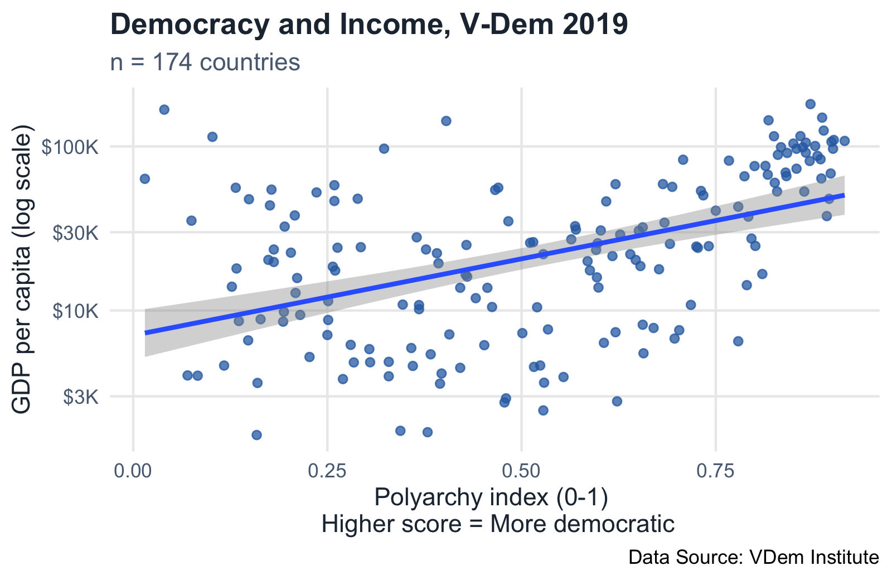

Polyarchy (our **measure** of democracy) vs. GDP per capita, one dot per country. $n = 174$.

## The Same Data, as Sets {.smaller}

```{=html}
<div class="viz viz-scatter-to-sets">
  <div class="sts-layout">
    <div class="sts-plot-col">
      <svg class="sts-svg" viewBox="0 0 480 300" role="img" aria-label="Scatterplot of polyarchy vs GDP per capita for 174 countries, with 8 countries highlighted"></svg>
      <div class="sts-caption">Polyarchy vs. GDP per capita, V-Dem 2019. n = 174.</div>
    </div>
    <div class="sts-sets-col">
      <div class="sts-set">
        <div class="sts-set-title">Countries</div>
        <div class="sts-set-brace">{ <span class="sts-items" data-set="country"></span>, &hellip; }</div>
      </div>
      <div class="sts-set">
        <div class="sts-set-title">Polyarchy</div>
        <div class="sts-set-brace">{ <span class="sts-items" data-set="polyarchy"></span>, &hellip; }</div>
      </div>
      <div class="sts-set">
        <div class="sts-set-title">GDP per capita</div>
        <div class="sts-set-brace">{ <span class="sts-items" data-set="gdppc"></span>, &hellip; }</div>
      </div>
      <div class="sts-note">showing 8 of 174 countries</div>
    </div>
  </div>
  <div class="sts-hint">Click to split the highlighted points into three sets &rarr;</div>
</div>

<style>
.viz-scatter-to-sets { max-width: 100%; font-size: 0.6em; }
.viz-scatter-to-sets .sts-layout {
  display: flex;
  gap: 24px;
  flex: 1 1 auto;
  min-height: 0;
  align-items: stretch;
}
.viz-scatter-to-sets .sts-plot-col {
  flex: 1 1 55%;
  display: flex;
  flex-direction: column;
  min-width: 0;
}
.viz-scatter-to-sets .sts-svg {
  width: 100%;
  height: auto;
  flex: 1 1 auto;
  min-height: 0;
}
.viz-scatter-to-sets .sts-caption {
  flex: 0 0 auto;
  font-size: 0.6em;
  color: #5A6B80;
  text-align: center;
  margin-top: 4px;
}
.viz-scatter-to-sets .sts-dot {
  fill: #C7CDD6;
  opacity: 0.7;
}
.viz-scatter-to-sets .sts-dot-hl {
  stroke: #fff;
  stroke-width: 1;
  transition: r 0.4s ease, filter 0.4s ease;
}
.viz-scatter-to-sets .sts-dot-label {
  font-size: 9px;
  font-weight: 700;
  fill: #22303F;
}
.viz-scatter-to-sets .sts-axis {
  stroke: #D9E0EA;
  stroke-width: 1;
}
.viz-scatter-to-sets .sts-tick {
  font-size: 8px;
  fill: #5A6B80;
}

.viz-scatter-to-sets .sts-sets-col {
  flex: 1 1 45%;
  display: flex;
  flex-direction: column;
  justify-content: center;
  gap: 10px;
  min-width: 0;
}
.viz-scatter-to-sets .sts-set-title {
  font-size: 0.65em;
  font-weight: 600;
  letter-spacing: .04em;
  text-transform: uppercase;
  color: #5A6B80;
}
.viz-scatter-to-sets .sts-set-brace {
  font-size: 0.75em;
  color: #22303F;
  background: #F7F8FA;
  border: 1px solid #EDF0F5;
  border-radius: 8px;
  padding: 6px 10px;
  min-height: 1.6em;
}
.viz-scatter-to-sets .sts-item {
  display: inline-block;
  opacity: 0;
  transform: translateY(6px);
  transition: opacity 0.4s ease, transform 0.4s ease;
  transition-delay: calc(var(--i) * 90ms);
}
.viz-scatter-to-sets .sts-item::after {
  content: ", ";
  color: #5A6B80;
}
.viz-scatter-to-sets .sts-item:last-child::after {
  content: "";
}
.viz-scatter-to-sets .sts-item .sts-badge {
  display: inline-block;
  background: #2b6cb0;
  color: #fff;
  border-radius: 999px;
  font-size: 0.8em;
  width: 1.3em;
  height: 1.3em;
  line-height: 1.3em;
  text-align: center;
  margin-right: 3px;
}
.viz-scatter-to-sets .sts-note {
  font-size: 0.55em;
  color: #5A6B80;
  font-style: italic;
}

.viz-scatter-to-sets .sts-hint {
  flex: 0 0 auto;
  text-align: center;
  font-size: 0.6em;
  color: #5A6B80;
  margin-top: 8px;
  cursor: pointer;
}

.viz-scatter-to-sets.sts-revealed .sts-item {
  opacity: 1;
  transform: translateY(0);
}
.viz-scatter-to-sets.sts-revealed .sts-dot-hl {
  r: 6;
  filter: drop-shadow(0 0 4px var(--hlc, #2b6cb0));
}
</style>

<script>
(function () {
  var ALL_POINTS = [
    [0.684,34308],[0.741,24668],[0.899,106746],[0.902,109451],[0.718,10820],
    [0.727,24104],[0.830,88837],[0.421,13762],[0.259,58026],[0.511,25857],
    [0.174,20346],[0.117,4619],[0.651,30629],[0.682,58956],[0.691,25458],
    [0.818,144274],[0.886,63753],[0.599,13803],[0.251,8755],[0.456,13750],
    [0.421,4474],[0.368,10796],[0.516,4533],[0.368,10187],[0.801,24750],
    [0.697,6748],[0.160,3619],[0.193,8554],[0.211,15775],[0.329,3975],
    [0.779,42896],[0.329,4867],[0.430,16082],[0.501,7280],[0.083,4007],
    [0.842,91211],[0.677,17835],[0.429,25081],[0.520,10467],[0.428,16533],
    [0.383,5408],[0.834,98923],[0.208,37955],[0.284,4827],[0.209,12790],
    [0.452,6148],[0.598,25697],[0.657,5487],[0.194,9816],[0.596,23400],
    [0.397,4132],[0.606,6354],[0.215,9400],[0.528,2461],[0.358,5907],
    [0.304,5818],[0.360,4594],[0.534,7669],[0.407,7151],[0.850,104068],
    [0.825,115340],[0.656,32139],[0.159,1743],[0.790,14275],[0.379,1813],
    [0.829,53121],[0.893,37622],[0.703,7587],[0.617,21463],[0.866,91636],
    [0.878,100560],[0.597,15925],[0.181,23538],[0.393,19391],[0.887,149770],
    [0.854,73132],[0.260,17520],[0.826,60021],[0.621,7374],[0.623,2796],
    [0.480,2915],[0.570,31125],[0.653,18664],[0.257,18495],[0.866,105434],
    [0.731,53534],[0.462,10506],[0.040,167513],[0.554,3934],[0.871,81503],
    [0.136,8627],[0.725,24531],[0.289,47988],[0.528,22043],[0.854,96727],
    [0.896,47918],[0.293,24322],[0.347,10867],[0.796,27448],[0.195,32471],
    [0.259,46491],[0.280,6176],[0.270,3822],[0.075,35272],[0.344,1849],
    [0.250,7090],[0.251,11417],[0.569,32642],[0.070,4021],[0.377,23549],
    [0.524,4622],[0.627,29006],[0.529,3632],[0.810,16689],[0.236,52424],
    [0.441,11894],[0.127,13965],[0.263,24137],[0.478,2753],[0.588,17553],
    [0.647,20338],[0.227,5210],[0.148,6578],[0.564,27126],[0.133,18037],
    [0.164,8843],[0.395,3584],[0.787,65763],[0.149,47662],[0.203,22516],
    [0.862,98753],[0.132,55987],[0.792,37336],[0.901,96770],[0.515,26094],
    [0.609,46229],[0.305,4837],[0.734,50321],[0.181,19759],[0.840,69276],
    [0.800,75901],[0.916,108005],[0.178,54551],[0.898,68392],[0.391,22338],
    [0.881,87580],[0.864,53067],[0.640,22018],[0.859,115552],[0.708,82950],
    [0.323,96897],[0.817,67225],[0.872,181069],[0.602,30736],[0.470,56016],
    [0.767,81913],[0.694,56700],[0.483,34992],[0.885,83507],[0.889,124864],
    [0.176,43703],[0.585,19990],[0.750,40590],[0.670,7829],[0.015,63454],
    [0.365,27929],[0.621,58857],[0.403,142915],[0.841,65901],[0.814,76072],
    [0.656,8192],[0.779,6496],[0.102,114381],[0.466,54310]
  ];

  var SAMPLE = [
    { country: "Saudi Arabia",   polyarchy: 0.01, gdppc: 63454 },
    { country: "Thailand",       polyarchy: 0.21, gdppc: 37955 },
    { country: "DR Congo",       polyarchy: 0.34, gdppc: 1849 },
    { country: "Hungary",        polyarchy: 0.47, gdppc: 54310 },
    { country: "N. Macedonia",   polyarchy: 0.60, gdppc: 30736 },
    { country: "Tunisia",        polyarchy: 0.72, gdppc: 24531 },
    { country: "Cyprus",         polyarchy: 0.84, gdppc: 69276 },
    { country: "Denmark",        polyarchy: 0.92, gdppc: 108005 }
  ];

  var wrappers = document.querySelectorAll('.viz-scatter-to-sets');
  var wrapper = wrappers[wrappers.length - 1];
  var svg = wrapper.querySelector('.sts-svg');
  var hint = wrapper.querySelector('.sts-hint');
  var svgNS = 'http://www.w3.org/2000/svg';

  var margin = { top: 14, right: 14, bottom: 26, left: 34 };
  var W = 480, H = 300;
  var plotW = W - margin.left - margin.right;
  var plotH = H - margin.top - margin.bottom;

  var logs = ALL_POINTS.map(function (p) { return Math.log10(p[1]); });
  var logMin = Math.min.apply(null, logs);
  var logMax = Math.max.apply(null, logs);

  function x(polyarchy) { return margin.left + polyarchy * plotW; }
  function y(gdppc) {
    var t = (Math.log10(gdppc) - logMin) / (logMax - logMin);
    return margin.top + plotH - t * plotH;
  }

  function el(tag, attrs) {
    var e = document.createElementNS(svgNS, tag);
    for (var k in attrs) e.setAttribute(k, attrs[k]);
    return e;
  }

  // axes
  svg.appendChild(el('line', { class: 'sts-axis', x1: margin.left, y1: H - margin.bottom, x2: W - margin.right, y2: H - margin.bottom }));
  svg.appendChild(el('line', { class: 'sts-axis', x1: margin.left, y1: margin.top, x2: margin.left, y2: H - margin.bottom }));
  [0, 0.25, 0.5, 0.75, 1].forEach(function (v) {
    var t = el('text', { class: 'sts-tick', x: x(v), y: H - margin.bottom + 12, 'text-anchor': 'middle' });
    t.textContent = v;
    svg.appendChild(t);
  });

  // 174 faint dots
  ALL_POINTS.forEach(function (p) {
    svg.appendChild(el('circle', { class: 'sts-dot', cx: x(p[0]), cy: y(p[1]), r: 2 }));
  });

  var COLORS = ['#2b6cb0', '#e53e3e', '#38a169', '#d69e2e', '#805ad5', '#dd6b20', '#319795', '#d53f8c'];

  // 8 highlighted dots + numbers, one distinct color per point
  SAMPLE.forEach(function (s, i) {
    var color = COLORS[i % COLORS.length];
    var dot = el('circle', {
      class: 'sts-dot-hl', cx: x(s.polyarchy), cy: y(s.gdppc), r: 4,
      fill: color, 'fill-opacity': 0.4
    });
    dot.style.setProperty('--hlc', color);
    svg.appendChild(dot);
    var t = el('text', { class: 'sts-dot-label', x: x(s.polyarchy) + 6, y: y(s.gdppc) - 6, fill: color });
    t.textContent = i + 1;
    svg.appendChild(t);
  });

  function fmtGdp(v) {
    return '$' + (v / 1000).toFixed(1) + 'k';
  }

  function fillSet(name, formatter) {
    var target = wrapper.querySelector('.sts-items[data-set="' + name + '"]');
    SAMPLE.forEach(function (s, i) {
      var span = document.createElement('span');
      span.className = 'sts-item';
      span.style.setProperty('--i', i);
      span.innerHTML = '<span class="sts-badge" style="background:' + COLORS[i % COLORS.length] + '">' + (i + 1) + '</span>' + formatter(s);
      target.appendChild(span);
    });
  }

  fillSet('country', function (s) { return s.country; });
  fillSet('polyarchy', function (s) { return s.polyarchy.toFixed(2); });
  fillSet('gdppc', function (s) { return fmtGdp(s.gdppc); });

  wrapper.addEventListener('click', function () {
    var on = wrapper.classList.toggle('sts-revealed');
    hint.textContent = on
      ? '← Click to collapse the sets'
      : 'Click to split the highlighted points into three sets →';
  });
})();
</script>
```

## All the Values It Could Take {.smaller}

::: {.incremental}
-   Every dot's polyarchy score is *some* value between 0 and 1.
-   The full range of values it **could** take — before we see any particular country — is its **sample space**.
-   Same idea for GDP per capita: some positive number, no fixed upper bound in principle.
-   Political scientists build claims about *all* of this range, not just the countries plotted here.
:::

## From the Picture to Notation {.smaller}

::: {.incremental}
-   Polyarchy $\in [0,1]$ — the sample space, written formally.
-   Each dot: one **unit of analysis** (a country), with a polyarchy value and a GDP value.
-   The threshold used to split "democracies" from "non-democracies": $D = 1\{\text{polyarchy} > 0.5\}$.
-   Where did 0.5 come from? *(open question — we'll come back to this)*
-   To make statements like this precise, we need the formal language of **sets**.
:::

## Sets and Sample Spaces {.smaller}

::: {.incremental}
-   A *set* is a collection of elements.
-   **Common sets:** Natural numbers ($\mathbb{N}$), Integers ($\mathbb{Z}$), Rational numbers ($\mathbb{Q}$), Real numbers ($\mathbb{R}$), etc.
-   A set can be:
    -   **Finite or infinite:** $\mathbb{Z}$ is infinite, but all the integers from 1 to 10 is finite.
    -   **Countable or uncountable:** a countable set is one whose each of its elements can be associated with a natural number (or an integer).
    -   **Bounded or unbounded:** A bounded set has finite size (but may have infinite elements).
-   Some important sets that we are going to use as political scientists:
    -   **Solution set:** a set that contains all solutions for an equation
    -   **Sample space:** a set that contains all values that a variable can take.
:::

```{=html}
<div class="running-example-note">&#8618; Running example: our sample space is &Omega; = {174 countries}; each country's polyarchy score is one element of [0,1].</div>
```

## Unions and Intersections {.smaller}

::: {.incremental}
-   Much as sets contain elements, they also can contain, and be contained by, other sets.
-   Notation:
    -   $A \subset B$: "A is a **proper subset** of B" implies that set B contains all the elements in A, plus at least one more
    -   $A \subseteq B$: "A is a **subset** of B". In this case, it allows A and B to be the same.
-   **Intersection:** $A \cap B$. The set of elements common to two sets.
-   **Union:** $A \cup B$. The set that contains all elements in both sets.
-   **Mutually exclusive sets:** the intersection is the empty set.
:::

```{=html}
<div class="running-example-note">&#8618; Running example: {polyarchy &gt; 0.5} &cap; {GDP per capita &gt; $30k} &mdash; the overlap our hypothesis is really about.</div>
```

## $A \subset B$ (Proper Subset) {.smaller}

::: {.incremental}
```{=html}
<div class="viz venn-subset">
<svg class="viz-plot" viewBox="0 0 300 220" role="img" aria-label="Circle A entirely inside circle B">
  <circle cx="150" cy="115" r="95" fill="#8a8f98"/>
  <circle cx="150" cy="115" r="46" fill="#2b6cb0"/>
  <text x="150" y="26" text-anchor="middle" font-size="20" fill="#22303F">B</text>
  <text x="150" y="120" text-anchor="middle" font-size="20" fill="#fff">A</text>
</svg>
</div>
<style>.venn-subset { max-width: 340px; margin: 0 auto; }</style>
```

```{=html}
<div class="running-example-note">&#8618; Running example: {Nordic democracies} &sub; {polyarchy &gt; 0.5} &mdash; a proper subset of our "democracies."</div>
```
:::

## $A \cap B$ (Intersection) {.smaller}

::: {.incremental}
```{=html}
<div class="viz venn-intersection">
<svg class="viz-plot" viewBox="0 0 320 200" role="img" aria-label="Two overlapping circles A and B with their intersection highlighted">
  <circle cx="130" cy="100" r="80" fill="#2b6cb0" fill-opacity="0.6"/>
  <circle cx="210" cy="100" r="80" fill="#8a8f98" fill-opacity="0.6"/>
  <text x="80" y="35" font-size="20" fill="#22303F">A</text>
  <text x="250" y="35" font-size="20" fill="#22303F">B</text>
  <text x="170" y="105" text-anchor="middle" font-size="16" fill="#fff">A∩B</text>
</svg>
</div>
<style>.venn-intersection { max-width: 360px; margin: 0 auto; }</style>
```

```{=html}
<div class="running-example-note">&#8618; Running example: {high polyarchy} &cap; {high GDP per capita} &mdash; exactly the cell selection bias is about.</div>
```
:::

## $A \cup B$ (Union) {.smaller}

::: {.incremental}
```{=html}
<div class="viz venn-union">
<svg class="viz-plot" viewBox="0 0 320 220" role="img" aria-label="Two overlapping circles A and B, both fully shaded to represent their union">
  <circle cx="130" cy="110" r="80" fill="#2b6cb0"/>
  <circle cx="210" cy="110" r="80" fill="#2b6cb0"/>
  <text x="80" y="35" font-size="20" fill="#22303F">A</text>
  <text x="250" y="35" font-size="20" fill="#22303F">B</text>
  <text x="170" y="18" text-anchor="middle" font-size="16" fill="#22303F">A∪B</text>
</svg>
</div>
<style>.venn-union { max-width: 360px; margin: 0 auto; }</style>
```

```{=html}
<div class="running-example-note">&#8618; Running example: {high polyarchy} &cup; {high GDP per capita} &mdash; every country in at least one of our comparison groups.</div>
```
:::

## $A \cap B = \emptyset$ (Mutually Exclusive) {.smaller}

::: {.incremental}
```{=html}
<div class="viz venn-disjoint">
<svg class="viz-plot" viewBox="0 0 340 200" role="img" aria-label="Two separate, non-overlapping circles A and B">
  <circle cx="90" cy="100" r="70" fill="#2b6cb0"/>
  <circle cx="260" cy="100" r="70" fill="#8a8f98"/>
  <text x="90" y="35" text-anchor="middle" font-size="20" fill="#22303F">A</text>
  <text x="260" y="35" text-anchor="middle" font-size="20" fill="#22303F">B</text>
</svg>
</div>
<style>.venn-disjoint { max-width: 380px; margin: 0 auto; }</style>
```

```{=html}
<div class="running-example-note">&#8618; Running example: {D=1} and {D=0} are mutually exclusive &mdash; a country can't be on both sides of the polyarchy &gt; 0.5 threshold.</div>
```
:::

## Essential Math Refresher

*Levels of measurement, arithmetic, notation, and sequences — the toolkit everything else builds on.*

## Levels of Measurement {.smaller}

Four levels, each subsuming the ones below it (Moore & Siegel 2013, ch. 1):

::: {.incremental}
-   **Nominal**: differences of *kind* only — $<, \le, =, \ge, >$ have no meaning.
    -   e.g. gender, party affiliation
-   **Ordinal**: differences of *degree*, with meaningful order ($<, \le, =, \ge, >$ apply) — but distance between values isn't constant, so addition/subtraction don't make sense.
    -   e.g. self-placed ideology (far left … far right)
-   **Interval**: order *and* a constant distance between values — addition/subtraction are meaningful, but zero isn't.
    -   e.g. feeling thermometer (0–100; 0 isn't "no feeling")
-   **Ratio**: interval, plus a meaningful zero — multiplication/division (ratios) are also meaningful.
    -   e.g. government spending, event counts (wars, vetoes)
-   Discrete vs. continuous cuts across interval/ratio: discrete = countable, continuous = not.
:::

## Why it Matters {.smaller}

::: {.incremental}
-   Visualization
    -   Categorical: pie charts, bar charts
    -   Numerical (especially continuous): histograms, box plots
-   Analysis
    -   Numerical data can use summary statistics (mean, median, standard deviation)
    -   Categorical – Categorical: cross-tabulation
    -   Categorical – Continuous: difference in means
    -   Continuous – Continuous: scatter plots, regression
:::

## Quick Drill: Levels of Measurement {.smaller}

What level of measurement is each? Click to check.

::: {.incremental}
-   Highest level of education (1 = some high school, …, 5 = postgraduate) — [**ordinal**, discrete: ordered, but the gap between levels isn't constant.]{.fragment}
-   Annual income — [**ratio**, continuous: constant distances, and \$0 means no income.]{.fragment}
-   Vote choice among Bush, Clinton, and Perot — [**nominal**: categories, no ordering.]{.fragment}
-   Absence/presence of a militarized interstate dispute — [**nominal** (binary): a difference of kind, not degree.]{.fragment}
-   Number of wars a country has participated in — [**ratio**, discrete: an event count — 0 means none, and 4 is twice 2.]{.fragment}
:::

## Basic Properties of Arithmetic {.smaller}

For variables that stand for real numbers or integers, these properties will always hold:

::: {.incremental}
-   **Associative properties:**
    -   $(a+b)+c=a+(b+c)$
    -   $(a \cdot b)\cdot c=a \cdot (b \cdot c)$
-   **Commutative properties:**
    -   $a+b=b+a$
    -   $a \cdot b = b \cdot a$
-   **Distributive properties:**
    -   $a \cdot (b+c)=ab+ac$
-   **Identity properties:**
    -   $a+0=a$
    -   $a \cdot 1 = a$
-   **Inverse properties (for real numbers, not integers):**
    -   $(-a) + a = 0$
    -   $a^{-1} \cdot a = 1$
:::

## Order of Operations {.smaller}

**PEMDAS:**

::: {.incremental}
-   Parentheses ()
-   Exponents ($x^{n}$)
-   Multiplication ($\cdot$)
-   Division ($\div$)
-   Addition ($+$)
-   Subtraction ($-$)
:::

## Examples: Order of Operations {.smaller}

::: {.incremental}
-   $2 + 3 \times 4$ = [$2 + 12 = 14$]{.fragment}
-   $(2 + 3) \times 4$ = [$5 \times 4 = 20$]{.fragment}
-   $10 - 2^2 \times 3$ = [$10 - 4 \times 3 = 10 - 12 = -2$]{.fragment}
-   $\dfrac{8 + 4}{2 \times 3}$ = [$\dfrac{12}{6} = 2$]{.fragment}
:::

## Inequalities {.smaller}

::: {.incremental}
-   All pairs of real numbers have exactly one of the following relations: $x=y$, $x>y$, or $x<y$.
-   Solving inequalities is similar to solving equations, but there are a few extra properties.
-   Adding any number to each side of these relations will not change them; this includes inequalities.
-   Multiplication:
    -   If $a$ is positive and $x>y$, then $ax>ay$.
    -   If $a$ is negative and $x>y$, then $ax<ay$.
-   Division:
    -   If $a$ is positive and $x>y$, then $\frac{x}{a}>\frac{y}{a}$.
    -   If $a$ is negative and $x>y$, then $\frac{x}{a}<\frac{y}{a}$.
:::

## Examples: Inequalities {.smaller}

::: {.incremental}
-   Solve $3x - 2 > 10$: [add 2 to both sides, then divide by 3 (positive, keeps direction): $x > 4$.]{.fragment}
-   Solve $-2x \le 8$: [divide both sides by $-2$ (negative, flips direction): $x \ge -4$.]{.fragment}
-   Is $-5 < -2$? [Yes — on the number line, $-5$ sits to the left of $-2$.]{.fragment}
:::

## Sequences and Series {.smaller}

::: {.incremental}
-   A **sequence** is an ordered list of numbers, $x_1, x_2, x_3, \dots$
    -   Finite, e.g. $5, 10, 15, 20, 25$
    -   Infinite, e.g. $1, 2, 3, 4, \dots$
-   A **series** is the sum of a sequence.
    -   Written $\sum\limits_{i=1}^{N} x_i$: add the terms starting at $x_1$ and stopping at $x_N$.
    -   For an infinite sequence, $N = \infty$.
:::

## Examples: Sequences and Series {.smaller}

::: {.incremental}
-   The sequence of the first 5 even numbers: [$2, 4, 6, 8, 10$]{.fragment}
-   The corresponding series (sum of that sequence): [$2+4+6+8+10 = 30$, i.e. $\sum\limits_{i=1}^{5} 2i = 30$]{.fragment}
-   A country's polyarchy score each year is a **sequence** indexed by year; summing it over a decade gives a **series**.
:::

<!--
The sections below (through "Checking Our Work Graphically") cover the
same topics as IQSS's "prefresher" course notes, functions chapter:
https://github.com/IQSS/prefresher/blob/main/02_functions.qmd (GPLv3
licensed). Content here is written independently in this deck's own voice
and slide format, not copied verbatim -- credit to the IQSS prefresher
authors for the topic selection and pedagogical structure this draws on.
-->

## Notations

- Summation

- Product

- Factorial


## Summation Notation {.smaller}

::: {.incremental}
-   Writing out a long sum term by term gets unwieldy fast — summation notation is shorthand for "add up a pattern."
-   $\sum\limits_{i=1}^{n} x_i = x_1 + x_2 + \cdots + x_n$
-   The number below $\sum$ is where the index $i$ starts; the number above is where it stops. Everything to the right (which must involve $i$) is what gets added at each step.
:::

## Rules of Summation {.smaller}

::: {.incremental}
-   $\sum\limits_{i=1}^{n} c\,x_i = c\sum\limits_{i=1}^{n} x_i$ — a constant factor can be pulled out front.
-   $\sum\limits_{i=1}^{n} (x_i + y_i) = \sum\limits_{i=1}^{n} x_i + \sum\limits_{i=1}^{n} y_i$ — a sum of sums splits apart.
-   $\sum\limits_{i=1}^{n} c = nc$ — adding the same constant $n$ times is just $n$ times that constant.
:::

## Product Notation {.smaller}

::: {.incremental}
-   $\prod$ works the same way as $\sum$, but multiplies instead of adds: $\prod\limits_{i=1}^{n} x_i = x_1 \cdot x_2 \cdots x_n$
-   $\prod\limits_{i=1}^{n} c\,x_i = c^{n}\prod\limits_{i=1}^{n} x_i$ — pulling out a constant costs you an exponent $n$, since it's multiplied in $n$ times.
-   $\prod\limits_{i=1}^{n} c = c^{n}$
-   Unlike summation, $\prod\limits_{i=1}^{n} (x_i + y_i)$ does **not** simplify nicely — multiplication doesn't distribute across a sum of sequences the way addition distributes across sums.
:::

## Factorials and Modulo {.smaller}

::: {.incremental}
-   **Factorial:** $x! = x \cdot (x-1) \cdot (x-2) \cdots 1$ — multiply a whole number down to 1.
-   **Modulo:** the remainder left over after division.
    -   $17 \bmod 3 = 2$ (since $17 = 5\times3 + 2$)
    -   $100 \bmod 30 = 10$
:::

## Quick Drill: Operators {.smaller}

Work these out, then click to check.

::: {.incremental}
-   $\sum\limits_{i=1}^{5} i$ = [$1+2+3+4+5 = 15$]{.fragment}
-   $\prod\limits_{i=1}^{5} i$ = [$1\times2\times3\times4\times5 = 120$]{.fragment}
-   $14 \bmod 4$ = [$2$]{.fragment}
-   $4!$ = [$4\times3\times2\times1 = 24$]{.fragment}
:::

## Functions

*Mappings between sets, domain and range, and the shapes a relationship can take.*

## Functions as Mappings {.smaller}

::: {.incremental}
-   A **function** maps every element of one set (the input) to exactly one element of another set (the output) — never to more than one.
-   What a function can *never* do is send a single input to two different outputs — that's the one property that actually defines "function."
:::

## Function or Not? — Visualized {.smaller}

```{=html}
<div class="viz function-check-map">
  <div class="fcm-panel">
    <svg class="viz-plot" viewBox="0 0 240 200" role="img" aria-label="A valid function: each of three inputs points to exactly one output, though two inputs share the same output">
      <text x="120" y="20" text-anchor="middle" font-size="14" font-weight="700" fill="#22303F">Valid function</text>
      <circle cx="60" cy="60" r="4" fill="#22303F"/><text x="40" y="55" font-size="12" fill="#22303F">x&#8321;</text>
      <circle cx="60" cy="100" r="4" fill="#22303F"/><text x="40" y="105" font-size="12" fill="#22303F">x&#8322;</text>
      <circle cx="60" cy="140" r="4" fill="#22303F"/><text x="40" y="145" font-size="12" fill="#22303F">x&#8323;</text>
      <circle cx="180" cy="80" r="4" fill="#2b6cb0"/><text x="192" y="75" font-size="12" fill="#2b6cb0">y&#8321;</text>
      <circle cx="180" cy="140" r="4" fill="#2b6cb0"/><text x="192" y="145" font-size="12" fill="#2b6cb0">y&#8322;</text>
      <line x1="64" y1="60" x2="176" y2="80" stroke="#5A6B80" stroke-width="1.5" marker-end="url(#fcm-arrow-ok)"/>
      <line x1="64" y1="100" x2="176" y2="80" stroke="#5A6B80" stroke-width="1.5" marker-end="url(#fcm-arrow-ok)"/>
      <line x1="64" y1="140" x2="176" y2="140" stroke="#5A6B80" stroke-width="1.5" marker-end="url(#fcm-arrow-ok)"/>
      <defs><marker id="fcm-arrow-ok" markerWidth="8" markerHeight="8" refX="6" refY="3" orient="auto"><path d="M0,0 L6,3 L0,6 Z" fill="#5A6B80"/></marker></defs>
    </svg>
  </div>
  <div class="fcm-panel">
    <svg class="viz-plot" viewBox="0 0 240 200" role="img" aria-label="Not a function: one input points to two different outputs">
      <text x="120" y="20" text-anchor="middle" font-size="14" font-weight="700" fill="#B23A48">Not a function</text>
      <circle cx="60" cy="60" r="4" fill="#22303F"/><text x="40" y="55" font-size="12" fill="#22303F">x&#8321;</text>
      <circle cx="60" cy="100" r="4" fill="#22303F"/><text x="40" y="105" font-size="12" fill="#22303F">x&#8322;</text>
      <circle cx="60" cy="140" r="4" fill="#22303F"/><text x="40" y="145" font-size="12" fill="#22303F">x&#8323;</text>
      <circle cx="180" cy="70" r="4" fill="#B23A48"/><text x="192" y="65" font-size="12" fill="#B23A48">y&#8321;</text>
      <circle cx="180" cy="110" r="4" fill="#B23A48"/><text x="192" y="115" font-size="12" fill="#B23A48">y&#8322;</text>
      <circle cx="180" cy="150" r="4" fill="#2b6cb0"/><text x="192" y="155" font-size="12" fill="#2b6cb0">y&#8323;</text>
      <line x1="64" y1="60" x2="176" y2="70" stroke="#B23A48" stroke-width="1.5" marker-end="url(#fcm-arrow-bad)"/>
      <line x1="64" y1="60" x2="176" y2="110" stroke="#B23A48" stroke-width="1.5" marker-end="url(#fcm-arrow-bad)"/>
      <line x1="64" y1="140" x2="176" y2="150" stroke="#5A6B80" stroke-width="1.5" marker-end="url(#fcm-arrow-bad2)"/>
      <defs>
        <marker id="fcm-arrow-bad" markerWidth="8" markerHeight="8" refX="6" refY="3" orient="auto"><path d="M0,0 L6,3 L0,6 Z" fill="#B23A48"/></marker>
        <marker id="fcm-arrow-bad2" markerWidth="8" markerHeight="8" refX="6" refY="3" orient="auto"><path d="M0,0 L6,3 L0,6 Z" fill="#5A6B80"/></marker>
      </defs>
    </svg>
  </div>
</div>
<style>
.function-check-map { display: flex; gap: 1.5rem; justify-content: center; flex-wrap: wrap; }
.fcm-panel { max-width: 280px; }
</style>
```

$x_1$ pointing to both $y_1$ and $y_2$ is what breaks it — everything else about the diagram (shared outputs, an unused $y$) is still fine for a function.

## Graph Examples {.smaller}

In which of these graphs can we observe a function?

::: {layout-ncol="2"}
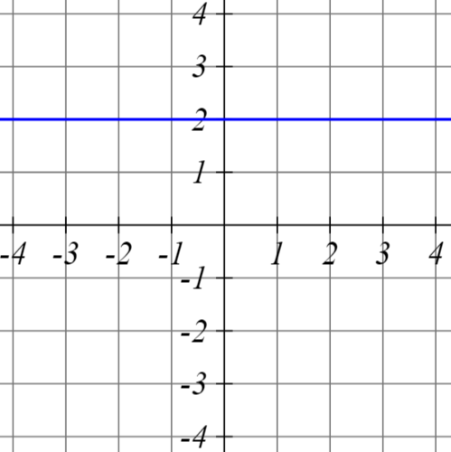

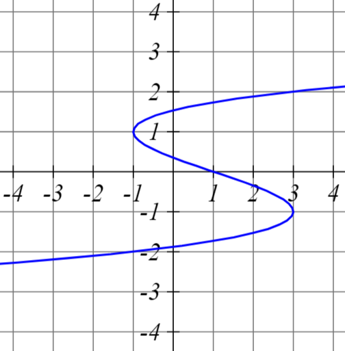

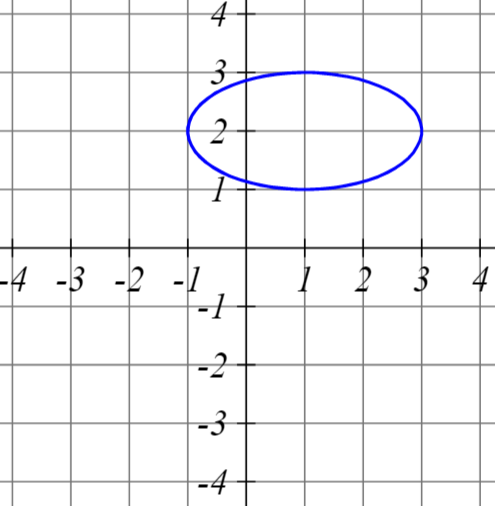

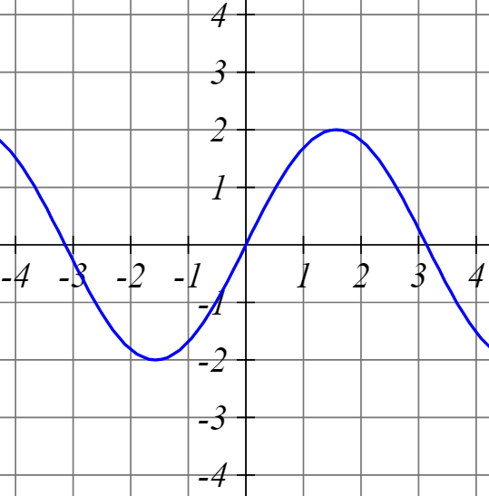
:::

## Graph Examples — Answer {.smaller}

**a)** and **d)** are functions — for every $x$ there's exactly one $y$.

::: {layout-ncol="2"}


:::

## Domain, Range, and Image {.smaller}

::: {.incremental}
-   **Domain:** the set of inputs where $f(x)$ is actually defined.
-   **Range** (or **image**): the set of outputs $f$ actually produces, $f(X) = \{y : y = f(x),\, x \in X\}$.
-   Some functions aren't defined everywhere — e.g. $f(x) = \sqrt{x}$ has domain $[0,\infty)$, not all of $\mathbb{R}^1$.
:::

## Domain, Codomain, and Range — Visualized {.smaller}

```{=html}
<div class="viz drc-map">
<svg class="viz-plot" viewBox="0 0 500 280" role="img" aria-label="A function f mapping four points in the domain A to points in the codomain B; the range is the subset of the codomain that is actually hit, smaller than the full codomain">
  <circle cx="120" cy="140" r="90" fill="#8a8f98" fill-opacity="0.35" stroke="#8a8f98" stroke-width="2"/>
  <text x="120" y="38" text-anchor="middle" font-size="16" font-weight="700" fill="#22303F">Domain (A)</text>

  <circle cx="380" cy="140" r="100" fill="#EDF0F5" stroke="#D9E0EA" stroke-width="2"/>
  <text x="380" y="28" text-anchor="middle" font-size="16" font-weight="700" fill="#22303F">Codomain (B)</text>

  <ellipse cx="362" cy="143" rx="55" ry="72" fill="#2b6cb0" fill-opacity="0.18" stroke="#2b6cb0" stroke-width="2" stroke-dasharray="5,4"/>
  <text x="362" y="235" text-anchor="middle" font-size="14" font-weight="700" fill="#2b6cb0">Range</text>

  <line x1="98" y1="90" x2="332" y2="90" stroke="#5A6B80" stroke-width="1.5" marker-end="url(#drc-arrow)"/>
  <line x1="98" y1="140" x2="332" y2="90" stroke="#5A6B80" stroke-width="1.5" marker-end="url(#drc-arrow)"/>
  <line x1="98" y1="190" x2="332" y2="150" stroke="#5A6B80" stroke-width="1.5" marker-end="url(#drc-arrow)"/>
  <line x1="150" y1="140" x2="392" y2="190" stroke="#5A6B80" stroke-width="1.5" marker-end="url(#drc-arrow)"/>

  <defs>
    <marker id="drc-arrow" markerWidth="8" markerHeight="8" refX="6" refY="3" orient="auto">
      <path d="M0,0 L6,3 L0,6 Z" fill="#5A6B80"/>
    </marker>
  </defs>

  <circle cx="90" cy="90" r="5" fill="#22303F"/>
  <text x="78" y="78" font-size="13" fill="#22303F">x₁</text>
  <circle cx="90" cy="140" r="5" fill="#22303F"/>
  <text x="78" y="128" font-size="13" fill="#22303F">x₂</text>
  <circle cx="90" cy="190" r="5" fill="#22303F"/>
  <text x="78" y="212" font-size="13" fill="#22303F">x₃</text>
  <circle cx="150" cy="140" r="5" fill="#22303F"/>
  <text x="156" y="132" font-size="13" fill="#22303F">x₄</text>

  <circle cx="340" cy="90" r="5" fill="#2b6cb0"/>
  <text x="316" y="78" font-size="13" fill="#2b6cb0">y₁</text>
  <circle cx="340" cy="150" r="5" fill="#2b6cb0"/>
  <text x="316" y="168" font-size="13" fill="#2b6cb0">y₃</text>
  <circle cx="400" cy="190" r="5" fill="#2b6cb0"/>
  <text x="406" y="210" font-size="13" fill="#2b6cb0">y₄</text>

  <circle cx="440" cy="90" r="5" fill="#8a8f98"/>
  <text x="446" y="82" font-size="13" fill="#5A6B80">y₂</text>
  <circle cx="450" cy="150" r="5" fill="#8a8f98"/>
  <text x="456" y="142" font-size="13" fill="#5A6B80">y₅</text>
</svg>
</div>
<style>.drc-map { max-width: 560px; margin: 0 auto; }</style>
```

::: {.incremental}
-   $x_1$ and $x_2$ both map to $y_1$ — many-to-one is still a function.
-   $y_2$ and $y_5$ sit in the **codomain** but are never hit — they're not in the range.
-   **Range $\subseteq$ Codomain**, always. They're only equal when every element of $B$ gets used.
:::

## Functions and Their Characteristics {.smaller}

::: {.incremental}
-   Functions give a **specific** description of the relationship between two (or more) concepts (in theory) or variables (in data).
-   Noted as $f(x): A \to B$, read "$f$ maps $A$ into $B$."
-   $A$ is the **domain** — the set of possible $x$ values.
-   $B$ is the **codomain** — the set of possible $y$ values.
-   To be a function, there must be exactly one value in the range ($y$) for each value in the domain ($x$).
:::

## One-to-One vs. Many-to-One {.smaller}

::: {.incremental}
-   **Many-to-one:** several different inputs can share the same output — still a function.
-   **One-to-one:** every input has its own distinct output — also a function.
:::

## One-to-One vs. Many-to-One — Visualized {.smaller}

```{=html}
<div class="viz function-check-map">
  <div class="fcm-panel">
    <svg class="viz-plot" viewBox="0 0 240 200" role="img" aria-label="One-to-one: three inputs each map to their own distinct output">
      <text x="120" y="20" text-anchor="middle" font-size="14" font-weight="700" fill="#22303F">One-to-one</text>
      <circle cx="60" cy="60" r="4" fill="#22303F"/><text x="40" y="55" font-size="12" fill="#22303F">x&#8321;</text>
      <circle cx="60" cy="100" r="4" fill="#22303F"/><text x="40" y="105" font-size="12" fill="#22303F">x&#8322;</text>
      <circle cx="60" cy="140" r="4" fill="#22303F"/><text x="40" y="145" font-size="12" fill="#22303F">x&#8323;</text>
      <circle cx="180" cy="60" r="4" fill="#2b6cb0"/><text x="192" y="55" font-size="12" fill="#2b6cb0">y&#8321;</text>
      <circle cx="180" cy="100" r="4" fill="#2b6cb0"/><text x="192" y="105" font-size="12" fill="#2b6cb0">y&#8322;</text>
      <circle cx="180" cy="140" r="4" fill="#2b6cb0"/><text x="192" y="145" font-size="12" fill="#2b6cb0">y&#8323;</text>
      <line x1="64" y1="60" x2="176" y2="60" stroke="#5A6B80" stroke-width="1.5" marker-end="url(#oto-arrow)"/>
      <line x1="64" y1="100" x2="176" y2="100" stroke="#5A6B80" stroke-width="1.5" marker-end="url(#oto-arrow)"/>
      <line x1="64" y1="140" x2="176" y2="140" stroke="#5A6B80" stroke-width="1.5" marker-end="url(#oto-arrow)"/>
      <defs><marker id="oto-arrow" markerWidth="8" markerHeight="8" refX="6" refY="3" orient="auto"><path d="M0,0 L6,3 L0,6 Z" fill="#5A6B80"/></marker></defs>
    </svg>
  </div>
  <div class="fcm-panel">
    <svg class="viz-plot" viewBox="0 0 240 200" role="img" aria-label="Many-to-one: two inputs share the same output, the third has its own">
      <text x="120" y="20" text-anchor="middle" font-size="14" font-weight="700" fill="#22303F">Many-to-one</text>
      <circle cx="60" cy="60" r="4" fill="#22303F"/><text x="40" y="55" font-size="12" fill="#22303F">x&#8321;</text>
      <circle cx="60" cy="100" r="4" fill="#22303F"/><text x="40" y="105" font-size="12" fill="#22303F">x&#8322;</text>
      <circle cx="60" cy="140" r="4" fill="#22303F"/><text x="40" y="145" font-size="12" fill="#22303F">x&#8323;</text>
      <circle cx="180" cy="80" r="4" fill="#2b6cb0"/><text x="192" y="75" font-size="12" fill="#2b6cb0">y&#8321;</text>
      <circle cx="180" cy="140" r="4" fill="#2b6cb0"/><text x="192" y="145" font-size="12" fill="#2b6cb0">y&#8322;</text>
      <line x1="64" y1="60" x2="176" y2="80" stroke="#5A6B80" stroke-width="1.5" marker-end="url(#mto-arrow)"/>
      <line x1="64" y1="100" x2="176" y2="80" stroke="#5A6B80" stroke-width="1.5" marker-end="url(#mto-arrow)"/>
      <line x1="64" y1="140" x2="176" y2="140" stroke="#5A6B80" stroke-width="1.5" marker-end="url(#mto-arrow)"/>
      <defs><marker id="mto-arrow" markerWidth="8" markerHeight="8" refX="6" refY="3" orient="auto"><path d="M0,0 L6,3 L0,6 Z" fill="#5A6B80"/></marker></defs>
    </svg>
  </div>
</div>
<style>
.function-check-map { display: flex; gap: 1.5rem; justify-content: center; flex-wrap: wrap; }
.fcm-panel { max-width: 280px; }
</style>
```

Both diagrams are still valid functions — the only question is whether any $y$ gets hit more than once.

## Quick Drill: One-to-One or Many-to-One? {.smaller}

::: {.incremental}
-   For $x \in [0,\infty)$, $f(x) = x^2$. [One-to-one — on this restricted domain, each output has only one input.]{.fragment}
-   For $x \in (-\infty,\infty)$, $f(x) = x^2$. [Many-to-one — both $2$ and $-2$ map to $4$.]{.fragment}
:::

## Dimensionality {.smaller}

::: {.incremental}
-   $\mathbb{R}^1$ is the set of all real numbers extending from $-\infty$ to $\infty$ — i.e., the real number line.
-   $\mathbb{R}^2$ is two-dimensional — a plane; $\mathbb{R}^3$ is three-dimensional — a space; and so on for $\mathbb{R}^n$.
-   A point in $\mathbb{R}^n$ is an **ordered $n$-tuple** — an ordered combination of $n$ elements, where order matters — and each element of the tuple is the coordinate along that dimension.
-   $\mathbb{R}^1$: a point like $(3)$.
-   $\mathbb{R}^2$: a point like $(-15, 5)$.
-   $\mathbb{R}^3$: a point like $(86, 4, 0)$.
:::

## Dimensionality, as Sets {.smaller}

$\mathbb{R}^n$ is just the **Cartesian product** of $\mathbb{R}$ with itself, $n$ times — the set of all ordered $n$-tuples you can build by picking one number from each copy of $\mathbb{R}$.

```{=html}
<div class="viz dim-sets">
  <div class="dim-panel">
    <svg class="viz-plot" viewBox="0 0 200 160" role="img" aria-label="R1: a single number line with one point marked, an example of a 1-tuple">
      <line x1="20" y1="90" x2="180" y2="90" stroke="#5A6B80" stroke-width="1.5" marker-start="url(#dim-arrow-1a)" marker-end="url(#dim-arrow-1b)"/>
      <line x1="50" y1="86" x2="50" y2="94" stroke="#5A6B80" stroke-width="1.25"/>
      <line x1="100" y1="86" x2="100" y2="94" stroke="#5A6B80" stroke-width="1.25"/>
      <line x1="150" y1="86" x2="150" y2="94" stroke="#5A6B80" stroke-width="1.25"/>
      <text x="100" y="112" text-anchor="middle" font-size="12" fill="#5A6B80">0</text>
      <circle cx="145" cy="90" r="5" fill="#2b6cb0"/>
      <text x="145" y="72" text-anchor="middle" font-size="13" fill="#2b6cb0">(3)</text>
      <defs>
        <marker id="dim-arrow-1a" markerWidth="8" markerHeight="8" refX="2" refY="3" orient="auto"><path d="M6,0 L0,3 L6,6 Z" fill="#5A6B80"/></marker>
        <marker id="dim-arrow-1b" markerWidth="8" markerHeight="8" refX="6" refY="3" orient="auto"><path d="M0,0 L6,3 L0,6 Z" fill="#5A6B80"/></marker>
      </defs>
    </svg>
    <div class="dim-caption">$\mathbb{R}^1$ — a line<br>1-tuple: $(x)$</div>
  </div>
  <div class="dim-panel">
    <svg class="viz-plot" viewBox="0 0 200 160" role="img" aria-label="R2: a coordinate plane with x and y axes crossing at the origin, and one point marked with dashed guide lines to each axis">
      <line x1="10" y1="120" x2="190" y2="120" stroke="#5A6B80" stroke-width="1.5" marker-start="url(#dim-arrow-2a)" marker-end="url(#dim-arrow-2b)"/>
      <line x1="100" y1="150" x2="100" y2="20" stroke="#5A6B80" stroke-width="1.5" marker-start="url(#dim-arrow-2a)" marker-end="url(#dim-arrow-2b)"/>
      <text x="182" y="114" font-size="12" fill="#5A6B80">x</text>
      <text x="105" y="28" font-size="12" fill="#5A6B80">y</text>
      <text x="90" y="134" font-size="12" fill="#5A6B80">0</text>
      <line x1="55" y1="50" x2="55" y2="120" stroke="#8a8f98" stroke-width="1" stroke-dasharray="3,3"/>
      <line x1="55" y1="50" x2="100" y2="50" stroke="#8a8f98" stroke-width="1" stroke-dasharray="3,3"/>
      <circle cx="55" cy="50" r="5" fill="#2b6cb0"/>
      <text x="30" y="42" font-size="13" fill="#2b6cb0">(-15, 5)</text>
      <defs>
        <marker id="dim-arrow-2a" markerWidth="8" markerHeight="8" refX="2" refY="3" orient="auto"><path d="M6,0 L0,3 L6,6 Z" fill="#5A6B80"/></marker>
        <marker id="dim-arrow-2b" markerWidth="8" markerHeight="8" refX="6" refY="3" orient="auto"><path d="M0,0 L6,3 L0,6 Z" fill="#5A6B80"/></marker>
      </defs>
    </svg>
    <div class="dim-caption">$\mathbb{R}^2$ — a plane<br>2-tuple: $(x, y)$</div>
  </div>
  <div class="dim-panel">
    <svg class="viz-plot" viewBox="0 0 200 200" role="img" aria-label="R3: three axes x, y, and z meeting at the origin, with one point in space located by dashed guide lines showing its x, y, and z coordinates">
      <line x1="70" y1="140" x2="190" y2="140" stroke="#5A6B80" stroke-width="1.5" marker-end="url(#dim-arrow-3)"/>
      <line x1="70" y1="140" x2="70" y2="20" stroke="#5A6B80" stroke-width="1.5" marker-end="url(#dim-arrow-3)"/>
      <line x1="70" y1="140" x2="25" y2="175" stroke="#5A6B80" stroke-width="1.5" marker-end="url(#dim-arrow-3)"/>
      <text x="196" y="144" font-size="12" fill="#5A6B80">x</text>
      <text x="75" y="24" font-size="12" fill="#5A6B80">y</text>
      <text x="8" y="184" font-size="12" fill="#5A6B80">z</text>
      <text x="58" y="153" font-size="12" fill="#5A6B80">0</text>
      <line x1="121" y1="95" x2="148" y2="74" stroke="#8a8f98" stroke-width="1" stroke-dasharray="3,3"/>
      <line x1="148" y1="74" x2="148" y2="140" stroke="#8a8f98" stroke-width="1" stroke-dasharray="3,3"/>
      <line x1="148" y1="74" x2="70" y2="74" stroke="#8a8f98" stroke-width="1" stroke-dasharray="3,3"/>
      <circle cx="121" cy="95" r="5" fill="#2b6cb0"/>
      <text x="128" y="88" font-size="13" fill="#2b6cb0">(x, y, z)</text>
      <defs>
        <marker id="dim-arrow-3" markerWidth="8" markerHeight="8" refX="6" refY="3" orient="auto"><path d="M0,0 L6,3 L0,6 Z" fill="#5A6B80"/></marker>
      </defs>
    </svg>
    <div class="dim-caption">$\mathbb{R}^3$ — a space<br>3-tuple: $(x, y, z)$</div>
  </div>
</div>
<style>
.dim-sets { display: flex; gap: 1.25rem; justify-content: center; flex-wrap: wrap; align-items: flex-end; }
.dim-panel { max-width: 210px; text-align: center; }
.dim-caption { font-size: 0.85rem; margin-top: 0.25rem; }
</style>
```

::: {.incremental}
-   $\mathbb{R}^2 = \mathbb{R} \times \mathbb{R} = \{(x,y) : x \in \mathbb{R},\, y \in \mathbb{R}\}$ — every ordered pair you get by picking one value from each set.
-   $\mathbb{R}^n = \underbrace{\mathbb{R} \times \mathbb{R} \times \cdots \times \mathbb{R}}_{n \text{ times}}$ — the set of all ordered $n$-tuples of real numbers.
-   Same idea as the sets we started with — we're just crossing $\mathbb{R}$ with itself instead of crossing two different variables.
:::

## Function Notation {.smaller}

::: {.incremental}
-   One variable in, one variable out: $f: \mathbb{R}^1 \to \mathbb{R}^1$, e.g. $f(x) = x + 1$.
-   Two variables in, one out: $f: \mathbb{R}^2 \to \mathbb{R}^1$, e.g. $f(x,y) = x^2 + y^2$ — every ordered pair $(x,y)$ maps to a single number.
-   We usually call the input $x$ and the output $y$: $y = f(x)$.
:::

## Types of Functions {.smaller}

::: {.incremental}
-   **Monomial:** $f(x) = ax^{k}$ — one term; $a$ is the coefficient, $k$ the degree. E.g. $y = x^2$.
-   **Polynomial:** a sum of monomials, e.g. $y = -\tfrac{1}{2}x^3 + x^2$. Its degree is the highest degree among its terms.
-   **Exponential:** the variable is in the exponent, e.g. $y = 2^x$ — grows (or shrinks) multiplicatively rather than additively.
:::

## Function Composition {.smaller}

::: {.incremental}
-   We can chain multiple functions using function composition.
    -   This is written either as $g \circ f(x)$ or $g(f(x))$.
    -   It is read as "$g$ composed with $f$" or "$g$ of $f$ of $x$"
    -   Generally, $g \circ f(x) \neq f \circ g(x)$
-   Example: Suppose $f(x)=2x$ and $g(x)=x^{3}$
    -   $g \circ f(x)=(2x)^{3}=8x^{3}$
    -   $f \circ g(x)=2(x^{3})=2x^{3}$
:::

## Examples of Functions of One Variable — Linear Equation {.smaller}

::: columns
::: {.column width="40%"}
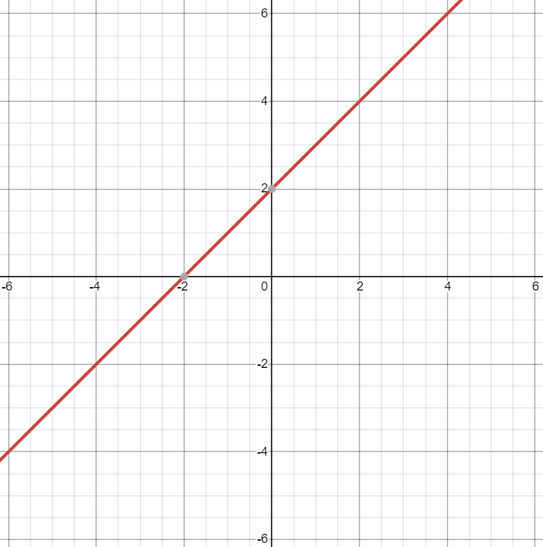
:::

::: {.column width="60%"}
::: {.incremental}
-   This is the classic linear equation $y=a+bx$ or $y=mx+n$
-   $a$ and $b$ are constants and $x$ is the variable.
-   $a$ is the intercept and $b$ is the slope of the line, or the amount that $y$ changes given a one-unit increase in $x$.
:::
:::
:::

## Examples of Functions of One Variable — Quadratic Function {.smaller}

::: columns
::: {.column width="40%"}
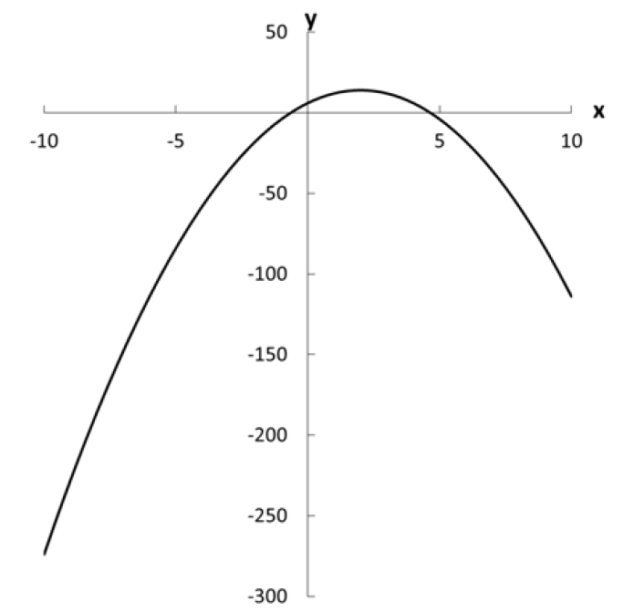
:::

::: {.column width="60%"}
::: {.incremental}
-   This is the classical quadratic function: $f(x)=ax^{2}+bx+c$ or $f(x)=\alpha+\beta_{1}x+\beta_{2}x^{2}$
-   If we set $a>0$ ($\beta_{2}>0$) we get a curve shaped like a U (a convex parabola).
-   If we set $a<0$ ($\beta_{2}<0$) we get a curve shaped like an inverse U (a concave parabola).
:::
:::
:::

## Functions and Theorizing {.smaller}

::: {.incremental}
-   Functions are important for theorizing about politics
-   Most quantitative social science boils down to how two variables relate!
-   Our examples suggest a precise function between $x$ and $y$
-   In statistics, you will *theorize* the functional form of the relationship
-   Statistical methods will *estimate* the most appropriate parameters; "a line of best fit"
:::

## Anscombe's Quartet {.smaller}

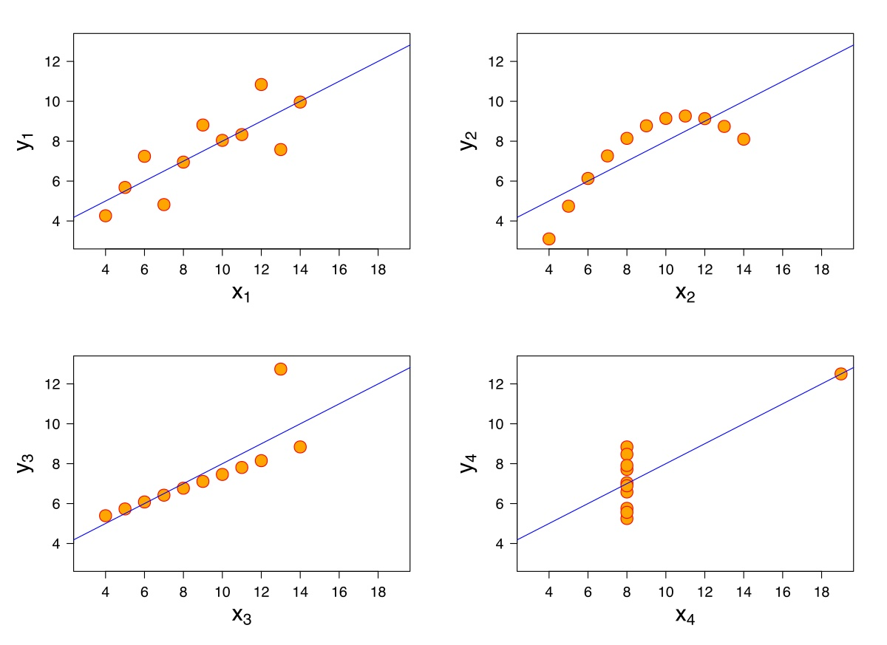

## Special Functions and Finding Roots

*Exponents, logarithms, roots, and solving an equation for $x$.*

## Exponents, Roots, and Logarithms {.smaller}

::: {.incremental}
-   Exponential: $x^{a}$
-   Roots: $\sqrt[a]{x}$ — can always be written as a fractional exponent, $\sqrt[a]{x} = x^{1/a}$
-   Logarithm: the inverse of an exponent. $y = \log_a(x) \iff a^{y} = x$ — "what power do I raise $a$ to, to get $x$?"
-   **Base 10:** written $\log(x)$ with no base shown.
-   **Base $e$:** the *natural* log, written $\ln(x)$, with $e \approx 2.7183$. Useful in calculus, and lets us interpret relationships in percentage-change terms.
:::

## Exponent and Logarithm Rules {.smaller}

::: columns
::: {.column width="50%"}
**Exponent rules**

::: {.incremental}
-   $x^{a} \cdot x^{b}=x^{a+b}$
-   $x^{a} \cdot z^{a}=(xz)^{a}$
-   $(x^{a})^{b}=x^{ab}$
-   $\frac{x^{a}}{x^{b}}=x^{a-b}$
-   $\frac{x^{a}}{z^{a}}=\left(\frac{x}{z}\right)^{a}$
-   $x^{-a} = 1/x^{a}$
-   $x^{0} = 1$
:::
:::

::: {.column width="50%"}
**Logarithm rules**

::: {.incremental}
-   $\log(x_{1} \cdot x_{2})=\log(x_{1})+\log(x_{2})$ for $x_{1},x_{2}>0$
-   $\log\left(\frac{x_{1}}{x_{2}}\right)=\log(x_{1})-\log(x_{2})$ for $x_{1},x_{2}>0$
-   $\log(x^{b})=b \cdot \log(x)$ for $x>0$
-   $\log(1/x) = -\log(x)$
-   $\log(1) = 0$
:::
:::
:::

## Root Rules {.smaller}

::: {.incremental}
-   $\sqrt{x}=x^{\frac{1}{2}}$
-   $\sqrt[n]{x} \cdot \sqrt[n]{z}=\sqrt[n]{xz}$ for $n>1$
-   $\frac{\sqrt[n]{x}}{\sqrt[n]{z}}=\sqrt[n]{\frac{x}{z}}$ for $n>1$
:::

## Exponent, Logarithm, and Root Graphs {.smaller}

::: {layout-ncol="3"}
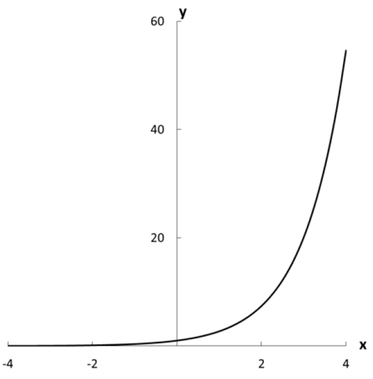

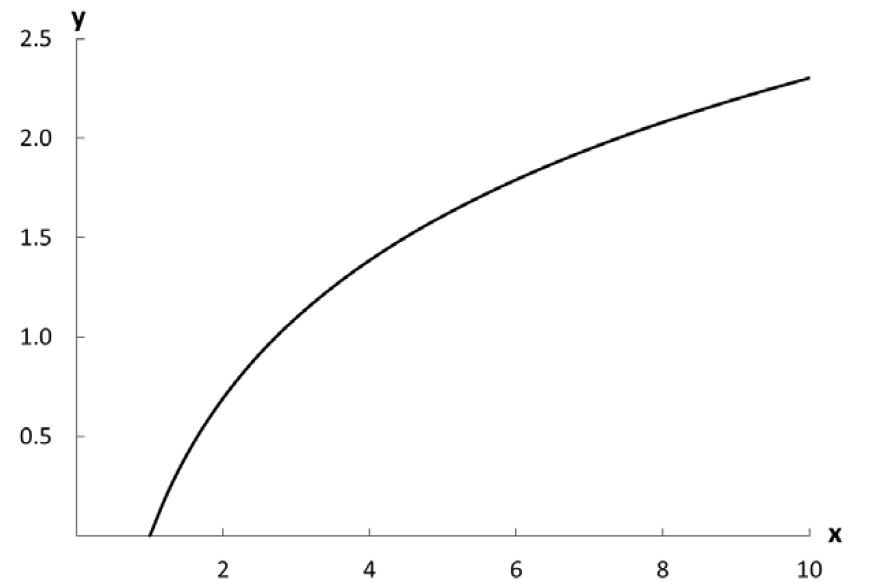

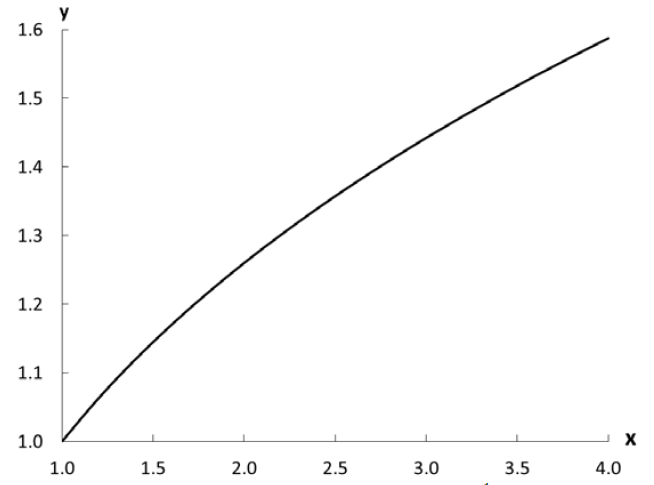
:::

## Change of Base {.smaller}

::: {.incremental}
-   Any log can be rewritten in a different base: $\log_b(x) = \dfrac{\log_a(x)}{\log_a(b)}$
-   Example: $\log_{10}(x) = \dfrac{\ln(x)}{\ln(10)}$
:::

## Logs Turn Products into Sums {.smaller}

Take the log of a product, term by term:

::: {.fragment}
$$\log\Big(\prod_{i=1}^n x_i\Big) = \log(x_1) + \log(x_2) + \cdots + \log(x_n) = \sum_{i=1}^n \log(x_i)$$
:::

::: {.fragment}
This is exactly why maximum-likelihood estimation works with a **log-likelihood**: it turns a product of probabilities into a sum, which is far easier to differentiate.
:::

## Quick Drill: Logarithms {.smaller}

::: {.incremental}
-   $\log_4(16)$ = [$2$, since $4^2 = 16$]{.fragment}
-   $\log_2(16)$ = [$4$, since $2^4 = 16$]{.fragment}
-   Simplify $\log_4(x^3 y^5)$ = [$3\log_4(x) + 5\log_4(y)$]{.fragment}
:::

## Reading a Graph {.smaller}

::: {.incremental}
-   Where is the function increasing or decreasing — and how fast?
-   Are there local or global maxima/minima? Where?
-   Any inflection points?
-   Is it continuous? Differentiable?
-   Does it approach some limiting value?
:::

## Solving for a Variable {.smaller}

::: {.incremental}
-   Given $y = f(x)$, isolate $x$ using algebra — move everything else to the other side.
-   $y = 3x + 2 \;\Rightarrow\; x = \tfrac{1}{3}(y-2)$
-   $y = e^x \;\Rightarrow\; x = \ln(y)$
:::

## Finding Roots {.smaller}

::: {.incremental}
-   A **root** is a value of $x$ where $f(x) = 0$ — set the function equal to zero and solve.
-   $x^2 - 9 = 0 \;\Rightarrow\; x^2 = 9 \;\Rightarrow\; x = \pm 3$ — quadratics generically have two roots.
-   **Quadratic formula:** for $ax^2+bx+c=0$, $\;x = \dfrac{-b \pm \sqrt{b^2-4ac}}{2a}$
:::

## Why Two Solutions? {.smaller}

::: {.fragment}
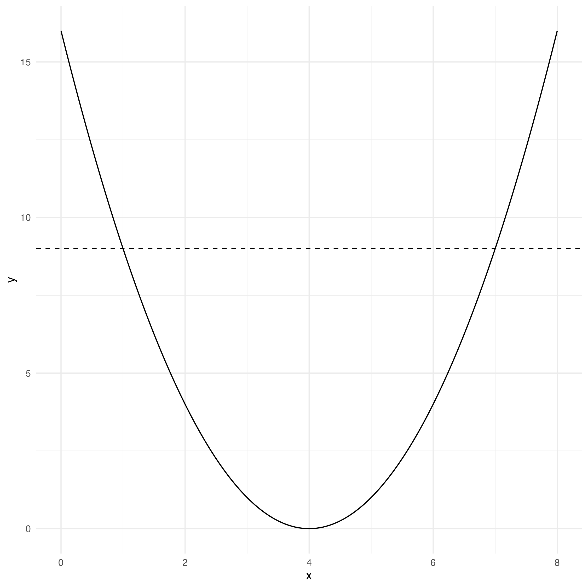
:::

## Quadratic Formula — Worked Example {.smaller}

$$3x^2 + 8x - 13 = 0$$

::: {.fragment}
$$x = \frac{-8\pm\sqrt{8^2-(4 \cdot 3 \cdot -13)}}{2 \cdot 3}$$
:::

::: {.fragment}
::: columns
::: {.column width="50%"}
$$x = \frac{-8 + \sqrt{220}}{6}$$

$$x \approx 1.14$$
:::

::: {.column width="50%"}
$$x = \frac{-8 - \sqrt{220}}{6}$$

$$x \approx -3.81$$
:::
:::
:::

## Checking Our Work Graphically {.smaller}

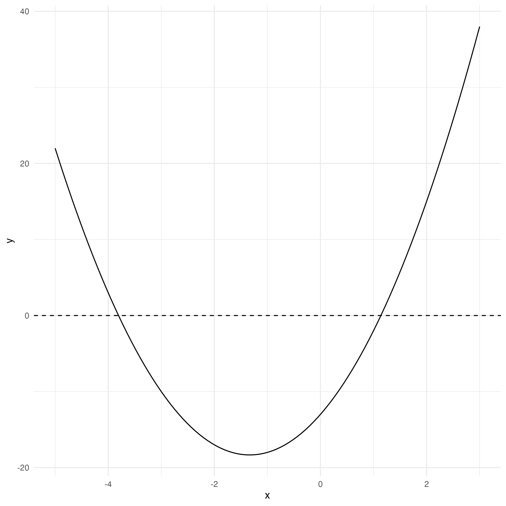

## Quick Drill: Solving and Roots {.smaller}

::: {.incremental}
-   $3x + 2 = 0$ = [$x = -\tfrac{2}{3}$]{.fragment}
-   $x^2 + 3x - 4 = 0$ = [$x = 1$ or $x = -4$]{.fragment}
-   $e^{-x} - 10 = 0$ = [$x = -\ln(10)$]{.fragment}
:::

## Final Exercise

*One derivation, using every tool from today.*

## The Problem {.smaller}

We have eight polyarchy values from the running V-Dem example, $x_1, \dots, x_8$, and their mean $\bar x = \frac{1}{n}\sum_{i=1}^n x_i$.

::: {.incremental}
-   **Claim 1:** the deviations from the mean sum to zero — $\displaystyle\sum_{i=1}^n (x_i - \bar x) = 0$.
-   **Claim 2:** among *every* possible constant $c$, the mean $\bar x$ is the one that minimizes the sum of squared deviations, $\displaystyle S(c) = \sum_{i=1}^n (x_i - c)^2$.
-   We'll see both claims happen on a graph, then prove them algebraically, step by step.
:::

## Watch It Happen — The Residuals {.smaller}

Drag the point $c$ along the eight polyarchy values and watch $\Sigma(x_i - c)$ in the readout.

```{=html}
<div class="viz join-minimize jm-part-residuals">
  <div class="jm-numberline-wrap">
    <svg class="jm-numberline" viewBox="0 0 640 210" role="img" aria-label="Eight polyarchy values on a number line, a draggable point c, and its signed residual to each value"></svg>
  </div>

  <div class="jm-controls">
    <input type="range" class="jm-slider" min="0" max="1" step="0.001" value="0.5" aria-label="c">
    <button class="jm-snap" type="button">Snap to x&#772;</button>
  </div>

  <div class="jm-readout">
    <div class="jm-readout-item">
      <span class="jm-readout-label">c</span>
      <span class="jm-readout-value jm-c-value">0.500</span>
    </div>
    <div class="jm-readout-item">
      <span class="jm-readout-label">&Sigma;(x&#8309; &minus; c)</span>
      <span class="jm-readout-value jm-sum-dev">0.000</span>
    </div>
    <div class="jm-readout-item">
      <span class="jm-readout-label">S(c) = &Sigma;(x&#8309; &minus; c)&sup2;</span>
      <span class="jm-readout-value jm-sum-sq">0.000</span>
    </div>
  </div>

  <div class="jm-hint">Drag the blue point on the number line, or use the slider.</div>
</div>

<style>
.viz.join-minimize { max-width: 640px; margin: 0 auto; font-size: 0.5em; }
.join-minimize .jm-numberline-wrap,
.join-minimize .jm-curve-wrap { width: 100%; }
.join-minimize svg { width: 100%; height: auto; display: block; }
.join-minimize .jm-axis { stroke: #D9E0EA; stroke-width: 1.5; }
.join-minimize .jm-tick { font-size: 11px; fill: #5A6B80; }
.join-minimize .jm-point { fill: #8a8f98; }
.join-minimize .jm-marker-line { stroke: #2b6cb0; stroke-width: 2; }
.join-minimize .jm-marker { fill: #2b6cb0; cursor: grab; touch-action: none; }
.join-minimize .jm-marker:active { cursor: grabbing; }
.join-minimize .jm-bar-pos { stroke: #2b6cb0; stroke-width: 5; }
.join-minimize .jm-bar-neg { stroke: #e53e3e; stroke-width: 5; }
.join-minimize .jm-bar-zero { stroke: #8a8f98; stroke-width: 5; }

.join-minimize .jm-controls {
  display: flex; align-items: center; gap: 14px; justify-content: center; margin: 10px 0;
}
.join-minimize .jm-slider { flex: 1 1 auto; max-width: 360px; }
.join-minimize .jm-snap {
  font-size: 0.9em; padding: 5px 12px; border-radius: 999px; border: 1px solid #2b6cb0;
  background: #fff; color: #2b6cb0; cursor: pointer;
}
.join-minimize .jm-snap:hover { background: #2b6cb0; color: #fff; }

.join-minimize .jm-readout {
  display: flex; justify-content: center; gap: 24px; flex-wrap: wrap; margin-bottom: 8px;
}
.join-minimize .jm-readout-item {
  background: #F7F8FA; border: 1px solid #EDF0F5; border-radius: 8px;
  padding: 6px 14px; text-align: center; min-width: 120px;
  transition: background 0.3s ease, border-color 0.3s ease;
}
.join-minimize .jm-readout-label { display: block; font-size: 0.85em; color: #5A6B80; }
.join-minimize .jm-readout-value { display: block; font-size: 1.2em; font-weight: 700; color: #22303F; }

.join-minimize.jm-at-min .jm-readout-item { background: #EAF6EF; border-color: #38a169; }
.join-minimize.jm-at-min .jm-readout-value { color: #2f855a; }

.join-minimize .jm-curve-line { fill: none; stroke: #2b6cb0; stroke-width: 2.5; }
.join-minimize .jm-curve-dot { fill: #2b6cb0; stroke: #fff; stroke-width: 1.5; }
.join-minimize .jm-xbar-line { stroke: #8a8f98; stroke-width: 1.5; stroke-dasharray: 4,4; }
.join-minimize .jm-xbar-label { font-size: 11px; fill: #5A6B80; }

.join-minimize .jm-hint {
  text-align: center; font-size: 0.85em; color: #5A6B80; font-style: italic; margin-top: 4px;
}
</style>
```

::: {.incremental}
-   $\Sigma(x_i - c)$ is a straight line in $c$ — it crosses zero exactly once.
-   Watch the readout: it hits $0.000$ right when $c = \bar x$.
:::

## Watch It Happen — Minimizing $S(c)$ {.smaller}

Same drag, same $c$ — now watch $S(c) = \Sigma(x_i - c)^2$ trace out a curve.

```{=html}
<div class="viz join-minimize jm-part-curve">
  <div class="jm-curve-wrap">
    <svg class="jm-curve" viewBox="0 0 640 190" role="img" aria-label="Parabola of S(c) versus c, with a marker at the current c and a dashed line at x-bar"></svg>
  </div>

  <div class="jm-hint">Keep dragging on the previous slide — the dot here moves with it.</div>
</div>

<script>
(function () {
  var DATA = [0.01, 0.21, 0.34, 0.47, 0.60, 0.72, 0.84, 0.92];
  var N = DATA.length;
  var XBAR = DATA.reduce(function (a, b) { return a + b; }, 0) / N;

  var wraps = document.querySelectorAll('.viz.join-minimize');
  var lineSvg = document.querySelector('.jm-numberline');
  var curveSvg = document.querySelector('.jm-curve');
  var slider = document.querySelector('.jm-slider');
  var snapBtn = document.querySelector('.jm-snap');
  var cValueEl = document.querySelector('.jm-c-value');
  var sumDevEl = document.querySelector('.jm-sum-dev');
  var sumSqEl = document.querySelector('.jm-sum-sq');
  var svgNS = 'http://www.w3.org/2000/svg';

  function el(tag, attrs) {
    var e = document.createElementNS(svgNS, tag);
    for (var k in attrs) e.setAttribute(k, attrs[k]);
    return e;
  }

  // ---- number line geometry ----
  var lineMargin = { left: 40, right: 40 };
  var LW = 640;
  var axisY = 34;
  var plotW = LW - lineMargin.left - lineMargin.right;

  function lx(v) { return lineMargin.left + v * plotW; }

  lineSvg.appendChild(el('line', { class: 'jm-axis', x1: lineMargin.left, y1: axisY, x2: LW - lineMargin.right, y2: axisY }));
  [0, 0.25, 0.5, 0.75, 1].forEach(function (v) {
    lineSvg.appendChild(el('line', { class: 'jm-axis', x1: lx(v), y1: axisY - 4, x2: lx(v), y2: axisY + 4 }));
    var t = el('text', { class: 'jm-tick', x: lx(v), y: axisY + 18, 'text-anchor': 'middle' });
    t.textContent = v;
    lineSvg.appendChild(t);
  });
  DATA.forEach(function (x) {
    lineSvg.appendChild(el('circle', { class: 'jm-point', cx: lx(x), cy: axisY, r: 4 }));
  });

  var markerLine = el('line', { class: 'jm-marker-line', x1: 0, y1: axisY - 16, x2: 0, y2: axisY + 16 });
  lineSvg.appendChild(markerLine);
  var marker = el('circle', { class: 'jm-marker', cx: 0, cy: axisY - 16, r: 8 });
  lineSvg.appendChild(marker);

  var barRows = DATA.map(function (x, i) {
    var y = axisY + 30 + i * 20;
    var bar = el('line', { class: 'jm-bar-zero', x1: lx(x), y1: y, x2: lx(x), y2: y });
    lineSvg.appendChild(bar);
    return { x: x, y: y, bar: bar };
  });

  // ---- curve geometry ----
  var curveMargin = { left: 46, right: 20, top: 16, bottom: 30 };
  var CW = 640, CH = 190;
  var cPlotW = CW - curveMargin.left - curveMargin.right;
  var cPlotH = CH - curveMargin.top - curveMargin.bottom;

  function sumSq(c) {
    var s = 0;
    for (var i = 0; i < N; i++) { var d = DATA[i] - c; s += d * d; }
    return s;
  }
  function sumDev(c) {
    var s = 0;
    for (var i = 0; i < N; i++) s += (DATA[i] - c);
    return s;
  }

  var yMax = Math.max(sumSq(0), sumSq(1)) * 1.08;

  function cx(v) { return curveMargin.left + v * cPlotW; }
  function cy(v) { return curveMargin.top + cPlotH - (v / yMax) * cPlotH; }

  curveSvg.appendChild(el('line', { class: 'jm-axis', x1: curveMargin.left, y1: CH - curveMargin.bottom, x2: CW - curveMargin.right, y2: CH - curveMargin.bottom }));
  curveSvg.appendChild(el('line', { class: 'jm-axis', x1: curveMargin.left, y1: curveMargin.top, x2: curveMargin.left, y2: CH - curveMargin.bottom }));
  [0, 0.25, 0.5, 0.75, 1].forEach(function (v) {
    var t = el('text', { class: 'jm-tick', x: cx(v), y: CH - curveMargin.bottom + 16, 'text-anchor': 'middle' });
    t.textContent = v;
    curveSvg.appendChild(t);
  });

  var pts = [];
  for (var i = 0; i <= 100; i++) {
    var c = i / 100;
    pts.push(cx(c) + ',' + cy(sumSq(c)));
  }
  curveSvg.appendChild(el('polyline', { class: 'jm-curve-line', points: pts.join(' ') }));

  curveSvg.appendChild(el('line', { class: 'jm-xbar-line', x1: cx(XBAR), y1: curveMargin.top, x2: cx(XBAR), y2: CH - curveMargin.bottom }));
  var xbarLabel = el('text', { class: 'jm-xbar-label', x: cx(XBAR), y: curveMargin.top - 4, 'text-anchor': 'middle' });
  xbarLabel.textContent = 'x̄';
  curveSvg.appendChild(xbarLabel);

  var curveDot = el('circle', { class: 'jm-curve-dot', cx: cx(0.5), cy: cy(sumSq(0.5)), r: 6 });
  curveSvg.appendChild(curveDot);

  // ---- render ----
  function render(c) {
    c = Math.max(0, Math.min(1, c));
    var dev = sumDev(c);
    var sq = sumSq(c);
    var atMin = Math.abs(c - XBAR) < 0.003;

    marker.setAttribute('cx', lx(c));
    markerLine.setAttribute('x1', lx(c));
    markerLine.setAttribute('x2', lx(c));

    barRows.forEach(function (row) {
      var positive = row.x - c > 0.0005;
      var negative = row.x - c < -0.0005;
      row.bar.setAttribute('x1', lx(c));
      row.bar.setAttribute('x2', lx(row.x));
      row.bar.setAttribute('class', positive ? 'jm-bar-pos' : negative ? 'jm-bar-neg' : 'jm-bar-zero');
    });

    curveDot.setAttribute('cx', cx(c));
    curveDot.setAttribute('cy', cy(sq));

    cValueEl.textContent = c.toFixed(3);
    sumDevEl.textContent = dev.toFixed(3);
    sumSqEl.textContent = sq.toFixed(3);

    wraps.forEach(function (w) { w.classList.toggle('jm-at-min', atMin); });
    slider.value = c;
  }

  render(parseFloat(slider.value));

  slider.addEventListener('input', function () { render(parseFloat(slider.value)); });
  snapBtn.addEventListener('click', function () { render(XBAR); });

  var dragging = false;
  function clientXToC(clientX) {
    var rect = lineSvg.getBoundingClientRect();
    var svgX = (clientX - rect.left) / rect.width * LW;
    return (svgX - lineMargin.left) / plotW;
  }
  marker.addEventListener('pointerdown', function (ev) {
    dragging = true;
    marker.setPointerCapture(ev.pointerId);
  });
  marker.addEventListener('pointermove', function (ev) {
    if (!dragging) return;
    render(clientXToC(ev.clientX));
  });
  marker.addEventListener('pointerup', function () { dragging = false; });
  marker.addEventListener('pointercancel', function () { dragging = false; });
})();
</script>
```

::: {.incremental}
-   $\Sigma(x_i - c)$ is a straight line in $c$ — it crosses zero exactly once.
-   $S(c) = \Sigma(x_i-c)^2$ is a parabola in $c$ — it has exactly one minimum.
-   Drag until both readouts hit their special value together. That $c$ is $\bar x$.
:::

## Proof, Step 1: Expand the Sum {.smaller}

**Claim 1:** $\displaystyle\sum_{i=1}^n (x_i - \bar x) = 0$

::: {.fragment}
Split the sum term by term: $\displaystyle\sum_{i=1}^n (x_i - \bar x) = \sum_{i=1}^n x_i \;-\; \sum_{i=1}^n \bar x$
:::

::: {.fragment}
$\bar x$ is a constant, so adding it to itself $n$ times just gives $n\bar x$:

$$\sum_{i=1}^n (x_i - \bar x) = \sum_{i=1}^n x_i - n\bar x$$
:::

## Proof, Step 2: Substitute the Definition of $\bar x$ {.smaller}

::: {.fragment}
Recall $\bar x = \dfrac{1}{n}\displaystyle\sum_{i=1}^n x_i$, so $n\bar x = \displaystyle\sum_{i=1}^n x_i$.
:::

::: {.fragment}
Substitute that back in:

$$\sum_{i=1}^n x_i - n\bar x = \sum_{i=1}^n x_i - \sum_{i=1}^n x_i = 0$$
:::

::: {.fragment}
**Claim 1 proved** — deviations from the mean always sum to zero, for any data.
:::

## Proof, Step 3: Set Up $S(c)$ {.smaller}

**Claim 2:** $\bar x$ minimizes $S(c) = \displaystyle\sum_i (x_i-c)^2$ — no calculus required.

::: {.fragment}
The trick: add and subtract $\bar x$ inside each term.

$$x_i - c = (x_i - \bar x) + (\bar x - c)$$
:::

::: {.fragment}
So we can rewrite $S(c)$ as

$$S(c) = \sum_i \big[(x_i-\bar x) + (\bar x - c)\big]^2$$
:::

## Proof, Step 4: Expand the Square {.smaller}

::: {.fragment}
Expand $(a+b)^2 = a^2 + 2ab + b^2$ with $a = (x_i-\bar x)$ and $b = (\bar x - c)$:

$$S(c) = \sum_i (x_i-\bar x)^2 \;+\; 2(\bar x-c)\sum_i(x_i-\bar x) \;+\; \sum_i(\bar x - c)^2$$
:::

::: {.fragment}
$(\bar x - c)$ doesn't depend on $i$, so it factors out of the last sum — same trick as Step 1: $\sum_i(\bar x-c)^2 = n(\bar x-c)^2$.

$$S(c) = \sum_i (x_i-\bar x)^2 \;+\; 2(\bar x-c)\sum_i(x_i-\bar x) \;+\; n(\bar x - c)^2$$
:::

## Proof, Step 5: Kill the Middle Term {.smaller}

::: {.fragment}
The middle term contains $\displaystyle\sum_i(x_i-\bar x)$ — that's exactly Claim 1. It's $0$.
:::

::: {.fragment}
So the whole middle term vanishes, leaving

$$S(c) = \underbrace{\sum_i(x_i-\bar x)^2}_{\text{fixed — doesn't depend on } c} \;+\; n(\bar x - c)^2$$
:::

## Proof, Step 6: Conclude {.smaller}

::: {.fragment}
The first term is fixed once the data is fixed — $c$ can't change it.
:::

::: {.fragment}
The second term, $n(\bar x-c)^2$, is a positive constant times a square — always $\ge 0$, and equal to $0$ only when $c=\bar x$.
:::

::: {.fragment}
So $S(c)$ is smallest exactly when $c=\bar x$ — **Claim 2 proved**, matching what you found by dragging.
:::

::: {.fragment}
*(We'll rederive this same fact with derivatives on Day 3 — same answer, different tool.)*
:::

## Recap: The Toolkit {.smaller}

::: {.incremental}
-   **Summation ($\sum$):** compress repeated addition into one symbol — our growth variable $Y$ is itself $\frac{1}{20}\sum_{t=2000}^{2019}\text{growth}_t$, a mean in disguise.
-   **Functions:** polyarchy *is* a function, country $\to [0,1]$ — domain is every country in $\Omega$, range is whatever scores actually occur.
-   **Logs and exponents:** GDP per capita gets log-transformed precisely so differences read as *percentage* changes, not raw dollars.
-   **Solving for roots:** the same algebra that solves $ax^2+bx+c=0$ resurfaces later this week solving for the coefficients that minimize a sum of squared errors.
-   **Sets:** our sample space is $\Omega = \{\text{174 countries}\}$; the threshold $D=1\{\text{polyarchy}>0.5\}$ is nothing more than set membership.
:::

## Recap: One Example, Every Tool {.smaller}

::: {style="font-size: 0.55em;"}
| Tool | This week's running example |
|---|---|
| **Summation** | $Y = \frac{1}{20}\sum_{t=2000}^{2019} \text{growth}_t$ |
| **Function** | polyarchy: country $\to [0,1]$ |
| **Domain / codomain / range** | domain = 174 countries; codomain = $[0,1]$; range = the polyarchy scores that actually occur |
| **Logarithm** | log GDP per capita, so differences are percentage changes |
| **Roots / quadratics** | the algebra that will later minimize a sum of squared errors |
| **Sets** | $\Omega = \{\text{174 countries}\}$; $D = 1\{\text{polyarchy}>0.5\}$ |

: {tbl-colwidths="[30,70]"}
:::

Same dataset, same questions — just increasingly precise language for asking them.

## Practice Exercises — Day 1 {.smaller}

Moore, W. H., & Siegel, D. A. (2013). *A Mathematics Course for Political and Social Research*. Princeton University Press.

::: {.incremental}
1.  Chapter 1: Exercises 3, 5
2.  Chapter 2: Exercises 16, 17, 19, 20, 21, 22, 26, 29
3.  Chapter 3: Exercises 2, 3
:::

##  {.center}

**Programming lecture:** [webpage chapter](../chapters/01-notation-functions-limits/programming.html)

**Back to:** [MathCamp 2026 website](../index.html)
