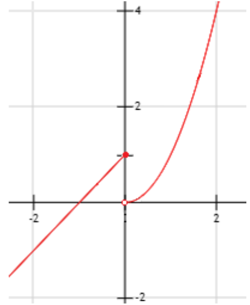

## The Big Question(s) {.smaller}

### Does Democracy Cause Growth?

```{=html}
<div class="viz term-cards">
  <div class="term-head">
    <div class="term-head-term">Term</div>
    <div class="term-head-def">Definition</div>
    <div class="term-head-ex">Democracy → growth, cross-section 2020</div>
  </div>

  <div class="term-row fragment">
    <div class="term-badge">Theory</div>
    <div class="term-def">A set of statements involving concepts</div>
    <div class="term-ex">Democracy constrains executive predation and secures property rights → investment → growth</div>
  </div>

  <div class="term-row fragment">
    <div class="term-badge">Concept</div>
    <div class="term-def">Abstract ideas used to understand the world</div>
    <div class="term-ex">Democracy; economic growth</div>
  </div>

  <div class="term-row fragment">
    <div class="term-badge">Measure</div>
    <div class="term-def">An operational indicator of a concept</div>
    <div class="term-ex">V-Dem polyarchy index (0&ndash;1); average annual growth in log GDP per capita</div>
  </div>

  <div class="term-row fragment">
    <div class="term-badge">Unit of analysis</div>
    <div class="term-def">The entity a row describes</div>
    <div class="term-ex">The country (<em>n</em> &approx; 175)</div>
  </div>

  <div class="term-row fragment">
    <div class="term-badge">Variable</div>
    <div class="term-def">Takes different values in the given set</div>
    <div class="term-ex">polyarchy; growth; region</div>
  </div>

  <div class="term-row fragment">
    <div class="term-badge">Constant</div>
    <div class="term-def">Single value in the given set</div>
    <div class="term-ex">The year (2020); the planet; anything time-varying</div>
  </div>
</div>

<style>
.term-cards {
  max-width: 100%;
  font-size: 0.42em;
  display: flex;
  flex-direction: column;
  gap: 4px;
}
.term-cards .term-head,
.term-cards .term-row {
  display: grid;
  grid-template-columns: 16% 32% 52%;
  gap: 14px;
  align-items: center;
  padding: 8px 12px;
  border-radius: 8px;
}
.term-cards .term-head {
  font-weight: 600;
  letter-spacing: .04em;
  text-transform: uppercase;
  font-size: 0.85em;
  color: #5A6B80;
  border-bottom: 2px solid #D9E0EA;
  padding-bottom: 10px;
}
.term-cards .term-row {
  background: #F7F8FA;
  border: 1px solid #EDF0F5;
}
.term-cards .term-badge {
  display: inline-block;
  background: #2b6cb0;
  color: #fff;
  font-weight: 600;
  text-align: center;
  border-radius: 999px;
  padding: 5px 10px;
}
.term-cards .term-def {
  color: #22303F;
}
.term-cards .term-ex {
  color: #5A6B80;
}
</style>
```

## Hypotheses {.smaller}

**Hypothesis:** a testable statement, derived from a theory, about the expected relationship between concepts or variables.

```{=html}
<div class="viz hyp-cards">
  <div class="hyp-head">
    <div class="hyp-head-type">Hypothesis</div>
    <div class="hyp-head-stmt">Statement</div>
  </div>

  <div class="hyp-row fragment">
    <div class="hyp-badge">Theoretical</div>
    <div class="hyp-stmt">Democracy causes higher economic growth</div>
  </div>

  <div class="hyp-row fragment">
    <div class="hyp-badge">Empirical</div>
    <div class="hyp-stmt">Countries with higher democracy scores have higher average growth</div>
  </div>

  <div class="hyp-row fragment">
    <div class="hyp-badge">Null</div>
    <div class="hyp-stmt">Average growth is the same in both groups</div>
  </div>

  <div class="hyp-row fragment">
    <div class="hyp-badge">Rival</div>
    <div class="hyp-stmt">Growth causes democracy &mdash; same correlation, opposite arrow</div>
  </div>
</div>

<style>
.hyp-cards {
  max-width: 100%;
  font-size: 0.5em;
  display: flex;
  flex-direction: column;
  gap: 6px;
}
.hyp-cards .hyp-head,
.hyp-cards .hyp-row {
  display: grid;
  grid-template-columns: 20% 80%;
  gap: 16px;
  align-items: center;
  padding: 10px 14px;
  border-radius: 8px;
}
.hyp-cards .hyp-head {
  font-weight: 600;
  letter-spacing: .04em;
  text-transform: uppercase;
  font-size: 0.85em;
  color: #5A6B80;
  border-bottom: 2px solid #D9E0EA;
  padding-bottom: 10px;
}
.hyp-cards .hyp-row {
  background: #F7F8FA;
  border: 1px solid #EDF0F5;
}
.hyp-cards .hyp-badge {
  display: inline-block;
  background: #2b6cb0;
  color: #fff;
  font-weight: 600;
  text-align: center;
  border-radius: 999px;
  padding: 6px 12px;
}
.hyp-cards .hyp-stmt {
  color: #22303F;
}
</style>
```

## Hence, theory to empirics

::: {.incremental}
::: {.incremental}
-   **Theory:** (simplified) a set of statements that involve concepts.
-   **Concept:** abstract ideas used to understand the world.
-   **Measure:** an operational indicator of a concept
-   **Variable:** A concept or measure that takes different values in a given set.
-   **Constant:** A concept or measure that has a single value for a given set.
-   **Hypothesis:** a testable statement, derived from a theory, about the expected relationship between concepts or variables.
:::

- **Let's hear some ideas from your research areas!**

:::

## Democracy and Growth, in the Data (V-Dem 2019) {.smaller}


Polyarchy (our **measure** of democracy) vs. GDP per capita, one dot per country. $n = 174$.

## The Same Data, as Sets {.smaller}

```{=html}
<div class="viz viz-scatter-to-sets">
  <div class="sts-layout">
    <div class="sts-plot-col">
      <svg class="sts-svg" viewBox="0 0 480 300" role="img" aria-label="Scatterplot of polyarchy vs GDP per capita for 174 countries, with 8 countries highlighted"></svg>
      <div class="sts-caption">Polyarchy vs. GDP per capita, V-Dem 2019. n = 174.</div>
    </div>
    <div class="sts-sets-col">
      <div class="sts-set">
        <div class="sts-set-title">Countries</div>
        <div class="sts-set-brace">{ <span class="sts-items" data-set="country"></span>, &hellip; }</div>
      </div>
      <div class="sts-set">
        <div class="sts-set-title">Polyarchy</div>
        <div class="sts-set-brace">{ <span class="sts-items" data-set="polyarchy"></span>, &hellip; }</div>
      </div>
      <div class="sts-set">
        <div class="sts-set-title">GDP per capita</div>
        <div class="sts-set-brace">{ <span class="sts-items" data-set="gdppc"></span>, &hellip; }</div>
      </div>
      <div class="sts-note">showing 8 of 174 countries</div>
    </div>
  </div>
  <div class="sts-hint">Click to split the highlighted points into three sets &rarr;</div>
</div>

<style>
.viz-scatter-to-sets { max-width: 100%; font-size: 0.6em; }
.viz-scatter-to-sets .sts-layout {
  display: flex;
  gap: 24px;
  flex: 1 1 auto;
  min-height: 0;
  align-items: stretch;
}
.viz-scatter-to-sets .sts-plot-col {
  flex: 1 1 55%;
  display: flex;
  flex-direction: column;
  min-width: 0;
}
.viz-scatter-to-sets .sts-svg {
  width: 100%;
  height: auto;
  flex: 1 1 auto;
  min-height: 0;
}
.viz-scatter-to-sets .sts-caption {
  flex: 0 0 auto;
  font-size: 0.6em;
  color: #5A6B80;
  text-align: center;
  margin-top: 4px;
}
.viz-scatter-to-sets .sts-dot {
  fill: #C7CDD6;
  opacity: 0.7;
}
.viz-scatter-to-sets .sts-dot-hl {
  stroke: #fff;
  stroke-width: 1;
  transition: r 0.4s ease, filter 0.4s ease;
}
.viz-scatter-to-sets .sts-dot-label {
  font-size: 9px;
  font-weight: 700;
  fill: #22303F;
}
.viz-scatter-to-sets .sts-axis {
  stroke: #D9E0EA;
  stroke-width: 1;
}
.viz-scatter-to-sets .sts-tick {
  font-size: 8px;
  fill: #5A6B80;
}

.viz-scatter-to-sets .sts-sets-col {
  flex: 1 1 45%;
  display: flex;
  flex-direction: column;
  justify-content: center;
  gap: 10px;
  min-width: 0;
}
.viz-scatter-to-sets .sts-set-title {
  font-size: 0.65em;
  font-weight: 600;
  letter-spacing: .04em;
  text-transform: uppercase;
  color: #5A6B80;
}
.viz-scatter-to-sets .sts-set-brace {
  font-size: 0.75em;
  color: #22303F;
  background: #F7F8FA;
  border: 1px solid #EDF0F5;
  border-radius: 8px;
  padding: 6px 10px;
  min-height: 1.6em;
}
.viz-scatter-to-sets .sts-item {
  display: inline-block;
  opacity: 0;
  transform: translateY(6px);
  transition: opacity 0.4s ease, transform 0.4s ease;
  transition-delay: calc(var(--i) * 90ms);
}
.viz-scatter-to-sets .sts-item::after {
  content: ", ";
  color: #5A6B80;
}
.viz-scatter-to-sets .sts-item:last-child::after {
  content: "";
}
.viz-scatter-to-sets .sts-item .sts-badge {
  display: inline-block;
  background: #2b6cb0;
  color: #fff;
  border-radius: 999px;
  font-size: 0.8em;
  width: 1.3em;
  height: 1.3em;
  line-height: 1.3em;
  text-align: center;
  margin-right: 3px;
}
.viz-scatter-to-sets .sts-note {
  font-size: 0.55em;
  color: #5A6B80;
  font-style: italic;
}

.viz-scatter-to-sets .sts-hint {
  flex: 0 0 auto;
  text-align: center;
  font-size: 0.6em;
  color: #5A6B80;
  margin-top: 8px;
  cursor: pointer;
}

.viz-scatter-to-sets.sts-revealed .sts-item {
  opacity: 1;
  transform: translateY(0);
}
.viz-scatter-to-sets.sts-revealed .sts-dot-hl {
  r: 6;
  filter: drop-shadow(0 0 4px var(--hlc, #2b6cb0));
}
</style>

<script>
(function () {
  var ALL_POINTS = [
    [0.684,34308],[0.741,24668],[0.899,106746],[0.902,109451],[0.718,10820],
    [0.727,24104],[0.830,88837],[0.421,13762],[0.259,58026],[0.511,25857],
    [0.174,20346],[0.117,4619],[0.651,30629],[0.682,58956],[0.691,25458],
    [0.818,144274],[0.886,63753],[0.599,13803],[0.251,8755],[0.456,13750],
    [0.421,4474],[0.368,10796],[0.516,4533],[0.368,10187],[0.801,24750],
    [0.697,6748],[0.160,3619],[0.193,8554],[0.211,15775],[0.329,3975],
    [0.779,42896],[0.329,4867],[0.430,16082],[0.501,7280],[0.083,4007],
    [0.842,91211],[0.677,17835],[0.429,25081],[0.520,10467],[0.428,16533],
    [0.383,5408],[0.834,98923],[0.208,37955],[0.284,4827],[0.209,12790],
    [0.452,6148],[0.598,25697],[0.657,5487],[0.194,9816],[0.596,23400],
    [0.397,4132],[0.606,6354],[0.215,9400],[0.528,2461],[0.358,5907],
    [0.304,5818],[0.360,4594],[0.534,7669],[0.407,7151],[0.850,104068],
    [0.825,115340],[0.656,32139],[0.159,1743],[0.790,14275],[0.379,1813],
    [0.829,53121],[0.893,37622],[0.703,7587],[0.617,21463],[0.866,91636],
    [0.878,100560],[0.597,15925],[0.181,23538],[0.393,19391],[0.887,149770],
    [0.854,73132],[0.260,17520],[0.826,60021],[0.621,7374],[0.623,2796],
    [0.480,2915],[0.570,31125],[0.653,18664],[0.257,18495],[0.866,105434],
    [0.731,53534],[0.462,10506],[0.040,167513],[0.554,3934],[0.871,81503],
    [0.136,8627],[0.725,24531],[0.289,47988],[0.528,22043],[0.854,96727],
    [0.896,47918],[0.293,24322],[0.347,10867],[0.796,27448],[0.195,32471],
    [0.259,46491],[0.280,6176],[0.270,3822],[0.075,35272],[0.344,1849],
    [0.250,7090],[0.251,11417],[0.569,32642],[0.070,4021],[0.377,23549],
    [0.524,4622],[0.627,29006],[0.529,3632],[0.810,16689],[0.236,52424],
    [0.441,11894],[0.127,13965],[0.263,24137],[0.478,2753],[0.588,17553],
    [0.647,20338],[0.227,5210],[0.148,6578],[0.564,27126],[0.133,18037],
    [0.164,8843],[0.395,3584],[0.787,65763],[0.149,47662],[0.203,22516],
    [0.862,98753],[0.132,55987],[0.792,37336],[0.901,96770],[0.515,26094],
    [0.609,46229],[0.305,4837],[0.734,50321],[0.181,19759],[0.840,69276],
    [0.800,75901],[0.916,108005],[0.178,54551],[0.898,68392],[0.391,22338],
    [0.881,87580],[0.864,53067],[0.640,22018],[0.859,115552],[0.708,82950],
    [0.323,96897],[0.817,67225],[0.872,181069],[0.602,30736],[0.470,56016],
    [0.767,81913],[0.694,56700],[0.483,34992],[0.885,83507],[0.889,124864],
    [0.176,43703],[0.585,19990],[0.750,40590],[0.670,7829],[0.015,63454],
    [0.365,27929],[0.621,58857],[0.403,142915],[0.841,65901],[0.814,76072],
    [0.656,8192],[0.779,6496],[0.102,114381],[0.466,54310]
  ];

  var SAMPLE = [
    { country: "Saudi Arabia",   polyarchy: 0.01, gdppc: 63454 },
    { country: "Thailand",       polyarchy: 0.21, gdppc: 37955 },
    { country: "DR Congo",       polyarchy: 0.34, gdppc: 1849 },
    { country: "Hungary",        polyarchy: 0.47, gdppc: 54310 },
    { country: "N. Macedonia",   polyarchy: 0.60, gdppc: 30736 },
    { country: "Tunisia",        polyarchy: 0.72, gdppc: 24531 },
    { country: "Cyprus",         polyarchy: 0.84, gdppc: 69276 },
    { country: "Denmark",        polyarchy: 0.92, gdppc: 108005 }
  ];

  var wrappers = document.querySelectorAll('.viz-scatter-to-sets');
  var wrapper = wrappers[wrappers.length - 1];
  var svg = wrapper.querySelector('.sts-svg');
  var hint = wrapper.querySelector('.sts-hint');
  var svgNS = 'http://www.w3.org/2000/svg';

  var margin = { top: 14, right: 14, bottom: 26, left: 34 };
  var W = 480, H = 300;
  var plotW = W - margin.left - margin.right;
  var plotH = H - margin.top - margin.bottom;

  var logs = ALL_POINTS.map(function (p) { return Math.log10(p[1]); });
  var logMin = Math.min.apply(null, logs);
  var logMax = Math.max.apply(null, logs);

  function x(polyarchy) { return margin.left + polyarchy * plotW; }
  function y(gdppc) {
    var t = (Math.log10(gdppc) - logMin) / (logMax - logMin);
    return margin.top + plotH - t * plotH;
  }

  function el(tag, attrs) {
    var e = document.createElementNS(svgNS, tag);
    for (var k in attrs) e.setAttribute(k, attrs[k]);
    return e;
  }

  // axes
  svg.appendChild(el('line', { class: 'sts-axis', x1: margin.left, y1: H - margin.bottom, x2: W - margin.right, y2: H - margin.bottom }));
  svg.appendChild(el('line', { class: 'sts-axis', x1: margin.left, y1: margin.top, x2: margin.left, y2: H - margin.bottom }));
  [0, 0.25, 0.5, 0.75, 1].forEach(function (v) {
    var t = el('text', { class: 'sts-tick', x: x(v), y: H - margin.bottom + 12, 'text-anchor': 'middle' });
    t.textContent = v;
    svg.appendChild(t);
  });

  // 174 faint dots
  ALL_POINTS.forEach(function (p) {
    svg.appendChild(el('circle', { class: 'sts-dot', cx: x(p[0]), cy: y(p[1]), r: 2 }));
  });

  var COLORS = ['#2b6cb0', '#e53e3e', '#38a169', '#d69e2e', '#805ad5', '#dd6b20', '#319795', '#d53f8c'];

  // 8 highlighted dots + numbers, one distinct color per point
  SAMPLE.forEach(function (s, i) {
    var color = COLORS[i % COLORS.length];
    var dot = el('circle', {
      class: 'sts-dot-hl', cx: x(s.polyarchy), cy: y(s.gdppc), r: 4,
      fill: color, 'fill-opacity': 0.4
    });
    dot.style.setProperty('--hlc', color);
    svg.appendChild(dot);
    var t = el('text', { class: 'sts-dot-label', x: x(s.polyarchy) + 6, y: y(s.gdppc) - 6, fill: color });
    t.textContent = i + 1;
    svg.appendChild(t);
  });

  function fmtGdp(v) {
    return '$' + (v / 1000).toFixed(1) + 'k';
  }

  function fillSet(name, formatter) {
    var target = wrapper.querySelector('.sts-items[data-set="' + name + '"]');
    SAMPLE.forEach(function (s, i) {
      var span = document.createElement('span');
      span.className = 'sts-item';
      span.style.setProperty('--i', i);
      span.innerHTML = '<span class="sts-badge" style="background:' + COLORS[i % COLORS.length] + '">' + (i + 1) + '</span>' + formatter(s);
      target.appendChild(span);
    });
  }

  fillSet('country', function (s) { return s.country; });
  fillSet('polyarchy', function (s) { return s.polyarchy.toFixed(2); });
  fillSet('gdppc', function (s) { return fmtGdp(s.gdppc); });

  wrapper.addEventListener('click', function () {
    var on = wrapper.classList.toggle('sts-revealed');
    hint.textContent = on
      ? '← Click to collapse the sets'
      : 'Click to split the highlighted points into three sets →';
  });
})();
</script>
```

## All the Values It Could Take {.smaller}

::: {.incremental}
-   Every dot's polyarchy score is *some* value between 0 and 1.
-   The full range of values it **could** take — before we see any particular country — is its **sample space**.
-   Same idea for GDP per capita: some positive number, no fixed upper bound in principle.
-   Political scientists build claims about *all* of this range, not just the countries plotted here.
:::

## From the Picture to Notation {.smaller}

::: {.incremental}
-   Polyarchy $\in [0,1]$ — the sample space, written formally.
-   Each dot: one **unit of analysis** (a country), with a polyarchy value and a GDP value.
-   The threshold used to split "democracies" from "non-democracies": $D = 1\{\text{polyarchy} > 0.5\}$.
-   Where did 0.5 come from? *(open question — we'll come back to this)*
-   To make statements like this precise, we need the formal language of **sets**.
:::

## Sets and Sample Spaces {.smaller}

::: {.incremental}
-   A *set* is a collection of elements.
-   **Common sets:** Natural numbers ($\mathbb{N}$), Integers ($\mathbb{Z}$), Rational numbers ($\mathbb{Q}$), Real numbers ($\mathbb{R}$), etc.
-   A set can be:
    -   **Finite or infinite:** $\mathbb{Z}$ is infinite, but all the integers from 1 to 10 is finite.
    -   **Countable or uncountable:** a countable set is one whose each of its elements can be associated with a natural number (or an integer).
    -   **Bounded or unbounded:** A bounded set has finite size (but may have infinite elements).
-   Some important sets that we are going to use as political scientists:
    -   **Solution set:** a set that contains all solutions for an equation
    -   **Sample space:** a set that contains all values that a variable can take.
:::

## Unions and Intersections {.smaller}

::: {.incremental}
-   Much as sets contain elements, they also can contain, and be contained by, other sets.
-   Notation:
    -   $A \subset B$: "A is a **proper subset** of B" implies that set B contains all the elements in A, plus at least one more
    -   $A \subseteq B$: "A is a **subset** of B". In this case, it allows A and B to be the same.
-   **Intersection:** $A \cap B$. The set of elements common to two sets.
-   **Union:** $A \cup B$. The set that contains all elements in both sets.
-   **Mutually exclusive sets:** the intersection is the empty set.
:::

## $A \subset B$ (Proper Subset) {.smaller}

```{=html}
<div class="viz venn-subset">
<svg class="viz-plot" viewBox="0 0 300 220" role="img" aria-label="Circle A entirely inside circle B">
  <circle cx="150" cy="115" r="95" fill="#8a8f98"/>
  <circle cx="150" cy="115" r="46" fill="#2b6cb0"/>
  <text x="150" y="26" text-anchor="middle" font-size="20" fill="#22303F">B</text>
  <text x="150" y="120" text-anchor="middle" font-size="20" fill="#fff">A</text>
</svg>
</div>
<style>.venn-subset { max-width: 340px; margin: 0 auto; }</style>
```

## $A \cap B$ (Intersection) {.smaller}

```{=html}
<div class="viz venn-intersection">
<svg class="viz-plot" viewBox="0 0 320 200" role="img" aria-label="Two overlapping circles A and B with their intersection highlighted">
  <circle cx="130" cy="100" r="80" fill="#2b6cb0" fill-opacity="0.6"/>
  <circle cx="210" cy="100" r="80" fill="#8a8f98" fill-opacity="0.6"/>
  <text x="80" y="35" font-size="20" fill="#22303F">A</text>
  <text x="250" y="35" font-size="20" fill="#22303F">B</text>
  <text x="170" y="105" text-anchor="middle" font-size="16" fill="#fff">A∩B</text>
</svg>
</div>
<style>.venn-intersection { max-width: 360px; margin: 0 auto; }</style>
```

## $A \cup B$ (Union) {.smaller}

```{=html}
<div class="viz venn-union">
<svg class="viz-plot" viewBox="0 0 320 220" role="img" aria-label="Two overlapping circles A and B, both fully shaded to represent their union">
  <circle cx="130" cy="110" r="80" fill="#2b6cb0"/>
  <circle cx="210" cy="110" r="80" fill="#2b6cb0"/>
  <text x="80" y="35" font-size="20" fill="#22303F">A</text>
  <text x="250" y="35" font-size="20" fill="#22303F">B</text>
  <text x="170" y="18" text-anchor="middle" font-size="16" fill="#22303F">A∪B</text>
</svg>
</div>
<style>.venn-union { max-width: 360px; margin: 0 auto; }</style>
```

## $A \cap B = \emptyset$ (Mutually Exclusive) {.smaller}

```{=html}
<div class="viz venn-disjoint">
<svg class="viz-plot" viewBox="0 0 340 200" role="img" aria-label="Two separate, non-overlapping circles A and B">
  <circle cx="90" cy="100" r="70" fill="#2b6cb0"/>
  <circle cx="260" cy="100" r="70" fill="#8a8f98"/>
  <text x="90" y="35" text-anchor="middle" font-size="20" fill="#22303F">A</text>
  <text x="260" y="35" text-anchor="middle" font-size="20" fill="#22303F">B</text>
</svg>
</div>
<style>.venn-disjoint { max-width: 380px; margin: 0 auto; }</style>
```

## Levels of Measurement {.smaller}

::: {.incremental}
-   Categorical
    -   **Nominal**: No mathematical relationship; difference of kind.
        -   Occupation, colors, political party, gender
    -   **Ordinal:** Meaningful order, no meaningful "distance" between categories.
        -   Ideology, agree/disagree, education level
-   Numerical
    -   **Interval**: Meaningful order and distance between values.
        -   Age, budget, polity scores, vote share, feeling thermometer
        -   Discrete: countable
        -   Continuous: non-countable
        -   Ratio: meaningful zero (re-scaled thermometer)
:::

## Why it Matters {.smaller}

::: {.incremental}
-   Visualization
    -   Categorical: pie charts, bar charts
    -   Numerical (especially continuous): histograms, box plots
-   Analysis
    -   Numerical data can use summary statistics (mean, median, standard deviation)
    -   Categorical – Categorical: cross-tabulation
    -   Categorical – Continuous: difference in means
    -   Continuous – Continuous: scatter plots, regression
:::

## Basic Properties of Arithmetic {.smaller}

For variables that stand for real numbers or integers, these properties will always hold:

::: {.incremental}
-   **Associative properties:**
    -   $(a+b)+c=a+(b+c)$
    -   $(a \cdot b)\cdot c=a \cdot (b \cdot c)$
-   **Commutative properties:**
    -   $a+b=b+a$
    -   $a \cdot b = b \cdot a$
-   **Distributive properties:**
    -   $a \cdot (b+c)=ab+ac$
-   **Identity properties:**
    -   $a+0=a$
    -   $a \cdot 1 = a$
-   **Inverse properties (for real numbers, not integers):**
    -   $(-a) + a = 0$
    -   $a^{-1} \cdot a = 1$
:::

## Order of Operations {.smaller}

**PEMDAS:**

::: {.incremental}
-   Parentheses ()
-   Exponents ($x^{n}$)
-   Multiplication ($\cdot$)
-   Division ($\div$)
-   Addition ($+$)
-   Subtraction ($-$)
:::

## Inequalities {.smaller}

::: {.incremental}
-   All pairs of real numbers have exactly one of the following relations: $x=y$, $x>y$, or $x<y$.
-   Solving inequalities is similar to solving equations, but there are a few extra properties.
-   Adding any number to each side of these relations will not change them; this includes inequalities.
-   Multiplication:
    -   If $a$ is positive and $x>y$, then $ax>ay$.
    -   If $a$ is negative and $x>y$, then $ax<ay$.
-   Division:
    -   If $a$ is positive and $x>y$, then $\frac{x}{a}>\frac{y}{a}$.
    -   If $a$ is negative and $x>y$, then $\frac{x}{a}<\frac{y}{a}$.
:::

## Exponents, Logarithms, and Roots {.smaller}

::: {.incremental}
-   Exponential: $x^{a}$
-   Roots: $\sqrt[a]{x}$
    -   All roots can be expressed as fractional exponents
    -   $\sqrt[a]{x} = x^{1/a}$
-   Logarithm: inverse of exponents, $\log_{a}x$
    -   To what power would you need to raise $a$ to get $x$?
-   Natural log: log base $e$
    -   $e \approx 2.7183$
    -   Useful properties in calculus
    -   Taking the natural log of a variable allows us to interpret relationships in terms of percentage changes
:::

## Exponent, Logarithm, and Root Rules {.smaller}

::: columns
::: {.column width="50%"}
**Exponent rules**

::: {.incremental}
-   $x^{a} \cdot x^{b}=x^{a+b}$
-   $x^{a} \cdot z^{a}=(xz)^{a}$
-   $(x^{a})^{b}=x^{ab}$
-   $\frac{x^{a}}{x^{b}}=x^{a-b}$
-   $\frac{x^{a}}{z^{a}}=\left(\frac{x}{z}\right)^{a}$
:::
:::

::: {.column width="50%"}
**Logarithm rules**

::: {.incremental}
-   $\log(x_{1} \cdot x_{2})=\log(x_{1})+\log(x_{2})$ for $x_{1},x_{2}>0$
-   $\log\left(\frac{x_{1}}{x_{2}}\right)=\log(x_{1})-\log(x_{2})$ for $x_{1},x_{2}>0$
-   $\log(x^{b})=b \cdot \ln(x)$ for $x>0$
:::
:::
:::

## Exponent, Logarithm, and Root Rules — Root Rules {.smaller}

**Root rules**

-   $\sqrt{x}=x^{\frac{1}{2}}$
-   $\sqrt[n]{x} \cdot \sqrt[n]{z}=\sqrt[n]{xz}$ for $n>1$
-   $\frac{\sqrt[n]{x}}{\sqrt[n]{z}}=\sqrt[n]{\frac{x}{z}}$ for $n>1$

## Functions and Their Characteristics {.smaller}

::: {.incremental}
-   Functions provide a **specific** description of the association or relationship between two (or among several) concepts (in theoretical work) or variables (in empirical work)
-   Functions assign one element of the range to an element of the domain (no $x$ can be assigned to multiple $y$)
-   Noted as $f(x):A \rightarrow B$ or "f maps A into B"
-   $A$ is the *domain*, or set of possible $x$ values.
-   $B$ is the *codomain*, or set of possible $y$ values.
-   To be a function, there must only be one unique value in its range ($y$) for each value in its domain ($x$)
:::

## Graph Examples {.smaller}

In which of these graphs can we observe a function?

::: {layout-ncol="2"}


:::

## Graph Examples — Answer {.smaller}

**a)** and **d)** are functions — for every $x$ there's exactly one $y$.

::: {layout-ncol="2"}


:::

## Function Composition {.smaller}

::: {.incremental}
-   We can chain multiple functions using function composition.
    -   This is written either as $g \circ f(x)$ or $g(f(x))$.
    -   It is read as "$g$ composed with $f$" or "$g$ of $f$ of $x$"
    -   Generally, $g \circ f(x) \neq f \circ g(x)$
-   Example: Suppose $f(x)=2x$ and $g(x)=x^{3}$
    -   $g \circ f(x)=(2x)^{3}=8x^{3}$
    -   $f \circ g(x)=2(x^{3})=2x^{3}$
:::

## Examples of Functions of One Variable — Linear Equation {.smaller}

::: columns
::: {.column width="40%"}

:::

::: {.column width="60%"}
::: {.incremental}
-   This is the classic linear equation $y=a+bx$ or $y=mx+n$
-   $a$ and $b$ are constants and $x$ is the variable.
-   $a$ is the intercept and $b$ is the slope of the line, or the amount that $y$ changes given a one-unit increase in $x$.
:::
:::
:::

## Examples of Functions of One Variable — Quadratic Function {.smaller}

::: columns
::: {.column width="40%"}

:::

::: {.column width="60%"}
::: {.incremental}
-   This is the classical quadratic function: $f(x)=ax^{2}+bx+c$ or $f(x)=\alpha+\beta_{1}x+\beta_{2}x^{2}$
-   If we set $a>0$ ($\beta_{2}>0$) we get a curve shaped like a U (a convex parabola).
-   If we set $a<0$ ($\beta_{2}<0$) we get a curve shaped like an inverse U (a concave parabola).
:::
:::
:::

## Exponent, Logarithm, and Root Graphs {.smaller}

::: {layout-ncol="3"}


:::

## Functions and Theorizing {.smaller}

::: {.incremental}
-   Functions are important for theorizing about politics
-   Most quantitative social science boils down to how two variables relate!
-   Our examples suggest a precise function between $x$ and $y$
-   In statistics, you will *theorize* the functional form of the relationship
-   Statistical methods will *estimate* the most appropriate parameters; "a line of best fit"
:::

## Anscombe's Quartet {.smaller}


## Solving Equations {.smaller}

::: {.incremental}
1.  Isolate the variable you are looking for
2.  Combine like terms
3.  Factor and cancel
4.  Operate on both sides of the equation
5.  Check your answer
:::

## Special Products {.smaller}

::: {.incremental}
1.  $(a+b)^{2}=a^{2}+2ab+b^{2}$
2.  $(a-b)^{2}=a^{2}-2ab+b^{2}$
3.  $(x+a)(x+b)=x^{2}+(a+b)x+ab$
4.  $(a+b)(a-b)=a^{2}-b^{2}$
5.  $(a+b+c)^{2}=a^{2}+b^{2}+c^{2}+2(ab+ac+bc)$
6.  $(a+b)^{3}=a^{3}+3a^{2}b+3ab^{2}+b^{3}$
:::

## Factoring {.smaller}

Factoring: rearranging terms in an equation to make it simpler.

::: {.fragment}
$$\frac{3x^4 + 3x^3 - 6x^2}{6x^2 + 12x}$$
:::

::: {.fragment}
$$\frac{3x^2(x^2 + x - 2)}{6x(x+2)}$$
:::

::: {.fragment}
$$\frac{3x^2(x + 2)(x - 1)}{6x(x + 2)}$$
:::

::: {.fragment}
$$\frac{3x^2(x - 1)}{6x}$$
:::

::: {.fragment}
$$\frac{x(x - 1)}{2}$$
:::

## Quadratics and Special Products {.smaller}

Quadratic polynomials can be factored into the product of two terms: $(x\pm?) \times (x\pm?)$

$$x^2 - 8x + 16 = 9$$

::: {.fragment}
$(x\pm?) \times (x\pm?) = x^2 - 8x + 16$
:::

::: {.fragment}
$$(x - 4)^2 = 9$$
:::

::: {.fragment}
$$(x - 4) = \pm 3$$
:::

::: {.fragment}
$$x = 4 \pm 3$$
:::

::: {.fragment}
$x = 1$ OR $x = 7$
:::

## Why Two Solutions? {.smaller}

::: {.fragment}

:::

## Another Example {.smaller}

$$x^2 + 7x = -12$$

::: {.fragment}
$$x^2 + 7x + 12 = 0$$
:::

::: {.fragment}
How can we use special products here? Find $a$ and $b$:

$$(x + a)(x + b) = x^2 + (a+b)x + ab$$
:::

::: {.fragment}
$$(x + 3)(x + 4) = 0$$
:::

::: {.fragment}
Either $x + 3 = 0$ OR $x + 4 = 0$

$x = -3$ OR $x = -4$
:::

## Quadratic Formula {.smaller}

Useful if special products can't easily be found!

$$3x^2 + 8x - 13 = 0$$

::: {.fragment}
$$x = \frac{-b\pm\sqrt{b^2-4ac}}{2a}$$
:::

## Quadratic Formula — Worked Example {.smaller}

$$3x^2 + 8x - 13 = 0$$

::: {.fragment}
$$x = \frac{-8\pm\sqrt{8^2-(4 \cdot 3 \cdot -13)}}{2 \cdot 3}$$
:::

::: {.fragment}
::: columns
::: {.column width="50%"}
$$x = \frac{-8 + \sqrt{220}}{6}$$

$$x \approx 1.14$$
:::

::: {.column width="50%"}
$$x = \frac{-8 - \sqrt{220}}{6}$$

$$x \approx -3.81$$
:::
:::
:::

## Checking Our Work Graphically {.smaller}


## Sequences and Series {.smaller}

::: {.incremental}
-   A *sequence* is an ordered list of numbers
    -   A sequence can be infinite, such as $\{1,2,3,4,\dots\}$
    -   Or a sequence can be finite, such as $\{5,10,15,20,25\}$
-   A *series* is the sum of a sequence.
    -   Typically noted as $\sum_{i=1}^{N}x_{i}$, which means add the terms in the sequence beginning at $x_1$ and stopping at $x_N$.
    -   For an infinite sequence, $N=\infty$
:::

## Limits {.smaller}

::: {.incremental}
-   *Limits help us describe the behavior of a sequence, series, or function as it approaches a given value.*
    -   A sequence/series/function *converges* if it has a finite limit.
    -   A sequence/series/function *diverges* if it has no limit or the limit is $\pm\infty$
-   The limit of a sequence is the number $L$ such that as we approach infinity, $x_i$ gets arbitrarily close to $L$. Noted as: $\lim_{i\to\infty} x_{i}=L$
-   Example of the limit of a sequence:
    -   The limit of the sequence $\{i\}_{i=1}^{\infty}$ does not have an "endpoint" and approaches infinity, so it diverges.
    -   The limit of the sequence $\left\{\frac{3}{10^{i}}\right\}_{i=1}^{\infty}$ approaches zero as $i \to \infty$, so it converges.
:::

## Limits (continued) {.smaller}

::: {.incremental}
-   The limit of a series is similar, but you are not looking for an "endpoint". In this case, you are looking for the sum of all elements in an infinite sequence. For example:
    -   $\lim_{n\to\infty} \sum_{i=1}^{n} i= \infty$. So, this series is divergent.
    -   $\lim_{n\to\infty} \sum_{i=0}^{n} \frac{1}{2^{i}}$. This series converges. Where?
-   For a function $y=f(x)$, the limit is the value of $y$ that the function tends towards as small steps are taken towards a value $x=c$
-   Piecewise function: the function (relationship between $x$ and $y$) is different for different parts of the domain
:::

## Piecewise Function Example {.smaller}

Estimate the value of the following limits: $\lim_{x\to 0^{-}} f(x)$ and $\lim_{x\to 0^{+}} f(x)$ for the function:



$$f(x) = \begin{cases} x+1 & x\leq 0 \\ x^{2} & x > 0 \end{cases}$$

::: {.fragment}
$$\lim_{x\to 0^{-}} f(x) =\lim_{x\to 0^{-}} x+1 = 1$$

$$\lim_{x\to 0^{+}} f(x) =\lim_{x\to 0^{+}} x^{2} = 0$$
:::

## {.center}


## Limit Example {.smaller}

::: {.incremental}
-   The function $f(x) = \frac{1}{x-5}$ is undefined at which value of $x$?
-   The function $f(x)$ has a limit at $x = 5$
-   What is the value of $\lim_{x\to 5} f(x)$?
-   Does that value change whether we approach the limit from the negative or positive side?
-   Functions are **continuous** if they do not have sudden breaks, and **discontinuous** otherwise
:::

## Math Camp Exercises — Day 1 {.smaller}

::: {.incremental}
1.  M&S Chapter 1: Exercises 3, 5
2.  M&S Chapter 2: Exercises 16, 17, 19, 20, 21, 22, 26, 29
3.  M&S Chapter 3: Exercises 2, 3
4.  M&S Chapter 4: Exercises 3, 4, 5, 6, 9
:::

## Dataset preparation {.smaller}

```{r, echo=FALSE, warning=FALSE, message=FALSE}
library(readr)
library(dplyr)
load("../chapters/02-probability/data/JPRdata_Haim.rda")
COW_country_codes <- read_csv("../chapters/02-probability/data/COW-country-codes.csv")

JPRdata_joined <- left_join(JPRdata, COW_country_codes, by = c("ccode_e" = "CCode"))
JPRdata_joined <- JPRdata_joined %>%
  rename(StateAbb_export = StateAbb,
         StateNme_export = StateNme) %>%
  relocate(
    StateAbb_export,
    StateNme_export,
    .after = ccode_e
  ) 

JPRdata_joined <- left_join(JPRdata_joined, COW_country_codes, by = c("ccode_a" = "CCode"))
JPRdata_joined <- JPRdata_joined %>%
  rename(StateAbb_import = StateAbb,
         StateNme_import = StateNme) %>%
  relocate(
    StateAbb_import,
    StateNme_import,
    .after = ccode_a
  ) 

JPRdata_cut <- JPRdata_joined %>%
  filter(year > 2000)

JPRdata_select <- JPRdata_cut%>%
  select(year,
         ccode_e,
         StateAbb_export,
         StateNme_export,
         ccode_a,
         StateAbb_import,
         StateNme_import,
         logflow,
         shareally,
         MID,
         loggdp.e,
         loggdp.a,
         comcur,
         sscore,
         region,
         bilatno,
         multino)

```

## Dataset {.smaller}

This sample dataset is adapted from the replication data accompanying:

> Haim, Dotan. 2016. *Alliance Networks and Trade: The Effect of Indirect Political Alliances on Bilateral Trade Flows*. Journal of Peace Research.

The original replication files and codebook are available through the Journal of Peace Research replication archive and the author's website. This version retains a subset of variables for instructional purposes and adds country names and abbreviations by merging the Correlates of War (COW) country code list.

## Variables {.smaller}

| Variable          | Description                                                                                                                                                                                                                                        |
|:------------------------------|:---------------------------------------|
| `year`            | Year of the observation.                                                                                                                                                                                                                           |
| `ccode_e`         | Correlates of War (COW) numeric country code for the exporting (ego) state.                                                                                                                                                                        |
| `StateAbb_export` | Three-letter country abbreviation for the exporting state (added from the COW country code list).                                                                                                                                                  |
| `StateNme_export` | Country name for the exporting state (added from the COW country code list).                                                                                                                                                                       |
| `ccode_a`         | Correlates of War (COW) numeric country code for the importing (alter) state.                                                                                                                                                                      |
| `StateAbb_import` | Three-letter country abbreviation for the importing state (added from the COW country code list).                                                                                                                                                  |
| `StateNme_import` | Country name for the importing state (added from the COW country code list).                                                                                                                                                                       |
| `logflow`         | Natural logarithm of exports from the exporting state to the importing state, measured in millions of standardized U.S. dollars. Data originate from the CEPII Trade dataset.                                                                      |
| `shareally`       | Number of alliance ties jointly shared by both members of a dyad, adjusted for allies unique to the importing state. This variable measures indirect alliance embeddedness.                                                                        |
| `MID`             | Indicator for whether the two states were involved in a Militarized Interstate Dispute (MID) during the observation year.                                                                                                                          |
| `loggdp.e`        | Natural logarithm of the exporting state's gross domestic product (GDP), measured in millions of standardized U.S. dollars.                                                                                                                        |
| `loggdp.a`        | Natural logarithm of the importing state's gross domestic product (GDP), measured in millions of standardized U.S. dollars.                                                                                                                        |
| `comcur`          | Indicator for whether the two states share a common currency.                                                                                                                                                                                      |
| `sscore`          | Affinity (S-) score measuring similarity in the two states' United Nations General Assembly voting behavior.                                                                                                                                       |
| `region`          | Geographic region of the exporting state. Categories include East Asia and Pacific, South Asia, Middle East and North Africa, Sub-Saharan Africa, Europe and Central Asia, Latin America and Caribbean, North/Central America, and Western Europe. |
| `bilatno`         | Indicator for whether the two states are partners in at least one bilateral alliance.                                                                                                                                                              |
| `multino`         | Indicator for whether the two states are partners in at least one multilateral alliance.                                                                                                                                                           |

## Notes {.smaller}

-   Each observation represents a **directed country dyad-year**, where an exporting state trades with an importing state.
-   Variables beginning with `.e` refer to characteristics of the exporting (ego) state, whereas variables beginning with `.a` refer to the importing (alter) state.
-   `StateAbb_*` and `StateNme_*` were added to improve readability and are not part of the original Haim (2016) replication dataset.

```{r}
head(JPRdata)
```

##  {.center}

**Programming lecture:** [webpage chapter](../chapters/01-notation-functions-limits/programming.html)
