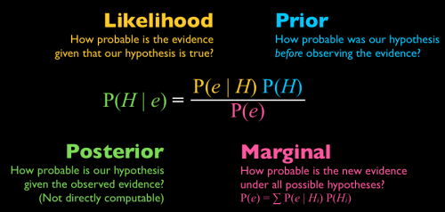

## Big questions live in an uncertain world

::: {.incremental}

- Democracies are *more likely* to grow faster — or not
- India will *probably* remain democratic — or not
- This poll is accurate to *within* three points — probably
- We *think* the effect is positive; the evidence is *thin*

- **Likely, chance, prone, probably, thin. The same vocabulary in journals, in newspapers, and at dinner.**
:::

---

## Probability is the mathematical language through which

::: {.incremental}

- we acknowledge how humble our knowledge of an uncertain world is
- yet audaciously analyse that uncertainty, and engage it critically
- communicate it in a language held in common
- and say, with a stated degree of confidence, what to expect

- **Not certainty. But uncertainty, made precise enough to argue with.**

:::

## Why Probability? {.smaller}

::: {.incremental}
-   Even the best model can't say with certainty whether any one country will grow next year — the world is uncertain, and probability is the language for being precise about *how* uncertain.
-   Two different quantities get called "probability": the *theoretical* chance built into the process, and the *empirical* frequency we actually observe in one sample.
-   Running example: of our 174 countries, some fraction happened to have positive growth — that's an empirical frequency. Probability asks what generated it.
    -   "What generated it" means the true, unknown probability $p$ that any given country has positive growth in a given year — the observed fraction is our sample's estimate of that fixed $p$, not $p$ itself.
:::

```{=html}
<div class="slide-footnote fragment">Framing probability as "theoretical chance" vs. "empirical frequency" reflects one particular view: the <strong>frequentist</strong> approach, which treats the true probability as a fixed, existing fact about the data-generating process — something a sample only ever <em>uncovers</em> or estimates, more precisely as the sample grows. A second view, the <strong>Bayesian</strong> approach, treats probability instead as a <em>degree of belief</em> that can attach to any proposition — including one-off, non-repeatable events — and that gets revised as new evidence comes in. We'll unpack this frequentist vs. Bayesian distinction explicitly on Day 5.</div>
```

## Today {.smaller}

::: {.columns .today-agenda}

::: {.column width="50%"}
::: {.incremental}
-   **Basic Probability**
    -   Terminology, Pr() notation
    -   Sets and set operations
    -   The axioms of probability
-   **Compound Probability**
    -   Joint and conditional probability, independence
    -   Bayes' theorem
-   **Counting**
    -   Permutations and combinations
:::
:::

::: {.column width="50%"}
::: {.incremental}
-   **Probability as a Function**
    -   Random variables: discrete vs. continuous
-   **Expectation algebra** — today's fluency block, same weight as Day 1's summation drill
-   Variance and covariance
-   **Conditional expectation and the type-shift**
-   The Law of Iterated Expectations (LIE)
-   **The selection-bias decomposition**, in four lines, from linearity alone
:::
:::

:::

## Basic Probability

*Outcomes, events, sets, and the sample space they all live in.*

## Terminology: Outcomes, Events, Sample Space {.smaller}

::: {.incremental}
-   **Outcome:** any single thing that might happen — one specific result.
-   **Event:** a collection of one or more outcomes we care about.
-   **Sample space ($\Omega$):** the set of *all* possible outcomes.
-   **Random event:** an event that's probabilistic rather than deterministic — we can point to causes that shift its probability, without any cause guaranteeing it happens.
:::

```{=html}
<div class="running-example-note">&#8618; Running example: &Omega; = {174 countries}; the event "Democracy" = {countries with polyarchy &gt; 0.5} &sub; &Omega;.</div>
<div class="slide-footnote">Note: "Democracy" here means polyarchy score &gt; 0.5 — that threshold is used throughout Day 2's running example, in place of the raw V-Dem term.</div>
```

## Pr() Notation {.smaller}

::: {.incremental}
-   When every outcome is equally likely, probability is just a counting ratio:
    $$Pr(e) = \frac{\text{number of outcomes in event } e}{\text{number of outcomes in the sample space}}$$
-   Example: probability of flipping tails on a fair coin — one favorable outcome out of two possible ones, $Pr(\text{tails}) = 1/2$.
:::

## Computing an Event's Probability {.smaller}

::: {.incremental}
-   An event's probability is the sum of the probabilities of the outcomes it contains: $P(A) = \sum_{\omega \in A} P(\omega)$.
-   Useful trick: it's often easier to compute $P(A^c)$ (the complement) and subtract from 1 than to compute $P(A)$ directly.
:::

<!--
The Sets and Counting slides below cover the same topics as IQSS's
"prefresher" course notes, probability chapter:
https://iqss.github.io/prefresher/06_probability.html (GPLv3 licensed).
Content here is written independently in this deck's own voice and
slide format, not copied verbatim -- credit to the IQSS prefresher
authors for the topic selection this draws on.
-->

## Sets Formalize Events {.smaller}

::: {.incremental}
-   Events aren't inherently numbers — "the country is a democracy" isn't a number until we formalize it.
-   *Set theory* is the formal language: an event is a subset of the sample space, and set operations tell us how to combine events.
-   This is the same set vocabulary from Day 1 (subset, union, intersection) — now put to work on probability.
:::

## Set Operations, Recap {.smaller}

::: {.incremental}
-   **Union** $A \cup B$: outcomes in $A$ *or* $B$ (or both).
-   **Intersection** $A \cap B$: outcomes in *both* $A$ and $B$.
-   **Complement** $A^c$: outcomes in $\Omega$ but *not* in $A$.
-   **Empty set** $\emptyset$: the event with no outcomes at all — probability zero.
:::

```{=html}
<div class="running-example-note">&#8618; Running example: A = {Democracy}, B = {growth &gt; 0}. A &cap; B = democratic, positive-growth countries; A &cup; B = countries with at least one of the two; A<sup>c</sup> = autocracies.</div>
```

## Outcomes: A World of 20 Countries {.smaller}

::: {.incremental}
-   Assume a world Ω of **20 countries**. Each dot below is one **outcome**.
-   Every country has two independent traits already baked in: its **regime** (democracy/autocracy) and its **growth** (high/low).
  - The other word for these traits here: **events**
-   This 20-country world is a smaller, concrete illustration of the same running example — distinct from the abstract 174-country population used in the earlier slides and later Quick Drills.

:::

```{=html}
<div class="sd-svg-wrap">
<svg viewBox="0 0 540 270" role="img" aria-label="20 countries as outcomes, laid out in a grid, colored by regime and marked by growth">
  <rect class="sd-omega" x="10" y="10" width="520" height="250" rx="12"></rect>
  <text class="sd-omega-label" x="24" y="34">&Omega;</text>
  <g>
    <path class="sd-dot sd-dem" d="M0,-9 L8,7 L-8,7 Z" transform="translate(55,55)"></path>
    <path class="sd-dot sd-dem" d="M0,-9 L8,7 L-8,7 Z" transform="translate(160,55)"></path>
    <path class="sd-dot sd-dem" d="M0,-9 L8,7 L-8,7 Z" transform="translate(265,55)"></path>
    <path class="sd-dot sd-dem" d="M0,-9 L8,7 L-8,7 Z" transform="translate(370,55)"></path>
    <path class="sd-dot sd-dem" d="M0,-9 L8,7 L-8,7 Z" transform="translate(475,55)"></path>
    <path class="sd-dot sd-dem" d="M0,9 L8,-7 L-8,-7 Z" transform="translate(55,108)"></path>
    <path class="sd-dot sd-dem" d="M0,9 L8,-7 L-8,-7 Z" transform="translate(160,108)"></path>
    <path class="sd-dot sd-dem" d="M0,9 L8,-7 L-8,-7 Z" transform="translate(265,108)"></path>
    <path class="sd-dot sd-dem" d="M0,9 L8,-7 L-8,-7 Z" transform="translate(370,108)"></path>
    <path class="sd-dot sd-dem" d="M0,9 L8,-7 L-8,-7 Z" transform="translate(475,108)"></path>
    <path class="sd-dot sd-dem" d="M0,9 L8,-7 L-8,-7 Z" transform="translate(55,162)"></path>
    <path class="sd-dot sd-dem" d="M0,9 L8,-7 L-8,-7 Z" transform="translate(160,162)"></path>
    <path class="sd-dot sd-dem" d="M0,9 L8,-7 L-8,-7 Z" transform="translate(265,162)"></path>
    <path class="sd-dot sd-aut" d="M0,-9 L8,7 L-8,7 Z" transform="translate(370,162)"></path>
    <path class="sd-dot sd-aut" d="M0,-9 L8,7 L-8,7 Z" transform="translate(475,162)"></path>
    <path class="sd-dot sd-aut" d="M0,-9 L8,7 L-8,7 Z" transform="translate(55,215)"></path>
    <path class="sd-dot sd-aut" d="M0,9 L8,-7 L-8,-7 Z" transform="translate(160,215)"></path>
    <path class="sd-dot sd-aut" d="M0,9 L8,-7 L-8,-7 Z" transform="translate(265,215)"></path>
    <path class="sd-dot sd-aut" d="M0,9 L8,-7 L-8,-7 Z" transform="translate(370,215)"></path>
    <path class="sd-dot sd-aut" d="M0,9 L8,-7 L-8,-7 Z" transform="translate(475,215)"></path>
  </g>
</svg>
<div class="sd-legend">
  <span><i class="sd-tri dem-up"></i> Democracy, high growth</span>
  <span><i class="sd-tri dem-down"></i> Democracy, low growth</span>
  <span><i class="sd-tri aut-up"></i> Autocracy, high growth</span>
  <span><i class="sd-tri aut-down"></i> Autocracy, low growth</span>
</div>
</div>

<style>
.sd-svg-wrap { max-width: 480px; margin: -4px auto 0; }
.sd-svg-wrap svg { width: 100%; height: auto; display: block; }
.sd-omega { fill: #F7F8FA; stroke: #D9E0EA; stroke-width: 1.5; }
.sd-omega-label { font-size: 16px; fill: #5A6B80; font-weight: 700; }
.sd-circle { fill: none; stroke-width: 2.5; }
.sd-circle-a { stroke: #2b6cb0; }
.sd-circle-b { stroke: #d9720f; stroke-dasharray: 7 4; }
.sd-circle-c { stroke: #7952b3; stroke-dasharray: 1.5 3.5; }
.sd-label-a { fill: #2b6cb0; font-size: 15px; font-weight: 700; }
.sd-label-b { fill: #d9720f; font-size: 15px; font-weight: 700; }
.sd-label-c { fill: #7952b3; font-size: 15px; font-weight: 700; }
.sd-dot { stroke: #22303F; stroke-width: 0.6; }
.sd-dot.sd-dem { fill: #2f9e63; }
.sd-dot.sd-aut { fill: #c0392b; }
.sd-shade { fill: #2b6cb0; fill-opacity: 0.28; }
.sd-count-label { font-size: 22px; font-weight: 700; fill: #2b6cb0; }
.sd-legend { display: flex; gap: 14px; flex-wrap: wrap; justify-content: center; font-size: 0.6em; color: #5A6B80; margin-top: 3px; }
.sd-tri { display: inline-block; width: 0; height: 0; border-left: 5px solid transparent; border-right: 5px solid transparent; margin-right: 4px; vertical-align: middle; }
.sd-tri.dem-up { border-bottom: 8px solid #2f9e63; }
.sd-tri.dem-down { border-top: 8px solid #2f9e63; }
.sd-tri.aut-up { border-bottom: 8px solid #c0392b; }
.sd-tri.aut-down { border-top: 8px solid #c0392b; }
.sd-mini-row { display: flex; gap: 16px; justify-content: center; flex-wrap: wrap; margin-top: 4px; }
.sd-mini { flex: 0 0 28%; max-width: 210px; text-align: center; }
.sd-mini svg { width: 100%; height: auto; display: block; }
.sd-mini-title { font-weight: 700; color: #2b6cb0; margin-bottom: 2px; font-size: 0.65em; }
.sd-mini-count { font-size: 0.6em; color: #5A6B80; }
.sd-calc-row { display: flex; flex-direction: column; gap: 1px; margin-bottom: 7px; font-size: 0.62em; }
.sd-calc-question { color: #22303F; }
.sd-calc-answer { color: #2b6cb0; }
.sd-calc-answer strong { color: #2b6cb0; }
.sd-compact-slide { font-size: 0.72em; line-height: 1.25; }
.sd-compact-slide ul { margin: 0.15em 0; }
.sd-compact-slide li { margin-bottom: 0.15em; }
.sd-ops-slide { font-size: 0.85em; line-height: 1.3; }
.sd-ops-slide ul { margin: 0.15em 0; }
.sd-ops-slide li { margin-bottom: 0.2em; }
.sd-ops-slide strong { display: block; margin-top: 0.3em; }
.sd-notation-table { width: 100%; border-collapse: collapse; font-size: 0.95em; }
.sd-notation-table th, .sd-notation-table td { text-align: left; padding: 6px 10px; border-bottom: 1px solid #D9E0EA; }
.sd-notation-table th { color: #5A6B80; font-weight: 700; }
.sd-notation-table td:first-child { color: #2b6cb0; font-weight: 700; white-space: nowrap; }
</style>
```

## Events: A = Democracy, B = High Growth {.smaller}

::: {.incremental}
-   **Event A** = {country is a democracy}. Out of 20 countries, **$\lvert A\rvert = 13$**.
-   **Event B** = {country has high growth}. Out of 20 countries, **$\lvert B\rvert = 8$**.
-   Sorting the same 20 dots by A and B lands them in four regions: only A, only B, both, or neither.
:::

```{=html}
<div class="sd-svg-wrap">
<svg viewBox="0 0 540 270" role="img" aria-label="The same 20 countries sorted into events A (Democracy) and B (High growth)">
  <rect class="sd-omega" x="10" y="10" width="520" height="250" rx="12"></rect>
  <text class="sd-omega-label" x="24" y="34">&Omega;</text>
  <circle class="sd-circle sd-circle-a" cx="190" cy="135" r="80"></circle>
  <circle class="sd-circle sd-circle-b" cx="310" cy="135" r="80"></circle>
  <text class="sd-label-a" x="70" y="45">A: Democracy</text>
  <text class="sd-label-b" x="400" y="45">B: High growth</text>
  <g>
    <path class="sd-dot sd-dem" d="M0,-9 L8,7 L-8,7 Z" transform="translate(247,133)"></path>
    <path class="sd-dot sd-dem" d="M0,-9 L8,7 L-8,7 Z" transform="translate(253,151)"></path>
    <path class="sd-dot sd-dem" d="M0,-9 L8,7 L-8,7 Z" transform="translate(247,157)"></path>
    <path class="sd-dot sd-dem" d="M0,-9 L8,7 L-8,7 Z" transform="translate(253,121)"></path>
    <path class="sd-dot sd-dem" d="M0,-9 L8,7 L-8,7 Z" transform="translate(247,145)"></path>
    <path class="sd-dot sd-dem" d="M0,9 L8,-7 L-8,-7 Z" transform="translate(223,151)"></path>
    <path class="sd-dot sd-dem" d="M0,9 L8,-7 L-8,-7 Z" transform="translate(199,133)"></path>
    <path class="sd-dot sd-dem" d="M0,9 L8,-7 L-8,-7 Z" transform="translate(175,181)"></path>
    <path class="sd-dot sd-dem" d="M0,9 L8,-7 L-8,-7 Z" transform="translate(133,139)"></path>
    <path class="sd-dot sd-dem" d="M0,9 L8,-7 L-8,-7 Z" transform="translate(187,103)"></path>
    <path class="sd-dot sd-dem" d="M0,9 L8,-7 L-8,-7 Z" transform="translate(235,181)"></path>
    <path class="sd-dot sd-dem" d="M0,9 L8,-7 L-8,-7 Z" transform="translate(181,157)"></path>
    <path class="sd-dot sd-dem" d="M0,9 L8,-7 L-8,-7 Z" transform="translate(163,115)"></path>
    <path class="sd-dot sd-aut" d="M0,-9 L8,7 L-8,7 Z" transform="translate(355,181)"></path>
    <path class="sd-dot sd-aut" d="M0,-9 L8,7 L-8,7 Z" transform="translate(355,103)"></path>
    <path class="sd-dot sd-aut" d="M0,-9 L8,7 L-8,7 Z" transform="translate(319,109)"></path>
    <path class="sd-dot sd-aut" d="M0,9 L8,-7 L-8,-7 Z" transform="translate(73,61)"></path>
    <path class="sd-dot sd-aut" d="M0,9 L8,-7 L-8,-7 Z" transform="translate(379,97)"></path>
    <path class="sd-dot sd-aut" d="M0,9 L8,-7 L-8,-7 Z" transform="translate(229,31)"></path>
    <path class="sd-dot sd-aut" d="M0,9 L8,-7 L-8,-7 Z" transform="translate(97,223)"></path>
  </g>
</svg>
<div class="sd-legend">
  <span><i class="sd-tri dem-up"></i> Democracy, high growth</span>
  <span><i class="sd-tri dem-down"></i> Democracy, low growth</span>
  <span><i class="sd-tri aut-up"></i> Autocracy, high growth</span>
  <span><i class="sd-tri aut-down"></i> Autocracy, low growth</span>
</div>
</div>
```

```{=html}
<div class="slide-footnote">A dot outside both circles is still valid — it's an autocracy with low growth. Regime {Democracy, Autocracy} and growth {High, Low} are two separate partitions of &Omega;: each is mutually exclusive and exhaustive on its own, but they cut across each other, so a country can sit outside both A and B without any contradiction.</div>
```

## Set Operations: Reading the Regions {.smaller}

::: {.incremental}
-   **$A \cap B$** ("both"): countries in the shaded lens are democracies *and* high-growth.
-   **$A \cup B$** ("either"): countries in the shaded area are in *at least one* of the two events.
-   **$A^c$** ("complement"): everything shaded is *not* in A — the autocracies.
:::

```{=html}
<div class="sd-mini-row">

  <div class="sd-mini">
    <div class="sd-mini-title">A &cap; B</div>
    <svg viewBox="0 0 170 130" role="img" aria-label="A intersect B shaded">
      <rect class="sd-omega" x="5" y="10" width="160" height="110" rx="8"></rect>
      <clipPath id="sd-clip-and"><circle cx="55" cy="65" r="45"></circle></clipPath>
      <path class="sd-shade" clip-path="url(#sd-clip-and)" d="M 70 65 A 45 45 0 1 0 160 65 A 45 45 0 1 0 70 65 Z"></path>
      <circle class="sd-circle sd-circle-a" cx="55" cy="65" r="45"></circle>
      <circle class="sd-circle sd-circle-b" cx="115" cy="65" r="45"></circle>
    </svg>
    <div class="sd-mini-count">5 of 20 countries</div>
  </div>

  <div class="sd-mini">
    <div class="sd-mini-title">A &cup; B</div>
    <svg viewBox="0 0 170 130" role="img" aria-label="A union B shaded">
      <rect class="sd-omega" x="5" y="10" width="160" height="110" rx="8"></rect>
      <path class="sd-shade" d="M 10 65 A 45 45 0 1 0 100 65 A 45 45 0 1 0 10 65 Z M 70 65 A 45 45 0 1 0 160 65 A 45 45 0 1 0 70 65 Z"></path>
      <circle class="sd-circle sd-circle-a" cx="55" cy="65" r="45"></circle>
      <circle class="sd-circle sd-circle-b" cx="115" cy="65" r="45"></circle>
    </svg>
    <div class="sd-mini-count">16 of 20 countries</div>
  </div>

  <div class="sd-mini">
    <div class="sd-mini-title">A<sup>c</sup></div>
    <svg viewBox="0 0 170 130" role="img" aria-label="Complement of A shaded">
      <rect class="sd-omega" x="5" y="10" width="160" height="110" rx="8"></rect>
      <path class="sd-shade" fill-rule="evenodd" d="M 5 10 H 165 V 120 H 5 Z M 10 65 A 45 45 0 1 0 100 65 A 45 45 0 1 0 10 65 Z"></path>
      <circle class="sd-circle sd-circle-a" cx="55" cy="65" r="45"></circle>
      <circle class="sd-circle sd-circle-b" cx="115" cy="65" r="45"></circle>
    </svg>
    <div class="sd-mini-count">7 of 20 countries</div>
  </div>

</div>
```

## Calculating Probabilities {.smaller}

::: {.columns}

::: {.column width="42%"}
```{=html}
<div class="sd-svg-wrap">
<svg viewBox="0 0 540 270" role="img" aria-label="Venn diagram with the count of countries labeled in each of the four regions">
  <rect class="sd-omega" x="10" y="10" width="520" height="250" rx="12"></rect>
  <text class="sd-omega-label" x="24" y="34">&Omega;</text>
  <circle class="sd-circle sd-circle-a" cx="190" cy="135" r="80"></circle>
  <circle class="sd-circle sd-circle-b" cx="310" cy="135" r="80"></circle>
  <text class="sd-label-a" x="70" y="45">A: Democracy</text>
  <text class="sd-label-b" x="400" y="45">B: High growth</text>
  <text class="sd-count-label" x="150" y="140" text-anchor="middle">8</text>
  <text class="sd-count-label" x="250" y="140" text-anchor="middle">5</text>
  <text class="sd-count-label" x="350" y="140" text-anchor="middle">3</text>
  <text class="sd-count-label" x="460" y="230" text-anchor="middle">4</text>
</svg>
</div>
```
:::

::: {.column width="56%"}
```{=html}
<div class="sd-calc-row">
  <div class="sd-calc-question fragment">What's the probability a country is a democracy?</div>
  <div class="sd-calc-answer fragment"><strong>P(A) = 13/20 = 0.65</strong></div>
</div>
<div class="sd-calc-row">
  <div class="sd-calc-question fragment">What's the probability a country has high growth?</div>
  <div class="sd-calc-answer fragment"><strong>P(B) = 8/20 = 0.40</strong></div>
</div>
<div class="sd-calc-row">
  <div class="sd-calc-question fragment">What's the probability a country is a democracy AND has high growth?</div>
  <div class="sd-calc-answer fragment"><strong>P(A &cap; B) = 5/20 = 0.25</strong></div>
</div>
<div class="sd-calc-row">
  <div class="sd-calc-question fragment">What's the probability a country is a democracy OR has high growth (or both)?</div>
  <div class="sd-calc-answer fragment"><strong>P(A &cup; B) = 16/20 = 0.80</strong></div>
</div>
<div class="sd-calc-row">
  <div class="sd-calc-question fragment">What's the probability a country is NOT a democracy?</div>
  <div class="sd-calc-answer fragment"><strong>P(A<sup>c</sup>) = 7/20 = 0.35</strong></div>
</div>
<div class="sd-calc-row">
  <div class="sd-calc-question fragment">Given a country has high growth, what's the probability it's a democracy?</div>
  <div class="sd-calc-answer fragment"><strong>P(A | B) = 5/8 = 0.625</strong></div>
</div>
```
:::

:::

## Properties of Set Operations {.smaller}

::: {.incremental}
-   **Commutative / associative:** $A \cup B = B \cup A$; grouping doesn't matter for repeated unions or intersections.
-   **Distributive:** $A \cap (B \cup C) = (A \cap B) \cup (A \cap C)$.
-   **De Morgan's laws:** $(A \cup B)^c = A^c \cap B^c$ — "not (A or B)" is the same event as "not A, and not B."
-   **Mutually exclusive / partition:** disjoint sets ($A \cap B = \emptyset$) that together cover $\Omega$ split the sample space into non-overlapping pieces — exactly what `D=1{Democracy}` does to our 174 countries.
:::

## A Third Event: C = Presidential System {.smaller}

::: {.sd-compact-slide}

::: {.incremental}
-   Add **Event C** = {presidential system} to the same 20-country world. **$\lvert C\rvert = 4$**.
-   Ω now splits into up to 8 regions — one consistent way to keep $\lvert A\rvert=13$, $\lvert B\rvert=8$, $\lvert A\cap B\rvert=5$ from before.
:::

::: {.columns}

::: {.column width="46%"}
```{=html}
<div class="sd-svg-wrap">
<svg viewBox="0 0 500 290" role="img" aria-label="Three-circle Venn diagram of events A (Democracy), B (High growth), and C (Presidential system), with the count of countries labeled in each of the eight regions">
  <rect class="sd-omega" x="15" y="15" width="470" height="255" rx="12"></rect>
  <circle class="sd-circle sd-circle-a" cx="215" cy="120" r="70"></circle>
  <circle class="sd-circle sd-circle-b" cx="275" cy="120" r="70"></circle>
  <circle class="sd-circle sd-circle-c" cx="245" cy="170" r="70"></circle>
  <text class="sd-label-a" x="140" y="45">A: Democracy</text>
  <text class="sd-label-b" x="300" y="45">B: High growth</text>
  <text class="sd-label-c" x="245" y="262" text-anchor="middle">C: Presidential</text>
  <text class="sd-count-label" x="175" y="95" text-anchor="middle">7</text>
  <text class="sd-count-label" x="315" y="95" text-anchor="middle">3</text>
  <text class="sd-count-label" x="245" y="222" text-anchor="middle">2</text>
  <text class="sd-count-label" x="245" y="95" text-anchor="middle">4</text>
  <text class="sd-count-label" x="200" y="155" text-anchor="middle">1</text>
  <text class="sd-count-label" x="290" y="155" text-anchor="middle">0</text>
  <text class="sd-count-label" x="245" y="140" text-anchor="middle">1</text>
  <text class="sd-count-label" x="440" y="240" text-anchor="middle">2</text>
  <text class="sd-none-label" x="440" y="222" text-anchor="middle">none of A,B,C</text>
</svg>
</div>

<style>
.sd-none-label { font-size: 11px; fill: #5A6B80; }
</style>
```
:::

::: {.column width="52%"}
::: {.incremental}
-   **Commutative:** $A\cap B = B\cap A$ — both 5.
-   **Associative:** $(A\cap B)\cap C = A\cap(B\cap C)$ — same 1-country center.
-   **Distributive:** $A\cap(B\cup C) = (A\cap B)\cup(A\cap C)$ — same $4{+}1{+}1=6$ countries.
-   **De Morgan's:** $(A\cup B\cup C)^c = A^c\cap B^c\cap C^c$ — same 2 countries outside all three.
-   **Partition:** $7{+}3{+}2{+}4{+}1{+}0{+}1{+}2 = 20$. $B\cap C\setminus A = 0$ is a valid, empty piece.
:::
:::

:::

:::

<!--
Quick-reference notation primer. Topic list (which symbols/definitions to
cover) is standard across intro probability treatments, including IQSS's
"prefresher" course notes, probability chapter:
https://iqss.github.io/prefresher/06_probability.html (GPLv3 licensed).
Definitions and examples here are written independently in this deck's own
voice, tied to the running country example -- not copied from that source.
-->

## Set Notation, Quick Reference {.smaller}

::: {.columns}

::: {.column width="50%"}
```{=html}
<table class="sd-notation-table">
<tr><th>Notation</th><th>Meaning</th></tr>
<tr><td>\(x \in A\)</td><td>x is an element of A</td></tr>
<tr><td>\(x \notin A\)</td><td>x is not an element of A</td></tr>
<tr><td>\(A \subseteq B\)</td><td>every element of A is also in B</td></tr>
<tr><td>\(\emptyset\)</td><td>the empty set — no elements</td></tr>
<tr><td>\(\Omega\) (or S)</td><td>the sample space — all possible outcomes</td></tr>
<tr><td>\(\lvert A \rvert\)</td><td>cardinality — the number of elements in A</td></tr>
<tr><td>\(A \cap B = \emptyset\)</td><td>A and B are mutually exclusive</td></tr>
</table>
```
:::

::: {.column width="50%"}
```{=html}
<table class="sd-notation-table">
<tr><th>Notation</th><th>Meaning</th></tr>
<tr><td>\(A \cup B\)</td><td>union — in A, or B, or both</td></tr>
<tr><td>\(A \cap B\)</td><td>intersection — in both A and B</td></tr>
<tr><td>\(A^c\) (or \(A'\))</td><td>complement — in &Omega; but not A</td></tr>
<tr><td>\(A \setminus B\)</td><td>difference — in A but not B</td></tr>
<tr><td>\(\displaystyle\bigcup_{i=1}^n A_i\)</td><td>union of n sets: \(A_1\cup\cdots\cup A_n\)</td></tr>
<tr><td>\(\displaystyle\bigcap_{i=1}^n A_i\)</td><td>intersection of n sets: \(A_1\cap\cdots\cap A_n\)</td></tr>
</table>
```
:::

:::

-   A **partition** of $\Omega$ is a collection of mutually exclusive sets $A_1,\dots,A_n$ whose union $\bigcup_{i=1}^n A_i$ is all of $\Omega$ — exactly the 8 regions two slides back (there, $n=8$).

## Quick Drill: Sets {.smaller}

::: {.sd-compact-slide}
::: {.incremental}
-   $A$ = {Democracy}, $B$ = {growth > 0}. In words, what is $A^c \cap B^c$? [Autocracies with non-positive growth — by De Morgan's, this is $(A \cup B)^c$.]{.fragment}
-   Are $\{D=1\}$ and $\{D=0\}$ mutually exclusive? Do they partition $\Omega$? [Yes to both — every country is in exactly one, so they're disjoint and cover all 174.]{.fragment}
-   Using the 20-country world with $A$ = Democracy, $B$ = High growth, $C$ = Presidential ($\lvert A\rvert=13,\lvert B\rvert=8,\lvert C\rvert=4$, $\lvert A\cap B\rvert=5,\lvert A\cap C\rvert=2,\lvert B\cap C\rvert=1,\lvert A\cap B\cap C\rvert=1$): how many countries are in $A \cup B \cup C$? [Inclusion–exclusion: $13+8+4-5-2-1+1=18$.]{.fragment}
-   Same setup — how many countries are in $(A \cap B) \cup C$? [$\lvert A\cap B\rvert + \lvert C\rvert - \lvert (A\cap B)\cap C\rvert = 5+4-1=8$, since $(A\cap B)\cap C$ is just the 1-country center region.]{.fragment}
:::
:::

## Axioms & Probability Operations

*The three rules any probability function must obey — and everything else, derived from them.*

## What Have We Observed, So Far? {.smaller}

::: {.incremental}
-   Every probability we've computed has been **non-negative** — never once did an event come out less likely than impossible.
-   $P(\Omega)$ has always come out to **1** — some outcome always occurs; the sample space is the whole deal.
-   When two events couldn't both happen — mutually exclusive events, like $D=1$ and $D=0$ — their probabilities just **added**.
-   Nothing we've done — Pr() notation, the complement trick, the Venn diagrams, three overlapping events — ever broke these three patterns.
-   **Question:** are these just patterns we happened to notice, or rules that *define* what "probability" is allowed to mean?
:::

## The Kolmogorov Axioms {.smaller}

::: {.incremental}
-   These patterns are not a coincidence — they **are**, formally, the definition of probability. Any function claiming to assign probabilities must satisfy exactly these three axioms (Kolmogorov, 1933):
-   **Axiom 1 (non-negativity):** $P(A) \geq 0$ for every event $A \subseteq \Omega$.
-   **Axiom 2 (normalization):** $P(\Omega) = 1$.
-   **Axiom 3 (additivity):** for pairwise disjoint events $A_1, A_2, \ldots, A_n$ (i.e. $A_i \cap A_j = \emptyset$ for $i\neq j$),
    $$P\Big(\bigcup\limits_{i=1}^{n} A_i\Big) = \sum\limits_{i=1}^{n} P(A_i)$$
-   That's it. Every other probability rule we'll use — including ones we haven't proven yet — is a *consequence* of these three, not an extra assumption.
:::

## Probability Is a Mapping {.smaller}

::: {.incremental}
-   Informally: probability is a machine. Feed it an **event**, it hands back a **number** in $[0,1]$ — nothing more, nothing less.
-   Formally: a **probability function** is a mapping
    $$P : \{\text{events on } \Omega\} \to [0,1]$$
    that satisfies Kolmogorov's three axioms above.
-   This is exactly the same idea as a function from Day 1 ($f: \text{domain} \to \text{codomain}$) — the domain here just happens to be *events*, not numbers.
-   Running example: $P(\text{Democracy})$ takes the event "country is a democracy" and returns $0.65$ — one event in, one number out.
:::

<!--
The Probability Operations slide below covers the same topic list as IQSS's
"prefresher" course notes, probability chapter:
https://iqss.github.io/prefresher/06_probability.html (GPLv3 licensed):
P(empty set)=0, 0<=P(A)<=1, the complement rule, monotonicity, the addition
rule, and Boole's inequality. Content, derivations, and examples here are
written independently in this deck's own voice, derived from the Kolmogorov
axioms above rather than copied -- credit to the IQSS prefresher authors for
the topic selection this draws on.
-->

## Probability Operations I {.smaller}

::: {.sd-ops-slide}
::: {.columns}

::: {.column width="48%"}
**Empty set**

::: {.incremental}
-   What is $P(\emptyset)$?
-   Let $A_1=\Omega$ and $A_2=\emptyset$ — disjoint, and their union is $\Omega$.
-   Axiom 3: $P(\Omega) = P(A_1\cup A_2) = P(\Omega)+P(\emptyset)$.
-   Subtract $P(\Omega)$ from both sides: $P(\emptyset)=0$.
:::
:::

::: {.column width="48%"}
**Bounded**

::: {.incremental}
-   Why is $0 \leq P(A) \leq 1$ for every event $A$?
-   Lower bound: that's just Axiom 1, directly.
-   Upper bound: $A \subseteq \Omega$, and by monotonicity (next slide) $P(A) \leq P(\Omega) = 1$.
:::
:::

:::
:::

## Probability Operations II {.smaller}

::: {.sd-ops-slide}
::: {.columns}

::: {.column width="48%"}
**Complement rule**

::: {.incremental}
-   What is $P(A^c)$, in terms of $P(A)$?
-   $A$ and $A^c$ are disjoint, and together cover $\Omega$: $A \cup A^c = \Omega$.
-   Axiom 3: $P(A) + P(A^c) = P(\Omega) = 1$.
-   Rearranged: $P(A^c) = 1-P(A)$.
:::
:::

::: {.column width="48%"}
**Monotonicity**

::: {.incremental}
-   If $A \subseteq B$, is $P(A) \leq P(B)$?
-   Split $B$ into two disjoint pieces: $B = A \cup (B\setminus A)$.
-   Axiom 3: $P(B) = P(A) + P(B\setminus A)$.
-   Since $P(B\setminus A) \geq 0$ (Axiom 1), $P(B) \geq P(A)$.
:::
:::

:::
:::

## Probability Operations III {.smaller}

::: {.sd-ops-slide}
::: {.columns}

::: {.column width="48%"}
**Addition rule**

::: {.incremental}
-   What is $P(A\cup B)$ once $A$ and $B$ overlap?
-   Split $A \cup B$ into three disjoint pieces: $A$-only, $B$-only, $A\cap B$.
-   Adding $P(A)+P(B)$ counts the $A\cap B$ piece **twice** — once inside each.
-   Subtract it back out once: $P(A\cup B) = P(A)+P(B)-P(A\cap B)$.
-   Check: $0.65+0.40-0.25=0.80$ — matches the $16/20$ we counted directly.
:::
:::

::: {.column width="48%"}
**Boole's inequality (stated)**

::: {.incremental}
-   For any events $A_1,\ldots,A_n$ — overlapping or not:
    $$P\Big(\bigcup\limits_{i=1}^{n} A_i\Big) \leq \sum\limits_{i=1}^{n} P(A_i)$$
-   Why an *inequality*, not always an equation? See the next slide.
:::
:::

:::
:::

## Boole's Inequality, Interactively {.smaller}

::: {.sd-compact-slide}
::: {.incremental}
-   The addition rule is **exact**: $P(A\cup B) = P(A)+P(B)-P(A\cap B)$.
-   Since $P(A\cap B) \geq 0$ always, dropping that term can only make the right side bigger (or leave it equal): $P(A\cup B) \leq P(A)+P(B)$.
-   **When A and B overlap**, summing $P(A)+P(B)$ double-counts the shared region — it *overshoots* the true union probability by exactly $P(A\cap B)$.
-   **When A and B are disjoint** ($P(A\cap B)=0$), there's nothing left to double-count, and the inequality becomes an equality.
-   Drag the sliders below and watch the gap between $P(A)+P(B)$ and $P(A\cup B)$ open and close with the overlap.
:::
:::

```{=html}
<div class="bl">
  <div class="bl-controls">
    <label>P(A): <span class="bl-pa-val">0.40</span>
      <input id="bl-pa" type="range" min="0.05" max="0.85" step="0.01" value="0.40">
    </label>
    <label>P(B): <span class="bl-pb-val">0.35</span>
      <input id="bl-pb" type="range" min="0.05" max="0.85" step="0.01" value="0.35">
    </label>
    <label>Overlap: <span class="bl-ov-val">0.50</span>
      <input id="bl-ov" type="range" min="0" max="1" step="0.01" value="0.50">
    </label>
  </div>

  <div class="bl-layout">
    <svg class="bl-svg" viewBox="0 0 420 220" role="img" aria-label="Two overlapping circles representing events A and B, resizing with the sliders">
      <rect class="sd-omega" x="6" y="6" width="408" height="208" rx="10"></rect>
      <text class="sd-omega-label" x="18" y="28">&Omega;</text>
      <circle class="bl-circle-a"></circle>
      <circle class="bl-circle-b"></circle>
      <text class="bl-label-a"></text>
      <text class="bl-label-b"></text>
    </svg>

    <div class="bl-panel">
      <div class="bl-row"><span>P(A)</span><strong class="bl-out-pa"></strong></div>
      <div class="bl-row"><span>P(B)</span><strong class="bl-out-pb"></strong></div>
      <div class="bl-row bl-row-sum"><span>P(A) + P(B)</span><strong class="bl-out-sum"></strong></div>
      <div class="bl-row"><span>P(A &cap; B) — the double-counted part</span><strong class="bl-out-pab"></strong></div>
      <div class="bl-row bl-row-union"><span>P(A &cup; B)</span><strong class="bl-out-pau"></strong></div>
      <div class="bl-ineq">P(A &cup; B) <span class="bl-out-rel">&le;</span> P(A) + P(B)</div>
    </div>
  </div>
</div>

<style>
.bl { font-size: 0.75em; }
.bl-controls { display: flex; flex-wrap: wrap; gap: 10px 22px; margin-bottom: 6px; }
.bl-controls label { display: flex; align-items: center; gap: 6px; }
.bl-controls input[type="range"] { width: 130px; }
.bl-layout { display: flex; gap: 18px; align-items: center; flex-wrap: wrap; }
.bl-svg { flex: 1 1 55%; min-width: 260px; }
.bl-circle-a { fill: #2b6cb0; fill-opacity: 0.45; stroke: #2b6cb0; stroke-width: 1.5; }
.bl-circle-b { fill: #d9720f; fill-opacity: 0.45; stroke: #d9720f; stroke-width: 1.5; }
.bl-label-a { font-size: 14px; font-weight: 700; fill: #2b6cb0; }
.bl-label-b { font-size: 14px; font-weight: 700; fill: #d9720f; }
.bl-panel { flex: 1 1 35%; min-width: 220px; display: flex; flex-direction: column; gap: 5px; }
.bl-row { display: flex; justify-content: space-between; gap: 10px; }
.bl-row strong { color: #2b6cb0; }
.bl-row-sum strong { color: #5A6B80; }
.bl-row-union strong { color: #18BC9C; }
.bl-ineq { margin-top: 6px; padding-top: 6px; border-top: 1px dashed #D9E0EA; font-weight: 700; text-align: center; }
.bl-out-rel { color: #c0392b; padding: 0 4px; }
</style>

<script>
(function () {
  var roots = document.querySelectorAll('.bl');
  var root = roots[roots.length - 1];

  var paSlider = root.querySelector('#bl-pa');
  var pbSlider = root.querySelector('#bl-pb');
  var ovSlider = root.querySelector('#bl-ov');

  var circleA = root.querySelector('.bl-circle-a');
  var circleB = root.querySelector('.bl-circle-b');
  var labelA = root.querySelector('.bl-label-a');
  var labelB = root.querySelector('.bl-label-b');

  var cx = 210, cy = 110, maxR = 78;

  function fmt(v) { return v.toFixed(2); }

  function draw() {
    var pa = parseFloat(paSlider.value);
    var pb = parseFloat(pbSlider.value);
    var ov = parseFloat(ovSlider.value);

    root.querySelector('.bl-pa-val').textContent = fmt(pa);
    root.querySelector('.bl-pb-val').textContent = fmt(pb);
    root.querySelector('.bl-ov-val').textContent = fmt(ov);

    var rA = maxR * Math.sqrt(pa);
    var rB = maxR * Math.sqrt(pb);
    var touching = rA + rB;
    var nested = Math.abs(rA - rB);
    var dist = touching - ov * (touching - nested);

    var xA = cx - dist / 2;
    var xB = cx + dist / 2;

    circleA.setAttribute('cx', xA);
    circleA.setAttribute('cy', cy);
    circleA.setAttribute('r', rA);
    circleB.setAttribute('cx', xB);
    circleB.setAttribute('cy', cy);
    circleB.setAttribute('r', rB);

    labelA.setAttribute('x', xA - rA - 6);
    labelA.setAttribute('y', cy - rA + 2);
    labelA.setAttribute('text-anchor', 'end');
    labelA.textContent = 'A';
    labelB.setAttribute('x', xB + rB + 6);
    labelB.setAttribute('y', cy - rB + 2);
    labelB.textContent = 'B';

    var pab = ov * Math.min(pa, pb);
    var pau = pa + pb - pab;
    var sum = pa + pb;

    root.querySelector('.bl-out-pa').textContent = fmt(pa);
    root.querySelector('.bl-out-pb').textContent = fmt(pb);
    root.querySelector('.bl-out-sum').textContent = fmt(sum);
    root.querySelector('.bl-out-pab').textContent = fmt(pab);
    root.querySelector('.bl-out-pau').textContent = fmt(pau);
    root.querySelector('.bl-out-rel').textContent = pab < 0.005 ? '=' : '<';
  }

  [paSlider, pbSlider, ovSlider].forEach(function (el) {
    el.addEventListener('input', draw);
  });

  draw();
})();
</script>
```


## Compound Probability & Bayes' Theorem

*Joint and conditional probability, independence, and flipping a conditional around.*

## Compound Probability: Joint & Conditional {.smaller}

::: {.incremental}
-   **Joint probability** $P(A \cap B)$: the chance both events happen at once.
    -   Running example: $P(\text{Democracy} \cap \text{High growth})$ — countries that are both.
-   **Conditional probability**: once we know $B$ happened, the world shrinks down to just $B$.
    -   Formally: $P(A \mid B) = \dfrac{P(A \cap B)}{P(B)}$, for $P(B)>0$.
    -   Intuition: restrict the sample space to $B$, then ask what *share* of that smaller world is also in $A$ — same ratio idea as $\Pr(e)$ back on Day 2's first slide, just on a shrunk-down $\Omega$.
:::

```{=html}
<div class="running-example-note">&#8618; Running example: A = {Democracy}, B = {High growth}. P(A|B) = share of high-growth countries that are also democracies — not the same number as P(A).</div>
```

## Compound Probability: The Multiplication Rule {.smaller}

::: {.incremental}
-   Clear the denominator in the conditional-probability definition:
    -   $P(A \mid B)\,P(B) = P(A\cap B)$.
-   The same logic, starting instead from $B\mid A$:
    -   $P(B \mid A)\,P(A) = P(A \cap B)$ too — the *same* joint probability, built two different ways.
    -   That's exactly the fact Bayes' rule exploits, coming up soon.
-   Check against the running example: $P(A\mid B) = 0.625$ and $P(B)=0.40$, so $P(A\mid B)P(B) = 0.625 \times 0.40 = 0.25$ — matches $P(A\cap B)=0.25$ we counted directly.
:::

## Independence: Two Events {.smaller}

::: {.incremental}
-   Intuition: $A$ and $B$ are **independent** if knowing one happened tells you *nothing* about the other.
-   Formal definition — two equivalent forms:
    -   $P(A \mid B) = P(A)$ — conditioning on $B$ doesn't move $A$'s probability at all.
    -   Equivalently: $P(A \cap B) = P(A)\,P(B)$.
    -   Why equivalent: substitute $P(A\mid B) = P(A)$ into the multiplication rule $P(A\cap B) = P(A\mid B)P(B)$, and the right side collapses to $P(A)P(B)$.
:::

```{=html}
<div class="running-example-note">&#8618; Running example check: P(A)=0.65, P(B)=0.40 &rarr; P(A)P(B)=0.26, but we counted P(A&cap;B)=0.25 directly. Close, but not equal — Democracy and High growth are <em>not quite</em> independent in this world.</div>
```

## Independence: Three or More Events {.smaller}

::: {.incremental}
-   With **three or more events**, independence comes in two strengths:
    -   **Pairwise independence**: every pair satisfies the product rule on its own —
        -   $P(A\cap B)=P(A)P(B)$
        -   $P(A\cap C)=P(A)P(C)$
        -   $P(B\cap C)=P(B)P(C)$
    -   **Mutual independence**: the *whole* collection satisfies the product rule at once —
        -   $P(A\cap B\cap C) = P(A)P(B)P(C)$
        -   *in addition to* every pairwise version above.
-   Mutual independence is strictly **stronger** — events can pass every pairwise check and still fail the joint one.
:::

## Quick Drill: Compound Probability {.smaller}

::: {.incremental}
-   Of our 20-country world, 8 have positive growth, and 5 of those are also democracies. What is $P(A|B)$? [$5/8 = 0.625$ — matching $P(A\mid B)$ from the running tallies.]{.fragment}
-   If instead $P(A) = 0.45$ and $P(A|B) = 0.45$, are $A$ and $B$ independent? [Yes — conditioning on B didn't move the probability of A.]{.fragment}
-   Suppose regime type and region were assigned independently. What would $P(\text{Democracy} \cap \text{region } r)$ equal? [$P(\text{Democracy}) \times P(\text{region } r)$, by independence.]{.fragment}
:::

## Bayes' Theorem: The Idea {.smaller}

::: {.incremental}
-   Conditional probability lets us go from $B$ to $A$, i.e. compute $P(A\mid B)$.
-   **Bayes' rule flips it around** — it recovers $P(A\mid B)$ starting from $P(B\mid A)$ instead.
-   Starting point: the multiplication rule, written two ways for the *same* joint probability:
    -   $P(A\cap B) = P(A\mid B)\,P(B)$
    -   $P(A\cap B) = P(B\mid A)\,P(A)$
:::

## Bayes' Theorem: Solving for P(A\|B) {.smaller}

::: {.incremental}
-   Both right-hand sides equal the same $P(A\cap B)$, so they equal each other:
    -   $P(A\mid B)\,P(B) = P(B\mid A)\,P(A)$
-   Divide both sides by $P(B)$:
    $$P(A \mid B) = \dfrac{P(B\mid A)\,P(A)}{P(B)}$$
-   That's **Bayes' Theorem**.
:::

```{=html}
<div class="running-example-note">&#8618; Worked example: P(B|A) = P(A&cap;B)/P(A) = 0.25/0.65 &asymp; 0.385. Bayes' rule: P(A|B) = 0.385 &times; 0.65 / 0.40 = 0.625 — matches the 5/8 = 0.625 we got by counting directly on the earlier slide.</div>
```

## Bayes' Theorem: Why the Direction Matters {.smaller}

::: {.incremental}
-   A monitoring model screens 500 countries for signs of an impending debt crisis.
-   Truly in crisis: 40 countries. Flagged by the model: 60 total — 32 of those are real crises, 28 are false alarms.
-   $P(\text{Crisis} \mid \text{Flagged}) = 32/60 \approx 0.53$
-   $P(\text{Flagged} \mid \text{Crisis}) = 32/40 = 0.80$
-   **These are different numbers** — 0.53 vs 0.80 — even though both describe the same two events, just conditioned in opposite directions.
-   $P(A\mid B) \neq P(B\mid A)$ in general. Bayes' rule is exactly the tool for converting one into the other.
:::

## Bayes' Rule, Generalized: Setup {.smaller}

::: {.incremental}
-   Real questions rarely have just one possible "cause."
-   Suppose the evidence $B$ could instead come from any of several mutually exclusive, exhaustive causes $A_1,\ldots,A_k$ — a **partition** of $\Omega$.
-   The generalized rule swaps in the **Law of Total Probability** for the denominator:
    $$P(A_j \mid B) = \dfrac{P(B\mid A_j)\,P(A_j)}{\displaystyle\sum_{i=1}^{k} P(B\mid A_i)\,P(A_i)}$$
:::

## Bayes' Rule, Generalized: Reading the Formula {.smaller}

::: {.incremental}
-   **Numerator:** the prior $P(A_j)$ times the likelihood $P(B\mid A_j)$ — how well cause $A_j$ alone explains the evidence.
-   **Denominator:** that same product, summed over *every* possible cause.
    -   This is exactly $P(B) = \sum_i P(B\mid A_i)P(A_i)$, just rewritten so nothing but priors and likelihoods appear.
-   **Reading it:** Bayes' rule takes our prior beliefs across all the possible causes and **reweights** them by how well each one predicts the evidence we actually saw.
:::

## Prior and Posterior Probability {.smaller}

```{=html}
<div class="pp-graphic">
  <div class="pp-box pp-prior">
    <div class="pp-label">Prior</div>
    <div class="pp-formula">P(A<sub>j</sub>)</div>
    <div class="pp-note">the probability of A<sub>j</sub> <em>before</em> anything else is known</div>
  </div>
  <div class="pp-arrow">&#10230;<span>fold in evidence B, via Bayes' rule</span></div>
  <div class="pp-box pp-posterior">
    <div class="pp-label">Posterior</div>
    <div class="pp-formula">P(A<sub>j</sub> | B)</div>
    <div class="pp-note">the probability of A<sub>j</sub> <em>after</em> evidence B is taken into account</div>
  </div>
</div>

<div class="pp-explain">
  <p><strong>Prior, P(A<sub>j</sub>):</strong> our belief about which cause is true before we observe anything — just the base rate.</p>
  <p><strong>Posterior, P(A<sub>j</sub> | B):</strong> our updated belief once we see the evidence B — the whole point of running Bayes' rule.</p>
  <p>Bayes' rule is, in this sense, an <strong>updating rule</strong>: it takes a prior and a piece of evidence, and returns a posterior.</p>
</div>

<style>
.pp-graphic { display: flex; align-items: center; justify-content: center; gap: 28px; margin: 40px 0 32px; flex-wrap: wrap; }
.pp-box { border: 2.5px solid #2b6cb0; border-radius: 12px; padding: 24px 32px; text-align: center; min-width: 260px; background: #F7F8FA; }
.pp-box.pp-posterior { border-color: #18BC9C; }
.pp-label { font-weight: 700; color: #2b6cb0; text-transform: uppercase; letter-spacing: 0.06em; font-size: 1.1em; }
.pp-posterior .pp-label { color: #18BC9C; }
.pp-formula { font-size: 1.6em; font-weight: 700; color: #22303F; margin: 10px 0; }
.pp-note { color: #5A6B80; font-style: italic; max-width: 260px; margin: 0 auto; font-size: 1.05em; }
.pp-arrow { font-size: 1.8em; color: #5A6B80; display: flex; flex-direction: column; align-items: center; }
.pp-arrow span { font-size: 0.32em; font-style: italic; max-width: 180px; text-align: center; }
.pp-explain { max-width: 800px; margin: 0 auto; font-size: 0.85em; }
.pp-explain p { margin: 0 0 12px; color: #22303F; }
.pp-explain strong { color: #2b6cb0; }
</style>
```

## Likelihood and the Marginal {.smaller}

{fig-align="center" width="42%" .nostretch}

## Quick Drill: Conditioning and Bayes {.smaller}

::: {.incremental}
-   Suppose 3% of countries are genuinely at risk of near-term democratic breakdown. A monitoring model flags 96% of at-risk countries correctly, and correctly clears 98% of countries that are *not* at risk. If the model flags a country, what's the probability it's actually at risk?
-   **Step 1 — name the events.** $R$ = "at risk," $F$ = "flagged." Given: $P(R)=0.03$, $P(F\mid R)=0.96$, $P(F\mid R^c)=1-0.98=0.02$.
-   **Step 2 — total probability of a flag:** $P(F) = P(F\mid R)P(R) + P(F\mid R^c)P(R^c) = (0.96)(0.03)+(0.02)(0.97) = 0.0288+0.0194=0.0482$.
-   **Step 3 — apply Bayes' rule:** $P(R\mid F) = \dfrac{P(F\mid R)P(R)}{P(F)} = \dfrac{0.0288}{0.0482} \approx 0.60$.
-   **Step 4 — the paradox:** even at 96%/98% accuracy, a flagged country is only about **60%** likely to truly be at risk — at-risk countries are rare, so false positives drawn from the much larger not-at-risk pool add up fast.
:::

<!--
The Counting slides below cover the same topic as IQSS's "prefresher"
course notes, probability chapter:
https://iqss.github.io/prefresher/06_probability.html (GPLv3 licensed).
Content here is written independently in this deck's own voice and
slide format, not copied verbatim -- credit to the IQSS prefresher
authors for the topic selection this draws on.

The Review of Factorials / Why These Formulas Work / worked-example slides
below expand on last year's in-house deck: Resources/Slide Decks 2025/
Latex_materials_mc/Latex/Slides/Math Camp Slides - Probability/main.tex
(Combinations and Permutations section), rewritten here in this deck's own
voice/format and tied to the running country example.
-->

## Counting

*Combinatorics: shortcuts for counting outcomes without listing every one.*

## Counting: Why We Need It {.smaller}

::: {.incremental}
-   `Pr(e)` was a ratio of counts — but counting outcomes by hand stops working once the sample space gets big.
-   *Combinatorics* gives us shortcuts for counting without listing every possibility.
-   Two questions decide which shortcut applies: does **order** matter, and are we sampling **with or without replacement**?
:::

## The Fundamental Rule of Counting {.smaller}

::: {.incremental}
-   If a choice is made in stages, and stage $i$ has $n_i$ independent options, the total number of ways to complete all stages is $\prod_i n_i$ — multiply, don't add.
-   Example: classifying one country by region (5 options) and by regime type (2 options) gives $5 \times 2 = 10$ possible classifications.
-   This single multiplication rule is what everything else on this slide builds on.
:::

## Review of Factorials {.smaller}

::: {.incremental}
-   $n! = n \times (n-1) \times \cdots \times 1$ — the number of ways to arrange all $n$ objects in order.
-   Example: $3! = 3\times2\times1=6$. For countries $\{X,Y,Z\}$, all 6 orderings: XYZ, XZY, YXZ, YZX, ZXY, ZYX.
    -   Slot 1 has 3 choices; slot 2 has 2 left; slot 3 has 1 left — $3\times2\times1$.
-   By convention, $0! = 1$ — there's exactly one way to arrange zero objects: do nothing.
-   Useful cancellation: $\dfrac{n!}{(n-k)!} = n\times(n-1)\times\cdots\times(n-k+1)$ — the tail end of the factorial cancels out.
    -   E.g. $\dfrac{5!}{(5-3)!} = 5\times4\times3$ — the trailing $2\times1$ cancels between numerator and denominator.
:::

## Permutations and Combinations {.smaller}

::: {.incremental}
-   Selecting $k$ items from $n$, **order matters**, **with replacement**: $n^k$ possible outcomes.
-   Selecting $k$ from $n$, **order matters**, **without replacement** (a *permutation*): $\dfrac{n!}{(n-k)!}$.
-   Selecting $k$ from $n$, **order doesn't matter**, **without replacement** (a *combination*): $\dbinom{n}{k} = \dfrac{n!}{k!(n-k)!}$ — read "n choose k."
:::

```{=html}
<div class="running-example-note">&#8618; Running example: choosing an unordered comparison group of 3 countries from a shortlist of 10 is a combination, $\binom{10}{3}=120$; ranking a top-3 by growth from that same shortlist is a permutation, $10 \cdot 9 \cdot 8 = 720$.</div>
```

## Why the Permutation Formula Works {.smaller}

::: {.incremental}
-   $\dfrac{n!}{(n-k)!}$: choosing $k$ from $n$, order matters, no replacement.
-   $n!$ counts every possible full ordering of all $n$ objects.
-   We only care about the first $k$ picks — the leftover $n-k$ slots can be filled in any of $(n-k)!$ ways, and we don't care which.
-   Dividing $n!$ by $(n-k)!$ cancels out exactly that irrelevant tail, leaving only the first $k$ picks: $n\times(n-1)\times\cdots\times(n-k+1)$.
:::

## Why the Combination Formula Works {.smaller}

::: {.incremental}
-   $\dbinom{n}{k} = \dfrac{n!}{k!(n-k)!}$: same setup as a permutation, but order no longer matters.
-   Start from the permutation count $\frac{n!}{(n-k)!}$ — but every unordered group of $k$ got counted once **for each of its $k!$ orderings**.
-   Example: the 3-country group $\{X,Y,Z\}$ shows up as $3!=6$ different permutations (XYZ, XZY, YXZ, YZX, ZXY, ZYX) — all the *same* group, over-counted 6 times.
-   Dividing by $k!$ collapses each cluster of duplicates back down to one group — that's the extra $k!$ in the denominator.
:::

## Combinations, Worked Step by Step {.smaller}

::: {.incremental}
-   How many ways to form an unordered research team of 3 from a shortlist of 5 countries?
-   $\dbinom{5}{3} = \dfrac{5!}{3!(5-3)!}$
-   $= \dfrac{120}{6 \times 2} = \dfrac{120}{12} = 10$
-   Sanity check via the cancellation trick: $\dfrac{5!}{2!} = 5\times4\times3=60$ ordered picks, then $\div\,3! = 6$ collapses those into $10$ unique unordered teams.
:::

## Combinations, Listed Out {.smaller}

::: {.incremental}
-   With 5 countries $\{V,W,X,Y,Z\}$, here are all $\binom{5}{3}=10$ possible research teams of 3, listed out:
-   VWX, VWY, VWZ, VXY, VXZ, VYZ
-   WXY, WXZ, WYZ
-   XYZ
-   Ten teams, no more, no fewer — the formula isn't an approximation, it's exactly this list's size.
:::

## Splitting Into Multiple Groups {.smaller}

::: {.incremental}
-   Combinations chain together when *everyone* gets split into more than two groups.
-   Suppose our shortlist of 20 countries needs to be split into research sub-teams: 4 for polling data, 6 for economic data, 5 for conflict data, and the remaining 5 for institutional data.
-   Choose each sub-team in turn, shrinking the pool each time:
    $$\binom{20}{4}\binom{16}{6}\binom{10}{5}\binom{5}{5}$$
-   By the fundamental rule of counting, multiply the stages together: $4845 \times 8008 \times 252 \times 1 \approx 9.78$ billion ways to split all 20 countries into the four teams.
:::

## Quick Drill: Counting {.smaller}

::: {.incremental}
-   From a shortlist of 8 countries, how many ways to choose an *unordered* pair for a paired comparison? [$\binom{8}{2} = 28$]{.fragment}
-   From that same shortlist, how many ways to pick an *ordered* "most, then second-most" democratic pair? [$8 \cdot 7 = 56$]{.fragment}
-   With 4 possible democracy-score categories and 3 possible growth categories, how many (democracy-score category, growth category) pairs are there? [$4 \times 3 = 12$, by the fundamental rule]{.fragment}
-   From a shortlist of 6 countries, selecting 3 to visit **in order, with repeat visits allowed**: how many itineraries? [$6^3 = 216$]{.fragment}
-   Same shortlist of 6, selecting 3 **in order, no repeats**: how many itineraries? [$6 \cdot 5 \cdot 4 = 120$]{.fragment}
-   Same shortlist of 6, selecting an **unordered** group of 3 to visit: how many groups? [$\binom{6}{3} = 20$]{.fragment}
:::

## At Least One Success {.smaller}

::: {.incremental}
-   Common problem: given a known $P(\text{success})$ on one attempt, what's $P(\text{at least one success})$ over several independent attempts?
-   Example: a game of chance has a 10% chance of success. If you play 5 times, what's the probability of winning at least once?
-   Warm-up (not the answer, but intuitive): the probability of winning **all 5** in a row is just $(0.1)^5 = 0.00001$ — multiply the single-trial probability by itself.
-   "At least once" is easier the other way: find the probability of **losing every time**, then take the complement.
-   $P(\text{lose all 5}) = (1-0.1)^5 = (0.9)^5$, so $P(\text{win at least once}) = 1-(0.9)^5 \approx 0.41$.
-   Play 10 times instead of 5: $1-(0.9)^{10}\approx 0.65$.
:::

## Random Variables & Expectation

*From events to numbers — and the algebra of what to expect.*

## Random Variables: Discrete vs. Continuous {.smaller}

*[TBD]*

## Expectation Algebra {.smaller}

*[TBD]*

## Variance and Covariance {.smaller}

*[TBD]*

## Conditional Expectation and the Type-Shift {.smaller}

*[TBD]*

## The Law of Iterated Expectations {.smaller}

*[TBD]*

## The Selection-Bias Decomposition {.smaller}

*[TBD]*

## Distributions {.smaller}

*[TBD]*

## References {.smaller}

::: {.incremental}
-   **Seeing Theory — Basic & Compound Probability** (Brown University): [https://seeing-theory.brown.edu/doc/basic-probability.pdf](https://seeing-theory.brown.edu/doc/basic-probability.pdf)
-   Blitzstein, J. K., & Hwang, J. (2019). *Introduction to Probability* (2nd ed.). Chapman and Hall/CRC. Free copy from the authors: [http://probabilitybook.net](http://probabilitybook.net)
-   **Statistics 110: Probability** — Harvard lecture videos by Joe Blitzstein: [https://stat110.hsites.harvard.edu/youtube](https://stat110.hsites.harvard.edu/youtube)
:::

##  {.center}

**Programming lecture:** [Webpage Chapter](../chapters/02-probability/programming.html)

**Back to:** [Math Camp 2026 website](../index.html)

